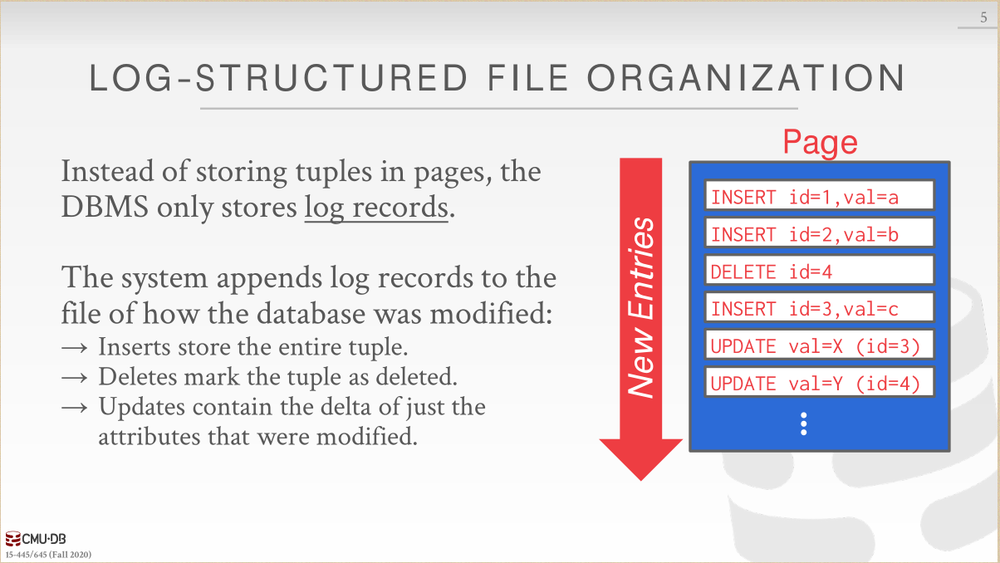
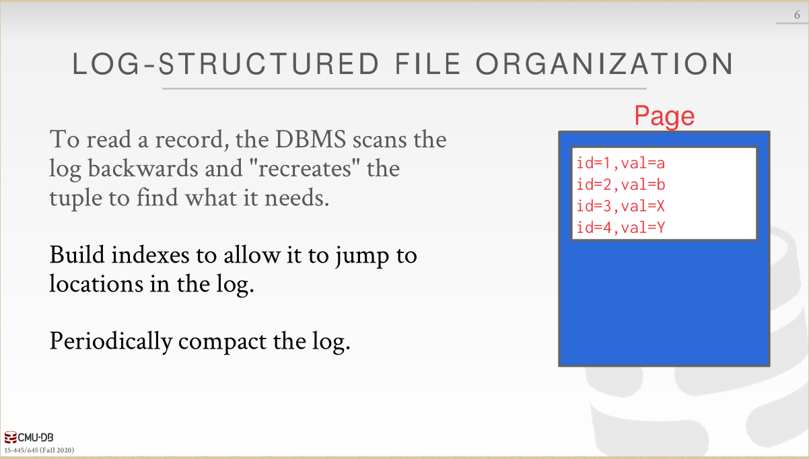

跟着cmu15-445学习一下数据库系统，因为大三数据库没学到东西。TBD

Project1 C++Primer

如何理解 模板类继承模板类， 子类看不到父类成员？https://www.zhihu.com/question/28139230

Do I need to explicitly call the base virtual destructor? https://stackoverflow.com/questions/677620/do-i-need-to-explicitly-call-the-base-virtual-destructor 

C with class 全忘了，一点也记不得了，将就着糊代码吧。

Lecture #01: Course Introduction and the Relational Model

data model：A schema is a blueprint of the database which specifies what fields will be present and what would be their types. For example an `employee` table will have an `employee_ID` column represented by a string of 10 digits and an `employee_Name` column with a string of 45 characters. 

schema：Data model is a high level design which decides what can be present in the schema. It provides a database user with a conceptual framework in which we specify the database requirements of the database user and the structure of the database to fulfill these requirements.

A data model can, for example, be a relational model where the data will be organised in tables whereas the schema for this model would be the set of attributes and their corresponding domains.

复制黏贴自Stack Overflow

Lecture #04: Database Storage II 

这两张图，一股浓浓的6.824的味道就出来了。果然分布式和数据库是息息相关的。

Project1 Buffer Pool

LRU Replacement Policy：

Buffer Pool Manager：