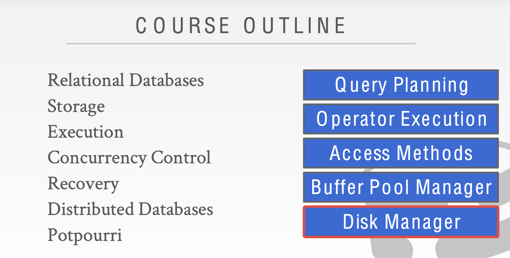
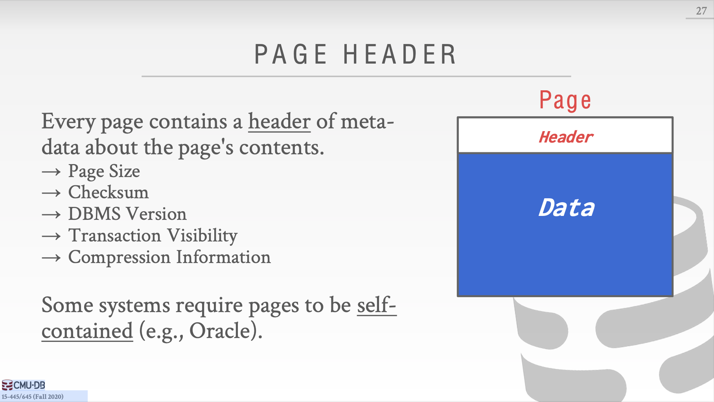

该Project下有4个主要的数据结构，分别是：

```c++
/** Array of buffer pool pages. */
Page *pages_;              
/** Page table for keeping track of buffer pool pages. */
std::unordered_map<page_id_t, frame_id_t> page_table_;
/** Replacer to find unpinned pages for replacement. */
Replacer *replacer_;
/** List of free pages. */
std::list<frame_id_t> free_list_;
```

从注释来看，`pages_` 包含了 `replacer_` `free_list_` 以及含有pin_count的所有frames。再根据page的三种状态之间的转换free、unpin、pin，我们可以进行编程。

在编程时关注 page的三个属性:`page_id`,`pin_count_`,`is_dirty_`,更新上述4个数据结构。

- Bug1:C++的类内成员变量如果是内置类型，比如int，一定要进行初始化，否则你永远不知道编译器会给它设置成多少……


- Bug2:`pages_`的索引在用page_id。。。大概我不是用脑子写的代码，是用脚写的。


- Bug3:之前`lru_replacer`留下的蹩脚代码，之前的析构函数是这样处理的。当时想的太简单，测试用例又没检查出来。


```c++
    // head->prev=nullptr;
    // head->next=nullptr;
    // tail->prev=nullptr;
    // tail->next = nullptr;
```

其实应该这样处理：

```c++
    std::shared_ptr<Node> work=head;
    std::shared_ptr<Node> next=head->next;
    while(work){
        work->next=nullptr;
        work=next;
        if (next) next = next->next;
    }
```

- Bug4：Single-parameter constructors should be marked explicit.


https://clang.llvm.org/extra/clang-tidy/checks/google-explicit-constructor.htm 这种类型的失误我目前没有太多时间去学习，需要注意。

- Feature?：如果Unpin的时候Frame已经在replacer中，不必处理，就当没发生事情一样，否则就会过不了测试。


-------------------------------------------------------------------------------

## page_table_ 中是否应该只存放pinned的Frame？

`pages_``page_table_``replacer_``free_list_`

从存放的Frame来看，`pages_`是全集，`free_list_`是删除了Page的Frame，`replacer_`是page.pin_count==0的Frame。

但是剩下的`page_table_`就有点疑问了：它到底是存着pinned page的Frame，还是全部Frame...在本实验中我是把它当成全集来看的。当然可能只放pinned page的Frame会好一点，毕竟这样就达成了一种互斥的感觉，很完美。那么如何实现这种方法呢？

首先明确一点：`free_list_`中的Frame不需要查找，直接取出来即可。然后考虑`Page *BufferPoolManager::FetchPageImpl(page_id_t page_id)`，给定page_id取出该Page，现在Page有可能是pin_count==0，那么一定不在`page_table_`中了，我们不能直接通过`page_table`的哈希表查找。必须在`replacer_`中增加一个查找接口，这个也好做，因为`replacer_`中本身也有一个哈希表，此处就不实现了。


以下内容是课程笔记

Storage-Part1

## 1 Storage

目前我们处在Disk Manager这一层，如果不加说明，DBMS的默认存储地址是非易失的磁盘，而DBMS的Disk Manager则将数据从非易失的磁盘和易失的内存中间移动。



至于存储体系，自下而上。从Network Storage到CPU寄存器，越小越贵越快。易失的存储硬件更加适合随机访问，且以字节为单位。非易失的存储硬件更加适合顺序访问，且以块（block）为单位。


## 2 Disk-Oriented DBMS Overview

内存毕竟就那么点，我们需要将数据存在磁盘中，因此DBMS需要最大限度的进行顺序访问。


## 3 DBMS vs. OS

看起来我们可以使用OS中的mmap来管理page，mmap会映射virtual memory和physical memory，到那时这样其实不行。

1.我们没办法对mmap映射的页进行写操作，只能读

2.如果mmap发生了page fault，我们的进程就会阻塞，因为这时候没有其他OS措施来处理page fault。

## 4 File Storage

然后我们来讨论DBMS是怎么把database表示成存储在磁盘中的文件的。balabala...不重要的就跳过了。

### File Storage


### Page Layout


这里的self-contained指的是什么？如果我们把创建数据库的元数据存储在单独的page里，发生crash以后其他数据就没办法解释。那么只要把这个元数据存在每一个page中，就是self-contained了。



那么除了元信息，如何组织page内部的data呢？我们假设只存储tuple。

两种方法：Tuple-oriented、Log-structured。

先来看Tuple-oriented。


如何删除一个tuple呢？slide中给定方法是设置墓碑标志，不过很神奇的是这样的话tuple的插入就不是简单append到末尾了，而要遍历墓碑，这和slide中说的有点矛盾。

如果有一个变长tuple如何存储呢？slotted page。


### Tuple Layout


Denormalized 可以看作 PreJoin。

## Conclusion


## Storage2

### Log-structured file organization

不同于直接在Page中写入完全的Tuple，记录结构的文件组织方式是另一种方式。


​	从插入Entry的过程可以看到，Insert、Update只包含了变化的属性值，所以需要读取某个Tuple的时候，只需要倒序读取就能重构出Tuple。

这样添加Entry的方式还有一些问题，比如Log文件会过大，倒序读取速度太慢等。因此，以下方式改善Log-Structured。

1.建立Entry的索引，这个就不提了，很常用的方法。

2.周期性的压缩Log


今天课程的主题。


Tuple只是一连串的bytes，需要DBMS来把这些bytes解释成types和values。DBMS的catalogs中的schema包含这些解释信息。


接下来是几种数据库的工作方式。

OLTP：快、短，操作整个Entity，重复操作。

OLAP：长、复杂、操作数据库的部分。


关系型数据库模型不满足我们必须把相同Tuple属性都存储在单个Page上的要求，因为关系型数据库是一行一行的，需要存储其他属性。


接下来介绍一个适合OLTP的存储模型，N-ARY Storage Model。就是按行存储Tuple。


与NSM对应的就是DSM，将所有Tuple的相同属性都存储在同一个Page中。


总结一下就是，OLTP=Row Store，OLAP=Column Store。接下来就该说说DBMS是如何管理内存，并且从磁盘中往复移动数据。

在磁盘上存储Page的时候应该注意一下两点：

1.尽可能的把一起使用的Page放在磁盘的靠近位置

2.尽可能减少读取磁盘的次数

今天的课程主要是三个方面：Buffer Pool Manager、Replacement Policies、Other Memory Pools。

我们把内存中一个array entry叫做Frame，其实就是磁盘中的Page，换了一个说法。


Locks 和 Latched的区别：Locks比较高层，是用来保护数据库的内容不受其他事务影响的原语。事务会持有Lock直到事务结束，Locks需要能回滚修改。

Latched则相反，保护的范围比较底层，用户保护数据库内部数据的关键部分，只有在操作进行的过程中会持有Latched，不需要回滚修改。

Page Table 和 Page Directory的区别


内存分配策略分为全局策略和局部策略。全局策略要求在分配内存的时候考虑所有正在运行的事务。而局部策略的目标是让一个查询或者事务变得更快，不考虑其他并发运行的事务。

Buffer Pool的优化方法：Mutiple Buffer Pools、Pre-Fetching、Scan Sharing、Buffer Pool Bypass。

Mutiple Buffer Pools：减少latches的竞争和提高命中率（毕竟缓冲区空间变大了）

Pre-Fetching：主要用在Sequential Scans和Index Scans上（因为这两个操作都是有规律的）

Scan Sharing：查询游标可以重用其他查询取得的数据。

Buffer Pool Bypass：[不怎么接触过的Light Scans](https://www.ibm.com/docs/en/informix-servers/12.10?topic=io-light-scans)，Sequential Scans不把从磁盘中取出来的Page放在Buffer Pool中，减少开销。

接下来说到**Buffer替换策略**。LRU、CLOCK。**问题**在于这两种策略会遇到sequential flooding，比如2个Frame和3个Page使用Sequential Scan，当Buffer Pool满了以后每次Buffer Pool都不会命中。

更好的策略：

 LRU-K：不谈了。

Localization：保持一个对于query来说**私有**的small buffer，使得真正的buffer里的page不变成dirty。

Priority Hint：对于某些特定查询，存在优先级，在Buffer中保留优先级高的Page。

同时由于Page处于Dirty状态我们在换出的时候必须写回磁盘，考虑使用**Background writing**

总结下来就是相比较于OS管理内存，DBMS自己进行管理更好。


