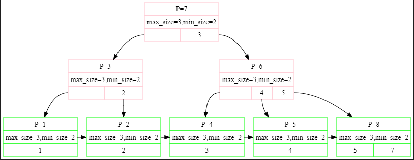
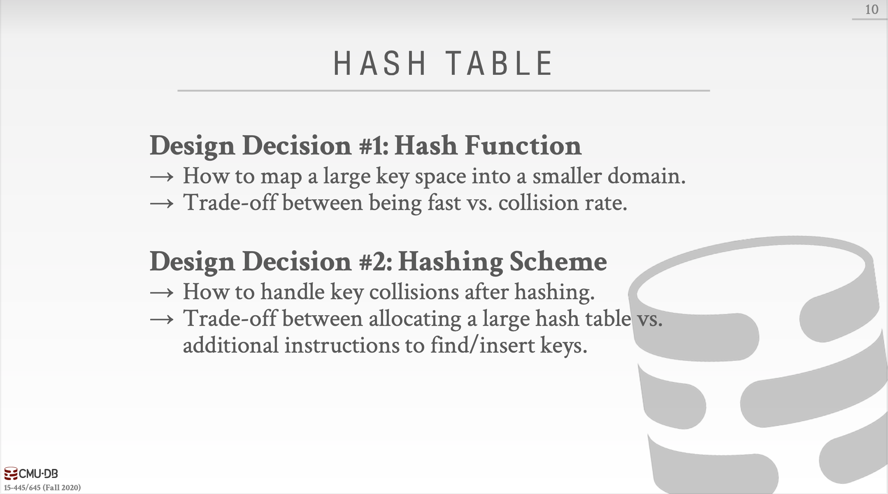
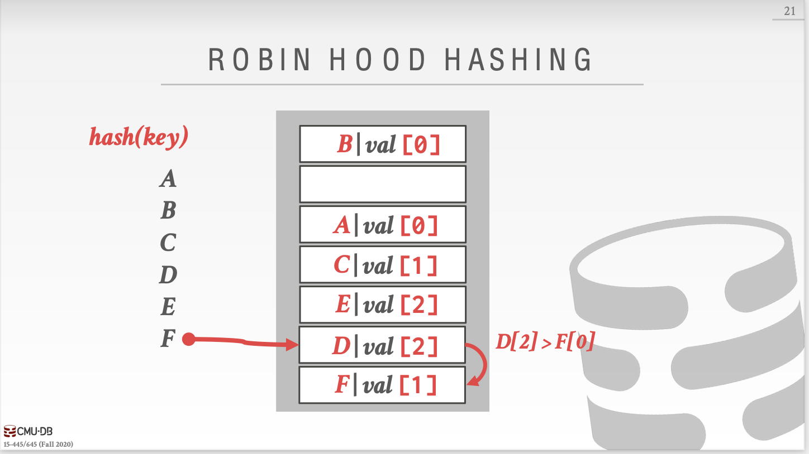
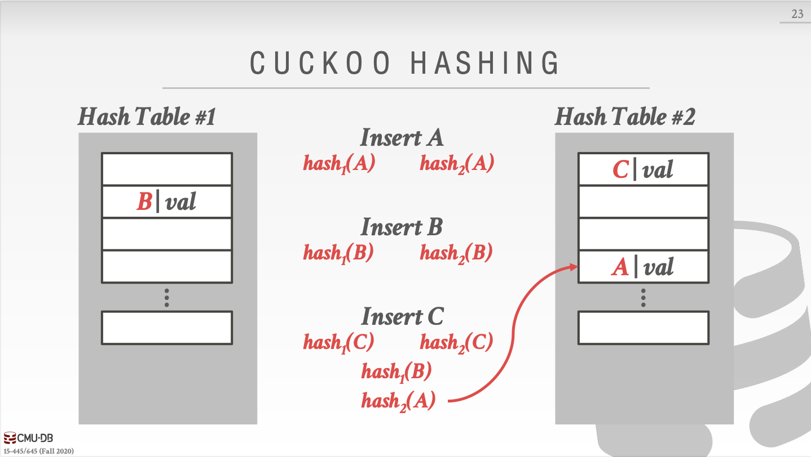

1.Every node has at most m children.

2.Every non-leaf node (except root) has at least ⌈m/2⌉ child nodes.

3.The root has at least two children if it is not a leaf node.

4.A non-leaf node with k children contains k − 1 keys.

5.All leaves appear in the same level and carry no information.

第一个Key是默认没有的。

1.为啥 B_PLUS_TREE_INTERNAL_PAGE_TYPE::MoveAllTo 可以保持不变？从父节点处拿下来一个放在第0号，再把整个给出到 recipient（有所要把父节点 拿下来的那个删掉吗？）

2.B_PLUS_TREE_INTERNAL_PAGE_TYPE::MoveFirstToEndOf 因为一边更新了，所以另一边就不更新了？

1.需要注意InteralPage 和 LeadPage的 Lookup 函数 不同，InternalPage需要找<=key，LeafPage需要找>=key。。。

2.好吧，KeyIndex也是不同的方法（这个后续需要修改）

3.不知道Node中Init应该初始化MaxSize设置成多少

4.FindLeafPage后面就要跟 Unpin（只有Fetch 、FindLeafPage需要这个）

5.GetValue的参数为什么是个vector

特点：

1.为了更好的偷懒（设置Leaf 和 Internal Page MaxSize的时候，-1，所以之后就可以直接插入，然后再Split，方便很多）

2.这里的Delete和网上流传的众多版本是不同的，分支上的最小Key没了以后是不会更新这条分支其它node的最小Key，相当于是简化版本的，不过这样也不影响正确性。

  

  

3.有几种优化方法在slice中会提到，先这样吧，目前懒得得到一个好看的流程

bug

0.concurrent_test 两个线程进行delete时

1 4

14

5 3 

5 2 

3 2 

3 1

4 0

4 0

1.unPin

2.nextpageid

3.注意到MoveAllTo是有顺序关系的，被加的那个在左边

  

4.我好像把node的Size（）定义弄错了....还是有很多没想明白的

删除key=3后，出现问题了，

4.我有一个非常疑惑的问题，在这个实验中我们需要在NewPage和FetchPage后面跟随Unpin，当然如果因为某个函数里无法这么做，该函数后续也要加上Unpin。

有一个极其特殊的地方也要加InsertIntoParent中的new_node，因为这个new_node在实验中是Split中虽然对recipient(recipient==new_node)已经unpin，但是在InsertIntoParent中这个new_node又一次被修改，所以是需要再次Unpin。然而old_node就不用在InsertIntoParent中Unpin了，因为old_node其实是原来的node，肯定会在caller中被unpin。

5.在Index Iterator中我们好像无法unpin

6.FindLeafPage中 除了root是通过FetchPage得来的，需要Unpin，剩下的有unpin的必要么？不必要，但是也可以unpin，因为在bufferpool中unpin是幂等的，如果pincount<=0了再unpin也没事。

7.CoalesceOrRedistribute中的unpin逻辑好乱啊。

d 1 失败

8.需要忽略那个没有key的pair，直接把在判断parent需要再次  CoalesceOrRedistribute 的条件变为  GetSize()<GetMinSize()+1 ，因为现在是InternalNode，比如MaxSize=3，MinSize=1，但实际上array[0].first不是key，表面上Size=1，实际上是0.

10.在程序中对于Size--对应的操作都是移动array，所以其实那些“被删除的array”依然存在，这就导致并发操作时，跟KeyIndex的实现方法也有关系，一前一后删除Key时，出现bug。

下面是索引结构的课程内容，其实就是两种索引结构：哈希表和B+树。

Hash Function怎么挑选就不提了。主要把重心放在Hashing Scheme如何设计上。3种方法

- Linear Probe Hashing 删除的话直接用TombStone就好。Movement就是图个乐，十分的复杂。

  Non-unique keys

  * Separate Linked List 
  * Redundant Keys  直接把key和value绑定起来

  

- Robin Hood Hashing（劫富济贫）

  每个Key都会保留一个number，该number指的是它们离最初位置的距离。

  当争夺同一个slot的时候，距离最初位置越远的key可以获得该slot。相同的话遵循先后来到规则。

  

- Cuckoo Hashing

  就是拿多个哈希表，多个哈希函数，如果有冲突发生了就使用另一个哈希表，以及与之对应的哈希函数。循环往复，直到没有冲突。

  

接下来是**动态哈希表**。

* Chained hashing

  以bucket为单位

* Extendible hashing

  global count、local count。桶不够用了，global count+1，那个不够的桶 local count+1，这个桶就可以分裂了。

  

* Linear hashing

  Split pointer控制着demarcation line，demarcation line之上的bucket是split之后的一部分，所以还要应用另外几个hash函数才能够最终确定bucket的位置。

  

结论：O（1）就完事了。下面一节课就是历史上最伟大的数据结构，B+树。

说真的动手写完B+树索引的实验以后，再看slide都可记录的不多，由此可见实践编程的重要性，多写点bug，就什么都理解了，比起记忆怎么split，怎么merge要好太多了。

Leaf Node Values

Leaf node values可以是Record Ids和Tuple Data。本实验中用的是Record Ids。

Duplicate Keys

* Append Record Id
* Overflow Leaf Nodes

Clustered B+Tree，[一篇介绍聚集索引的好文章](http://www.programmerinterview.com/database-sql/clustered-vs-non-clustered-index/)

聚集索引一般设置在Primary Key上，因为他们不会经常update（一次update往往会变成delete+insert）

下一节课我们会继续学习B+树，Tries/Radix Trees，Inverted Indexes

Variable length keys

intra-node search

* Linear

* Binary

* Interpolation

  根据已知分布的keys得出目标key的大概位置

Optimization

* Prefix Compression
* Deduplication
* Suffix Truncation
* Bulk Insert
* Pointer Swizzling：value不存page ids，当page在buffer pool处于pinned状态的时候，直接存raw pointers。

Partial Indexes：只在数据库表中的子集中添加索引。

Covering indexes：query中的所有要求的信息都在一个索引中，那么DBMS就不用取得该tuple。

Index include columns：columns只在leaf nodes中出现，不会在internal nodes中出现，所以不会影响index-only queries

Functional/expression indexes：创建index的时候用function、expression

Trie index ：

Radix Tree：就是把single child合到parent的Trie Index。

下一节课我们会学习Index Concurrency Control

**Latches Overview**

Blocking OS Mutex

Test-and-Set Spinlock（TAS）：别在用户空间下使用自旋锁

Reader-Writer Locks

**Hash Table Latching**

HashTable上锁比较简单，因为数据结构比较简单。

* Page Latches：每个Page都有自己的读写锁
* Slot Latches：每个Slot都有自己的锁

**B+ Tree Latching**

B+ Tree需要解决两个问题：不同线程同时修改一个node，当一个线程在split/merge的时候另一个线程路过。

最基本的原则：

1.父节点加锁

2.子节点加锁

3.当父节点安全的时候解锁父节点

那么什么样的节点是安全的呢？不处于split/merge边界条件的节点是安全的。

对于R锁（Find）就更简单了，当获取child的读锁以后直接释放parent的读锁。

对于W锁（Insert/Delete），child是安全的以后，释放其所有祖先的所有锁（为其他线程提供方便）。

Better latching algorithm

大多数修改并不会导致split/merge，所以我们可以乐观的认为使用read latches。只有leaf node使用W锁，internal node都是用R锁。如果发现leaf node不安全，释放所有的latches，重新使用悲观算法。

**Leaf Node Scans**

internal node的锁获取方式都是自上而下的，如果下面的锁无法获得，就会wait，不会导致死锁，因为这样不会影响下面线程的继续前进。而Leaf Node Scans的锁有两个方向，从左到右、从右到左，这样就会导致死锁。当一个线程自左向右Leaf node scan时，遇到一把无法获得的锁时，不能wait，因为wait的同时，自右向左的线程也无法前进，导致死锁。

Latches不支持死锁避免和死锁预防，只能通过编程规范来解决。如果线程想要获得leaf node的latch，但是latch还不能获得，线程应该立即abort操作（释放线程自己拥有的所有锁），然后再重新开始失败的操作。

**Delayed Parent Updates**

等到下一次parent再次获得W锁时再更新。