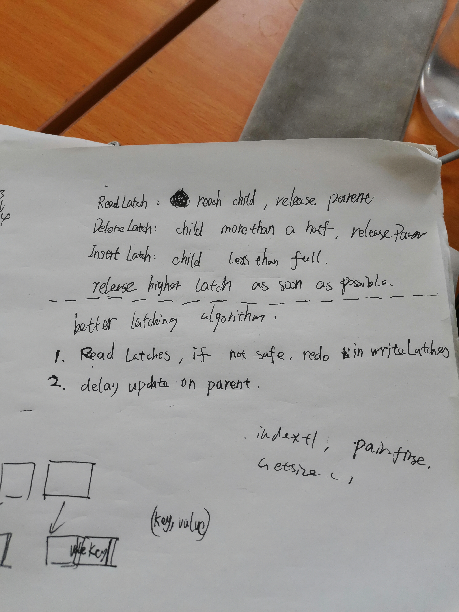
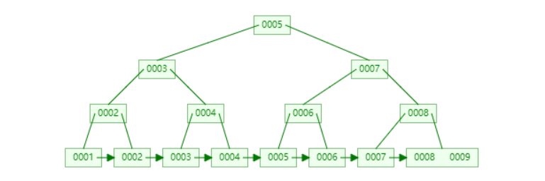
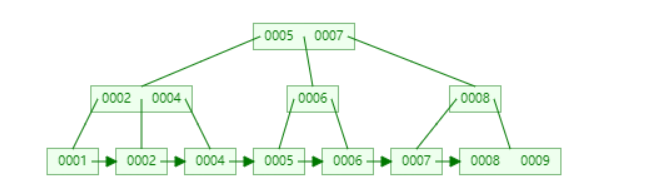
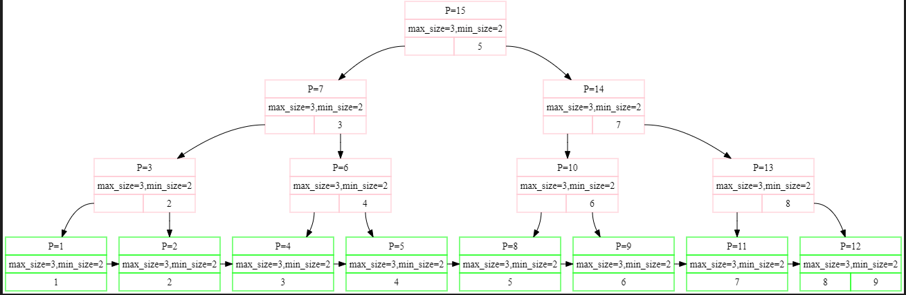
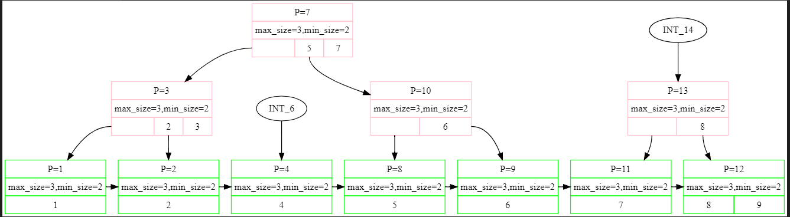
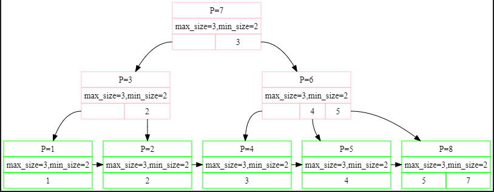
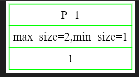
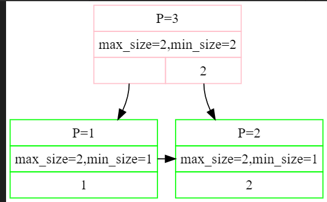
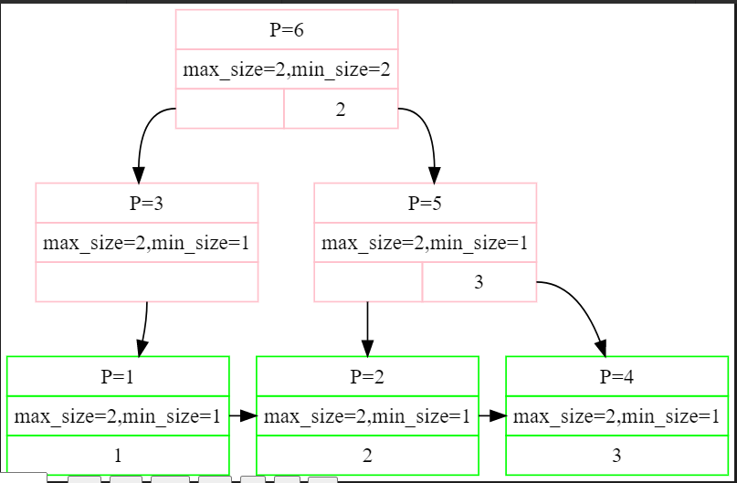
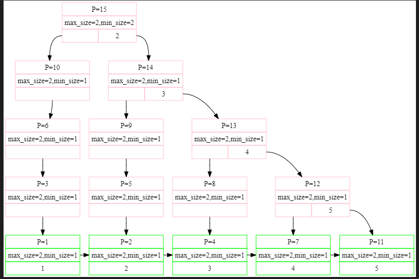

1.Every node has at most m children.

2.Every non-leaf node (except root) has at least ⌈m/2⌉ child nodes.

3.The root has at least two children if it is not a leaf node.

4.A non-leaf node with k children contains k − 1 keys.

5.All leaves appear in the same level and carry no information.

第一个Key是默认没有的。

1.为啥 B_PLUS_TREE_INTERNAL_PAGE_TYPE::MoveAllTo 可以保持不变？从父节点处拿下来一个放在第0号，再把整个给出到 recipient（有所要把父节点 拿下来的那个删掉吗？）

2.B_PLUS_TREE_INTERNAL_PAGE_TYPE::MoveFirstToEndOf 因为一边更新了，所以另一边就不更新了？

1.需要注意InteralPage 和 LeadPage的 Lookup 函数 不同，InternalPage需要找<=key，LeafPage需要找>=key。。。

2.好吧，KeyIndex也是不同的方法（这个后续需要修改）

3.不知道Node中Init应该初始化MaxSize设置成多少

4.FindLeafPage后面就要跟 Unpin（只有Fetch 、FindLeafPage需要这个）

5.GetValue的参数为什么是个vector

特点：

1.为了更好的偷懒（设置Leaf 和 Internal Page MaxSize的时候，-1，所以之后就可以直接插入，然后再Split，方便很多）

2.这里的Delete和网上流传的众多版本是不同的，分支上的最小Key没了以后是不会更新这条分支其它node的最小Key，相当于是简化版本的，不过这样也不影响正确性。

  

  

3.有几种优化方法在slice中会提到，先这样吧，目前懒得得到一个好看的流程

bug

0.concurrent_test 两个线程进行delete时

1 4

14

5 3 

5 2 

3 2 

3 1

4 0

4 0

1.unPin

2.nextpageid

3.注意到MoveAllTo是有顺序关系的，被加的那个在左边

  

4.我好像把node的Size（）定义弄错了....还是有很多没想明白的

    

删除key=3后，出现问题了，

4.我有一个非常疑惑的问题，在这个实验中我们需要在NewPage和FetchPage后面跟随Unpin，当然如果因为某个函数里无法这么做，该函数后续也要加上Unpin。

有一个极其特殊的地方也要加InsertIntoParent中的new_node，因为这个new_node在实验中是Split中虽然对recipient(recipient==new_node)已经unpin，但是在InsertIntoParent中这个new_node又一次被修改，所以是需要再次Unpin。然而old_node就不用在InsertIntoParent中Unpin了，因为old_node其实是原来的node，肯定会在caller中被unpin。

5.在Index Iterator中我们好像无法unpin

6.FindLeafPage中 除了root是通过FetchPage得来的，需要Unpin，剩下的有unpin的必要么？不必要，但是也可以unpin，因为在bufferpool中unpin是幂等的，如果pincount<=0了再unpin也没事。

7.CoalesceOrRedistribute中的unpin逻辑好乱啊。

d 1 失败

8.需要忽略那个没有key的pair，直接把在判断parent需要再次  CoalesceOrRedistribute 的条件变为  GetSize()<GetMinSize()+1 ，因为现在是InternalNode，比如MaxSize=3，MinSize=1，但实际上array[0].first不是key，表面上Size=1，实际上是0.

10.在程序中对于Size--对应的操作都是移动array，所以其实那些“被删除的array”依然存在，这就导致并发操作时，跟KeyIndex的实现方法也有关系，一前一后删除Key时，出现bug。