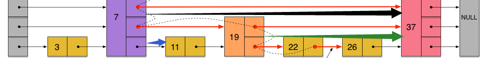

大部分内容出自[《redis设计与实现》](https://read.douban.com/reader/ebook/7519526/)

## 第一部分 数据结构与对象

1. sds

   struct中带有一个变长数组。《STL源码剖析》中也看到过一段。不定长数组的数组名只是一个标志，指向前一个成员变量的尾后地址，所以这个不定长数组不占用空间。

   ```c
   typedef char *sds;
   
   /* Note: sdshdr5 is never used, we just access the flags byte directly.
    * However is here to document the layout of type 5 SDS strings. */
   struct __attribute__ ((__packed__)) sdshdr5 {
       unsigned char flags; /* 3 lsb of type, and 5 msb of string length */
       char buf[];
   };
   
   static inline size_t sdslen(const sds s) {
       unsigned char flags = s[-1];
       switch(flags&SDS_TYPE_MASK) {
           case SDS_TYPE_5:
               return SDS_TYPE_5_LEN(flags);
           case SDS_TYPE_8:
               return SDS_HDR(8,s)->len;
           case SDS_TYPE_16:
               return SDS_HDR(16,s)->len;
           case SDS_TYPE_32:
               return SDS_HDR(32,s)->len;
           case SDS_TYPE_64:
               return SDS_HDR(64,s)->len;
       }
       return 0;
   }
   ```

   除了sdshdr5（never used）有点特殊以外，其它几种sdsX都一样，注释写的很明白。如下是sds64

   ```c
   struct __attribute__ ((__packed__)) sdshdr64 {
       uint64_t len; /* used */
       uint64_t alloc; /* excluding the header and null terminator */
       unsigned char flags; /* 3 lsb of type, 5 unused bits */
       char buf[];
   };
   ```

   

2. dict

   dictScan() 靠着 [这篇博客](http://www.langdebuqing.com/redis%20notebook/redis%E6%BA%90%E7%A0%81%E9%9A%BE%E7%82%B9%EF%BC%9A%E5%AD%97%E5%85%B8%E7%9A%84%E9%81%8D%E5%8E%86dictScan.html) 弄明白了，从高位+1导到低位。

   

3. zskiplist

   多分查找。需要注意的是源码中扫描插入位置并更新rank和update的时候是从上到下遍历，这样可以快速找到比新加节点大的forward，然后停下来。而实际进行插入操作是从下到上遍历，因为这时候只需要关注新插入节点的0~randomLevel层即可。

   ```c
       x = zsl->header;
       for (i = zsl->level-1; i >= 0; i--) {
           /* store rank that is crossed to reach the insert position */
           rank[i] = i == (zsl->level-1) ? 0 : rank[i+1];
           while (x->level[i].forward &&
               (x->level[i].forward->score < score ||
                   (x->level[i].forward->score == score &&
                   compareStringObjects(x->level[i].forward->obj,obj) < 0))) {
               rank[i] += x->level[i].span;
               x = x->level[i].forward;
           }
           update[i] = x;
       }
   ```

   ```c
       x = zslCreateNode(level,score,obj);
       for (i = 0; i < level; i++) {
           x->level[i].forward = update[i]->level[i].forward;
           update[i]->level[i].forward = x;
   
           /* update span covered by update[i] as x is inserted here */
           x->level[i].span = update[i]->level[i].span - (rank[0] - rank[i]);
           update[i]->level[i].span = (rank[0] - rank[i]) + 1;
       }
   ```

   

   由上图可以看到，x->level[1].span更新为3，update[1]->level[1].span更新为2。

   具体细节看 [这里](https://zhuanlan.zhihu.com/p/56941754)

   

4. 对象（字符串、列表、哈希、集合、有序集合）

   简单动态字符串、链表、字典（哈希表）、跳跃表、整数集合、压缩列表。

   字符串：int、raw、embstr

   列表：ziplist或者linkedlist。

   哈希：ziplist或者hashtable。

   集合：intset或者hashtable。

   有序集合：ziplist或者skiplist。

   

## 第二部分 单机数据库的实现

### RDB

### AOF

为了解决这种数据不一致问题，Redis服务器设置了一个AOF重写缓冲区，这个缓冲区在服务器创建子进程之后开始使用，当Redis服务器执行完一个写命令之后，它会同时将这个写命令发送给AOF缓冲区和AOF重写缓冲区。（[那么为什么RDB中BGSAVE不需要这个缓冲区呢？](https://www.zhihu.com/question/455384887)）

<script src="/assets/js/mermaid.min.js"></script>
<div class="mermaid">    
graph TD
	propagate--> feedAppendOnlyFile
    feedAppendOnlyFile--> aofRewriteBufferAppend
    aofRewriteBufferAppend--> aofChildWriteDiffData

    bgrewriteaofCommand-->rewriteAppendOnlyFileBackground
    rewriteAppendOnlyFileBackground-->rewriteAppendOnlyFile
    rewriteAppendOnlyFile-->aofReadDiffFromParent
    aofChildWriteDiffData-->aofReadDiffFromParent
    aofReadDiffFromParent-->aofChildWriteDiffData
</div>

aofReadDiffFromParent里对`int aof_pipe_read_data_from_parent`进行 read

aofChildWriteDiffData里对`int aof_pipe_write_data_to_child`进行write

这里是一对管道。


### 过期键的读写不一致

* 主服务器在删除一个过期键之后，会显式地向所有从服务器发送一个DEL命令，告知从服务器删除这个过期键。
* 从服务器在执行客户端发送的读命令时，即使碰到过期键也不会将过期键删除，而是继续像处理未过期的键一样来处理过期键。
* 从服务器只有在接到主服务器发来的DEL命令之后，才会删除过期键。

那么如何处理读写不一致呢？[检查expiretime](https://www.mdeditor.tw/pl/2Za4)


## 第三部分 多机数据库的实现（重点总算来了！一致性等等）

### 复制（同步+命令传播（propagate））


部分重同步的实现

* 主服务器的复制偏移量（replication offset）和从服务器的复制偏移量。

  

* 主服务器的复制积压缓冲区（replication backlog）。

  

* 服务器的运行ID（run ID）。

REPLCONF ACK：类似计算机网络中的ACK。


### Sentinel系统（sentinel领头者选举是raft协议，涉及到epoch、选举，这个需要好好总结）（其实是主从复制的自动选举版本）

这里选的是sentinel的leader，而不是server的leader。所以sentinel其实就是协调者。选出sentinel的leader只是为了处理下线的server的故障，毕竟监视着下线server的sentinel不止一个，不可能每个都来处理故障。看到最后发现就是类似Raft的实现。

1.先到先得

2.其它和Raft选举相似

这里就是它和Raft选举的区别，Raft选举的election timeout一般不同，所以很少出现选不出leader的情况。不知道redis中是如何处理这个问题的？

Make sure the election timeouts in different peers don't always fire at the same time, or else all peers will vote only for themselves and no one will become the leader.

集群（主节点选举也是raft协议）

## 第四部分 独立功能的实现

WATCH乐观锁：对应的隔离级别是可串行化的快照隔离吗？

### 事务

Redis的事务总是以串行的方式运行的，并且事务也总是具有隔离性的。（其实就是最一般的串行）

子进程：

1.BGSAVE

2.AOF后台重写

