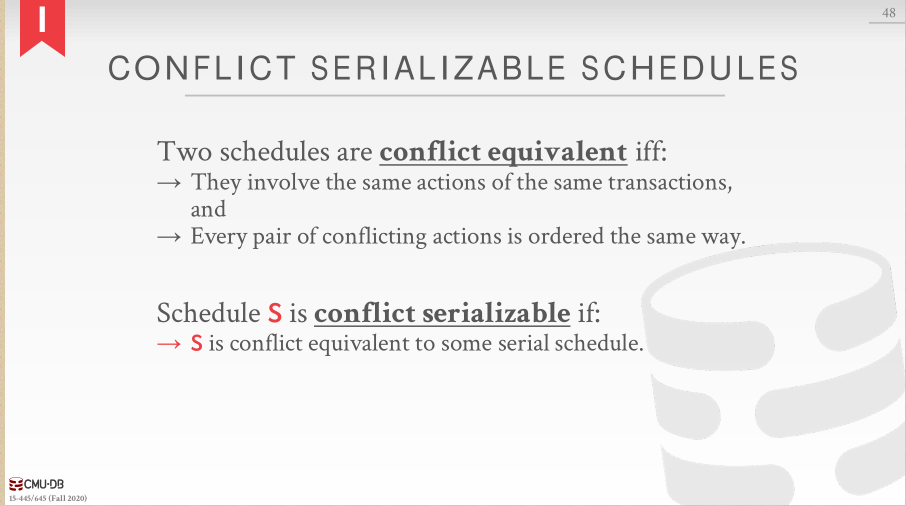
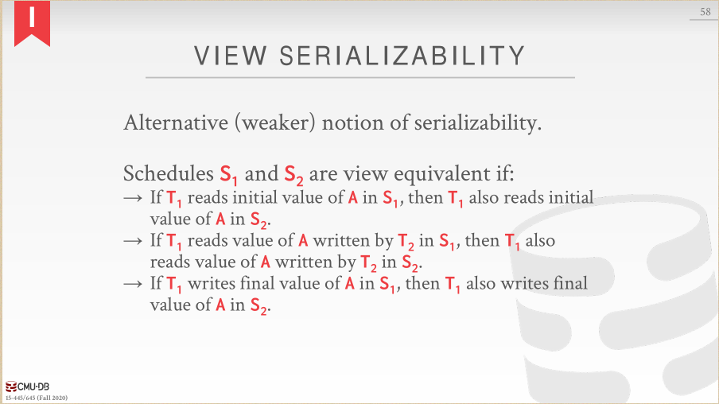
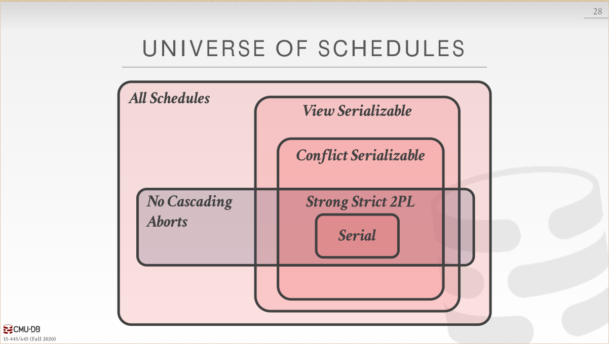
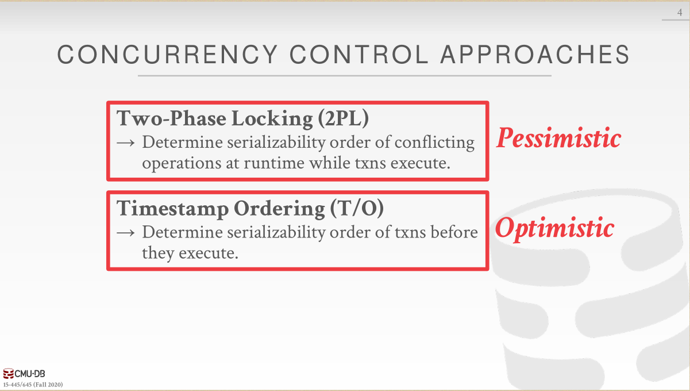
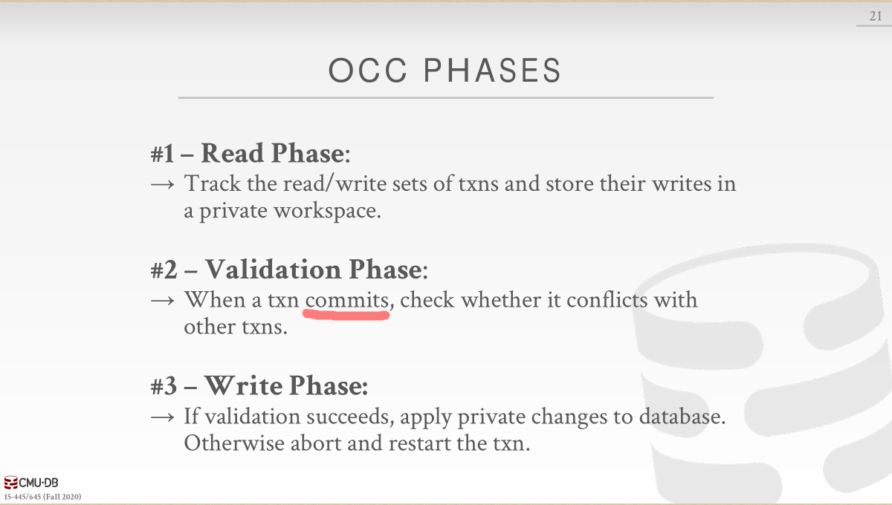
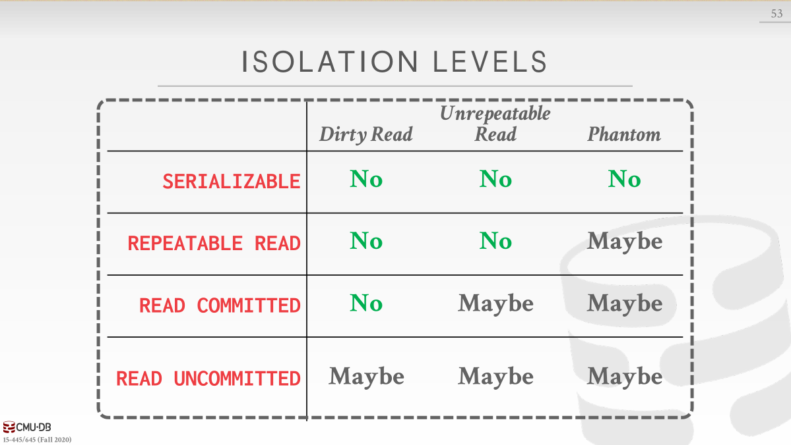

### Locks,Mutexes,Semaphores的区别

Locks：保护对共享对象的访问，即一个资源可以被多个线程共享。

Mutexes：如果不是特指某种互斥锁，一般指的是一个资源只能被一个线程占有。

Mutexes又分为Recursive Mutexes(可重入锁)、Reader/Writer Mutexes、Spinlocks。

Semaphores：不提了，就是PV操作。

### 处理原子性

### conflicting operations

### 两种串行化

#### conflict serializability

#### view serializability

### 2PL

而严格2PL只有在最后才释放所有Locks

下面3图流说明Non-2PL、2PL、Strong 2PL之间的区别。

strong 2PL 释放锁都是在事务结束的时候。

#### 2PL Deadlocks

#### Deadlock prevention

### Lock granularities

### conclusion

### optimistic concurrency control approaches（乐观和悲观）

### Basic Timestamp Ordering (T/O) Protocol

Thomas Write Rule提到我们可以忽略旧事务对于X的写操作，这是可以理解的，反正即使这个旧事务在正确的时间点对X进行写，写入的值也会被新事务的写所覆盖，最终结果依旧是X的值是新事务写入的值。

### Optimistic Concurrency Control

……好像可串行化的快照隔离啊，有两种`基于过期的条件做决定`的方法，前向和后向（需要求证一下）。

#### OCC 前向验证的三个要求

下图中的读写集合冲突是对应与某一个时间点来说的，而不是针对整个事务持续时间来说的。

在少量竞争的情况下，OCC比2PL表现好，因为不用锁。

### THE PHANTOM PROBLEM（幻读），2PL

目前我们只处理了read、update existing objects，但是面对不存在的object却没办法处理。（说真的一开始我都没看出来这是幻读，看了看示例才发现好像是幻读……）

### Isolation Levels

### MVCC

