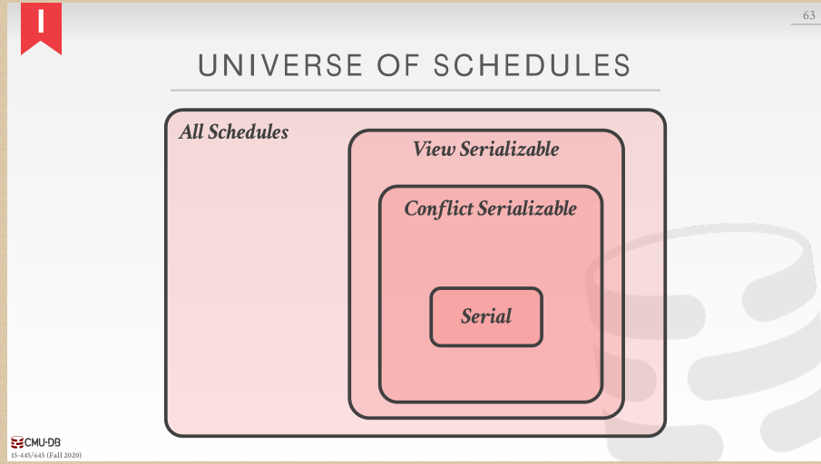
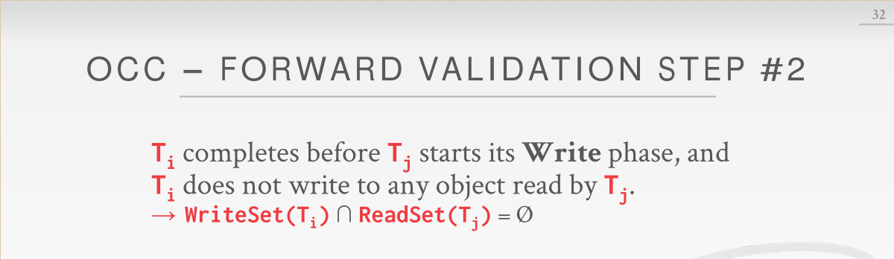

### Locks,Mutexes,Semaphores的区别

Locks：保护对共享对象的访问，即一个资源可以被多个线程共享。

Mutexes：如果不是特指某种互斥锁，一般指的是一个资源只能被一个线程占有。

Mutexes又分为Recursive Mutexes(可重入锁)、Reader/Writer Mutexes、Spinlocks。

Semaphores：不提了，就是PV操作。

之前经常看到的那张图，自下而上五层。Disk manager、Buffer Pool manager属于Recovery部分，Access Methods、Operator Execution属于Concurrency Control部分。最上面还有一层Query Planning。

事务的四个特性ACID，balabala。

### 处理原子性

Logging：DBMS记录所有的undo actions，同时保存在内存和磁盘。

Shadow Paging：拷贝那些被操作的页，并在拷贝后的页上操作，只有commit以后才对其他事物可见。

提到一个**并发控制协议**就是DBMS如何决定多个事务的操作之间的正确顺序。多个事务之间交织是因为如果一个事务因为某种资源停下来，那么另一个事务可以继续前进，这样可以最大化资源利用率。

如何判断一个调度是正确的？如何一个调度等价于某些串行执行，就是正确的。

什么是串行执行？不同事务中的操作不相互交织。

### 处理一致性

database consistency：之后的事务可以看到之前提交事务的影响

transaction consistency：这个归应用程序管，不归DBMS管，所以我们也不讨论。

### 处理隔离性（做好并发控制）

### conflicting operations

既然不同事务中的操作会交织，那么到底怎样的操作交织会对形成串行化执行结果有影响呢？冲突操作。

两个操作是冲突的：他们来自不同的事务；他们作用于同一个实例并且至少其中一个是W。

所以显然是RW、WR、WW这三种冲突操作组合。脏读、不可重复读、脏写都是没有串行化时的错误结果。

### two types of serializability

串行化有不同的级别：大多数DBMSs尝试支持的**冲突串行化**，几乎没有DBMS做到的**View Serializability**（这个我不知道怎么翻译）。在这节课中我们的主要内容是冲突串行化。

### conflict serializability

冲突串行话不止一种调度，那么如何知道两个调度是否等价呢？

1.他们涉及同一事务的同一操作。2.每一对冲突操作都按相同顺序排列。言下之意是非冲突操作想怎么来怎么来。同时如果你能讲一个调度S中的非冲突操作变换顺序成一个串行调度，那么这个调度S显然是一个串行话调度。

这么来回换一点也不方便，有什么好的算法来判断一个调度是否是串行调度吗？如果**前驱图**形成了环，那么就不是一个冲突串行化。

### View serializability

View Serializability比冲突串行话有更多的调度，说明View S限制更少。同时View S很难有高效的方法去检测。

所有调度的包含关系如下图所示。

### 处理持久性

所有提交事务的改变都应该是持久的。也用logging 或者 shadow paging……

下一节课我们来讲2PL、隔离级别。

先来复习一下上节课的内容，上节课提到了冲突串行话和查看串行话。冲突串行话有交换和依赖图两种方式，且几乎任何数据库都支持冲突串行话。查看串行化没有有效的方式去验证，几乎没有DBMS支持查看串行化。

显然，上节课检验一个调度是否是串行话调度需要先知道整个调度，但是现实情况下我们没办法知道整个调度。所以我们需要用锁来保护数据库实例。

今天的课程内容主要是Lock Types、2PL、死锁检测+预防、层级锁、隔离级别。

### Lock Types 

Locks 和 Latches的区别，已经不想重复了……

### 2PL

阶段1:Growing，事务申请、lock manager给/不给。

阶段2:Shrinking，事务释放，且不能再申请新的锁。

2PL要服从级联中止，因为abort的事务中的任何信息都不能流出该事务。

observations：

* 可能会出现2PL不允许的调度，但这个调度其实是串行化的。因为锁会限制并发性

* 可能会出现脏读->使用严格2PL，出现脏读其实就是在**没有级联中止**的情况下发生的。

  而严格2PL要求只有在提交或异常中止后才释放锁。这样一来，就没事了，相当于加了一把大锁。

* 可能会导致死锁->死锁预防或者检测

总而言之，言而总之，就是有级联中止，2PL就不会出现脏读。没有，那就老老实实用S2PL吧。

#### 2PL Deadlocks

死锁检测：也是画前驱图，发生死锁了就选择一个替罪羊事务回滚。替罪羊会重启或者是中止。

选替罪羊可以根据时间戳、事务进度、锁个数，也可以考虑该事务过去重启的次数来避免“饿死”。回滚也可以选择回滚进度。

死锁预防：事务申请的锁被另一个事务持有，DBMS就杀死其中一个事务来预防死锁。

### Lock granularities

IS：子节点有一个shared

IX：子节点有一个exclusive

SIX：子节点全部是share，有一个exclusive

意向锁允许高层节点以shared或者exclusive方式加锁，并且不用检查子节点。

当获取了太多了低级别的锁以后，锁升级会动态的请求粗粒度的锁。着减少了lock manager需要处理的请求的数量。

select...for update：执行select并对符合的tuples设置一个exclusive lock。

### 没啥可总结的，下节课我们来讲时间戳排序的并发控制。

2PL是悲观CC、TO是乐观CC。接下来就着重说TO是怎么实现的了。

有几种实现timestamp的方法：system clock、Logical counter、hybrid。

今天的主要内容就是：T/O 协议、OCC、隔离级别。

### Basic Timestamp Ordering (T/O) Protocol

注意T/O不仅要更新实例的读写时间戳，还要拷贝X的旧值来保证**可重复读**。

**Thomas Write Rule**提到我们可以忽略旧事务对于X的**写操作**，这是可以理解的，反正即使这个旧事务在正确的时间点对X进行写，写入的值也会被新事务的写所覆盖，最终结果X的值是新事务写入的值。

Observations：如果你不使用Thomas Write Rule，T/O协议产生的就是冲突串行化。没有死锁，没有等待（因为不符合时间戳要求的都abort了），当然存在长事务饿死的情况（短事务一直冲突，一直restart）。

### recoverable schedules（？哪里来的）

### Optimistic Concurrency Control

如果你假设事务之间的冲突很少并且绝大部分事务都是短暂的，那么用锁的方式就会带来过多开销，我们可以考虑OCC。……好像可串行化的快照隔离啊，有两种`基于过期的条件做决定`的方法，前向和后向（需要求证一下）。

OCC：任何读取实例都被拷贝到工作区，修改都应用于工作区。当提交时，DBMS会比较该事务的工作区和其他事务是否有冲突，没有冲突就将工作区的写集合安装到全局数据库。

#### OCC 前向验证的三个要求之一

如果TS(Ti)<TS(Tj)：以下三个条件至少有一个满足

下图中的读写集合冲突是对应与某一个时间点来说的，而不是针对整个事务持续时间来说的。

同时只有一个事务处于Write Phase，可以用write latches来支持并行的validation/writes。

目前我们只处理了read、update existing objects，但是面对不存在的object却没办法处理。（说真的一开始我都没看出来这是幻读，看了看示例才发现好像是幻读……）

### THE PHANTOM PROBLEM（幻读），2PL

* Re-Execute Scans：记录每个range query的scan set，等到commit以后，重新执行刚才每个query的scan部分来检查是否形成了相同的结果。
* Predicate Locking：对select查询的where子句中的谓词加共享锁，对update、insert、delete查询中的where子句中的谓词加排他锁。
* Index Locking：锁index page，如果数据在，锁在的那页；如果数据不在，锁数据将会放置的那页。如果没有适合的index，那么必须锁住table的每一页防止其中的一个tuple变成目标tuple；table也要锁住，防止加入或删除目标tuple。

### Isolation Levels

这节课我们来讲讲MVCC，首先来说说概念。MVCC就是DBMS会为数据库中每个逻辑实例维护多个物理版本。

当事务向该实例写时，DBMS会为该实例创建一个新版本。

当事务读取该实例时，事务会读取事务started时存在的最新的版本。

### MVCC

总结一下我们之前学习过的concurrency control protocol

* Timestamp Ordering
* Optimistic Concurrency Control
* Two-Phase Locking

然后就是如何存储实例的版本，有以下3种办法

* Append-Only Storage
* Time-Travel Storage
* Delta Storage

当然如果让版本一直增加下去肯定不对啊，那需要垃圾回收。

* Tuple-level：Background Vacuuming，Cooperative Cleaning

  背后回收就是另起线程来周期性的扫描version table。合作回收就是工作线程在工作的时候顺便回收，但是只适用于O2N。

* Transaction-level

MVCC的primary key指向版本链头部，但是二级索引就复杂很多了。二级索引需要根据找到tuple的primary key去找到版本链。

* Logical Pointers

  在二级索引处加一个指向primary key的指针，通过primary key找到版本头。好处是更新tuple，更新primary key，二级索引不用更新（因为指向了primary key）。

* Physical Pointers

  就是在二级索引处直接存版本链头，但是缺点是有多个二级索引的话，每次更新tuple时，所有二级索引都要更新。

MVCC的索引结构必须支持non-unique keys，因为相同的key指向不同快照中的logical tuples。因此workers在fetch一个实例时要找到正确的版本。

mvcc deletes

* deleted flag
* tombstone tuple

