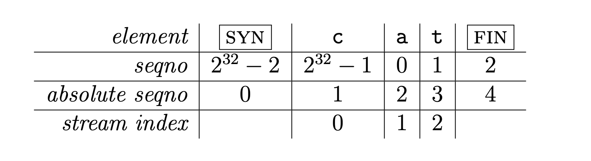
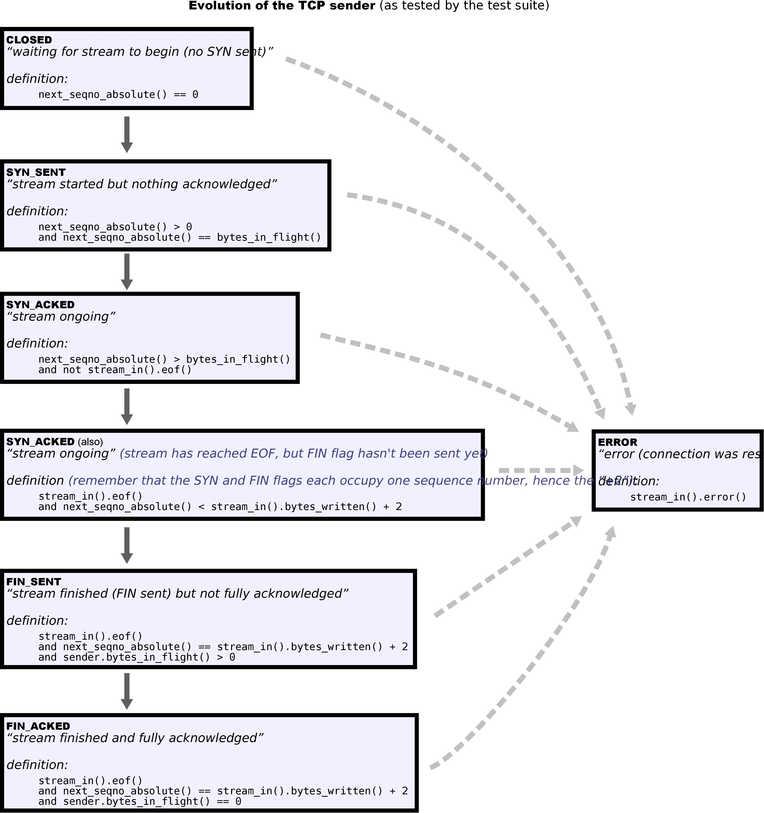
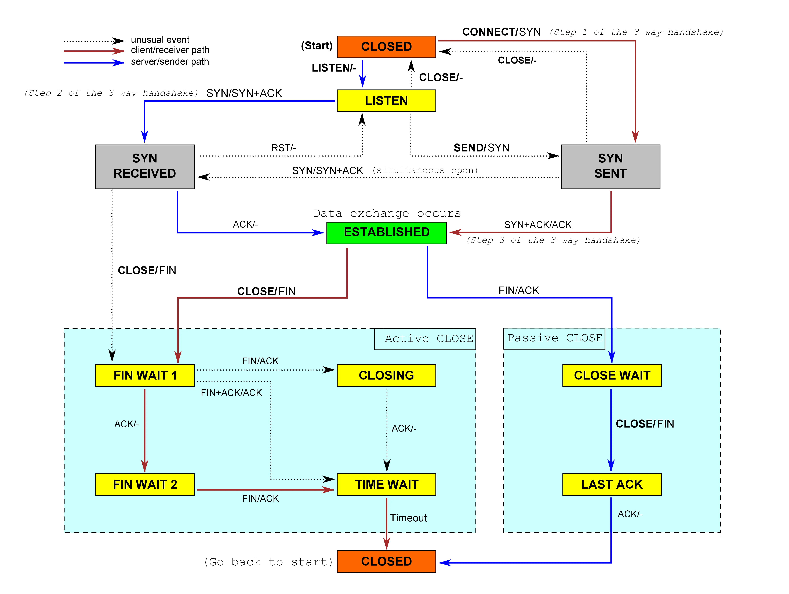

此处是cs144实验小结




## Lab3


ack传的是下一个期待发的报文段吗？还是这一个的？

seq：占 4 字节，序号范围[0，2^32-1]，序号增加到 2^32-1 后，下个序号又回到 0。TCP 是面向字节流的，通过 TCP 传送的字节流中的每个字节都按顺序编号，而报头中的序号字段值则指的是本报文段数据的第一个字节的序号。
ack：占 4 字节，期望收到对方**下个报文段的第一个数据字节的序号**。

看来我的计算机网络学的果然不好。

## 3.1 When should the TCPSender conclude that a segment was lost and send it again?

1.retransmission timeout 会改变，但是_initial_retransmission_timeout不会改变。

2.不管是第一次发还是重传段，只要length大于0，如果发送的时候timer没有跑，就启动重传计时器（第一种）。

3.当所有发出去的都被确认了，就关闭重传计时器

4.当tick被调用，并且重传计时器超时，

（a）重传最早未被确认的段，

（b）如果窗口大小非0:  （**这里要限制这个条件？**重传了以后窗口肯定不是0啊）

​		i.	_consecutive_retransmissions++,这个被用来TCPConnection判断连接是否没有希望了。

​		ii. RTO*=2

（c）启动重传计时器（第二种），这下重传时间变成RTO*2了。

5.收到ackno的时候

（a）设置RTO=initial value

（b）如果还有任何一个没被确认的数据，重启重传计时器（第三种）

（c）设置_consecutive_retransmissions=0

## 3.2 Implementing the TCP sender

1.fill_window:

从ByteStream中读取尽可能多的字节，只要里面有字节可以读，并且窗口空间允许。

调整_next_seqno。

2.ack_received:

移除ackno范围内的outstand段。

fill_window如果新的窗口出现。

如果ackno不合法就返回false。

3.tick:

时间流逝。

如果重传计时器超时的话，重传最小seqno的段。

4.send_empty_segment:

发送一个0长度的段，设置seq为_next_seqno，不需要当作outstanding，也不用被重传。一般用来当作ack。

## 3.3 FAQs and special cases

The receiver told me its window size was zero bytes. Should I just get stuck and never send any data again? 

接受方告诉发送方 window_size=0，发送方在发送的时候按1Byte发送，这叫做“0窗口探测”，以便探测接受方是否又增加了一些窗口空间。而最坏的情况也就是接受方忽略发送方的这个1Byte段，这没什么。


Bug1：ByteStream里面读取数量超过了deque里的数量，导致出错，铁背锅了。Bug2: (b) If the window size is nonzero: i. Keep track of the number of consecutive retransmissions, and increment it because you just retransmitted something. Your TCPConnection will use this information to decide if the connection is hopeless (too many consecutive retransmissions in a row) and needs to be aborted. ii. Double the value of RTO.3 这个窗口限制条件不对啊

Bug3.只剩下一个窗口的情况下，需要传输一个FIN。其实是这样的fill_window分为3个状态

_stream有byte，无eof

无byte，无eof

无byte，eof

总是从第一种状态转移到后面两个状态，所以循环条件限定在window_size存在就可以了，然后后面两种情况都要return。

```c
while( _window_size ){   
        // std::cout<<"_stream有内容，window_size = "<<_window_size<<std::endl;
        TCPSegment seg;      

        if(_stream.eof() && _fin_flag){
            // std::cout<<"已经发过eof了"<<std::endl;
            return;
        }else{
            size_t size = min(_window_size, TCPConfig::MAX_PAYLOAD_SIZE);
            string str=_stream.read(size);
            // std::cout<<"正常发"<<str<<"!"<<std::endl;

            seg.payload() = Buffer(std::move(str));

            if(seg.length_in_sequence_space() < win_size && _stream.eof()){   //捎带上eof
                seg.header().fin=true;
                _fin_flag = true;
            }
            if(seg.length_in_sequence_space()==0){
                return;
            }
            send_segment(seg);
        }
    }
```


## Lab4


The hardest part will be deciding when to fully terminate a TCPConnection and declare it no longer “active.”

两种方式来处理 连接关闭：


Option A: lingering after both streams end.

Option B: passive close.







​	

