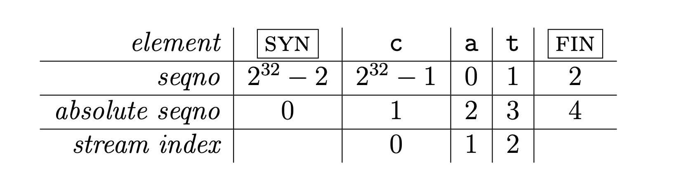
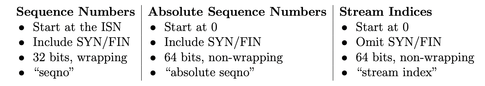
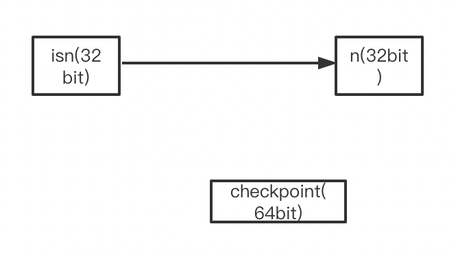
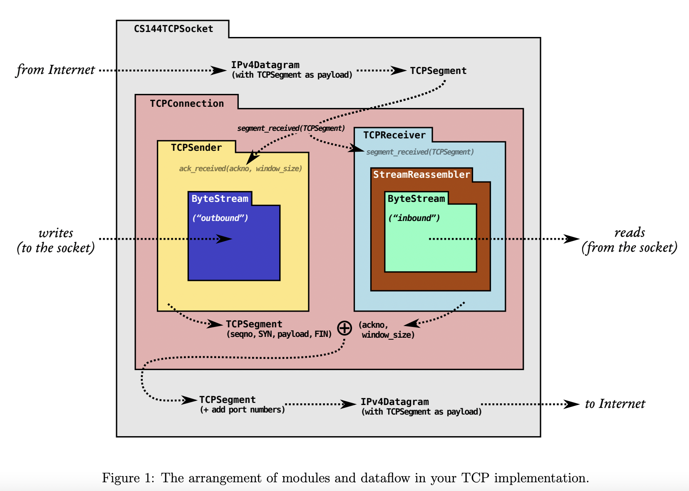
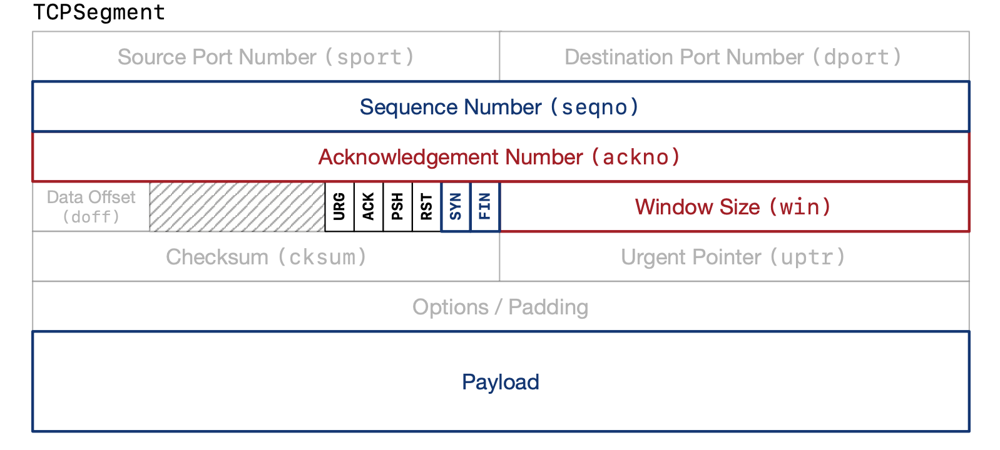
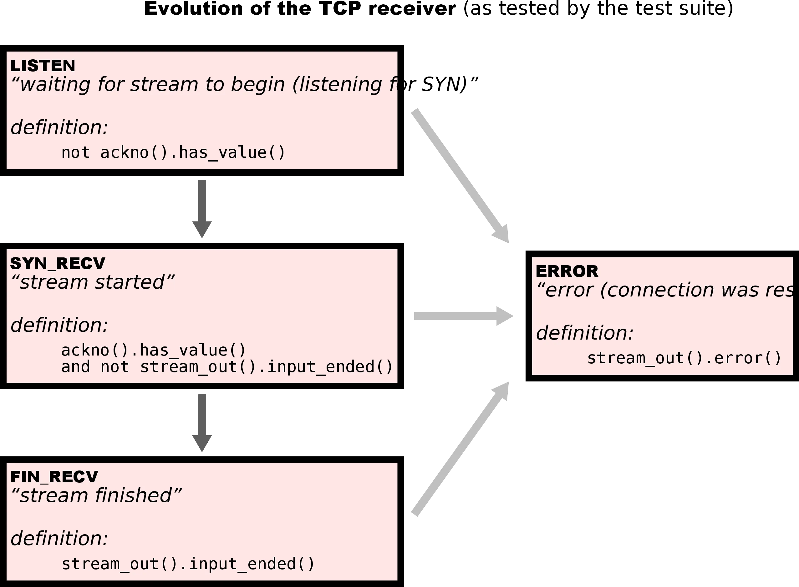
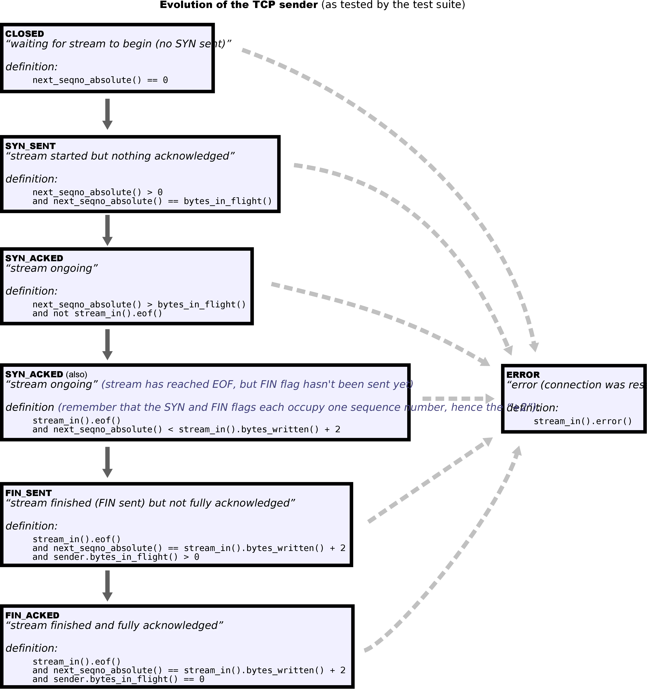
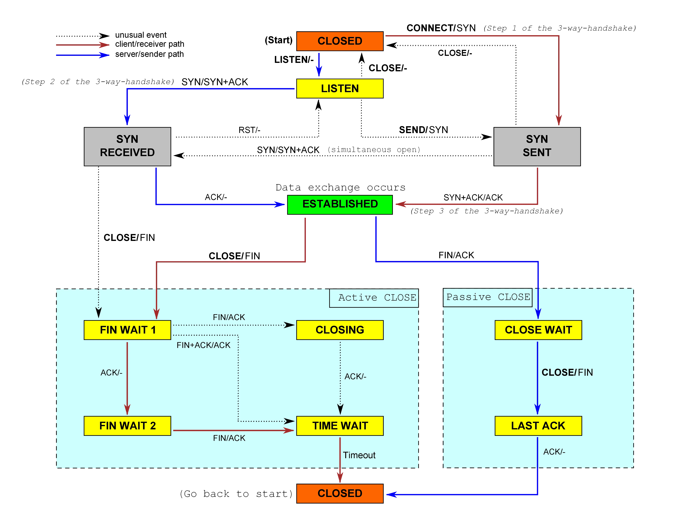
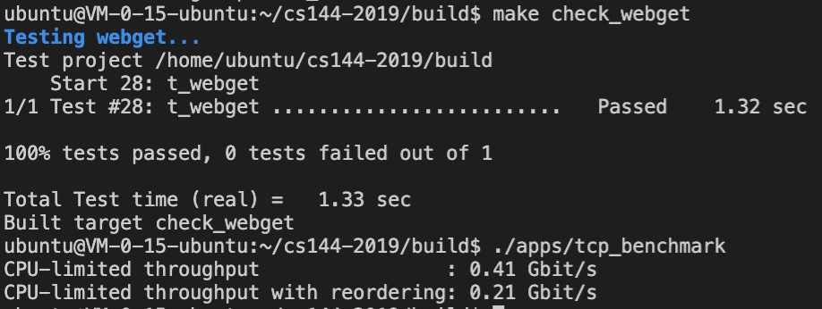

## Lab 0：networking warmup

本实验的任务：

* 获得一个Web网页并发送一条mseeage。
* 实现网络的关键抽象之一：可靠的字节流。

这两个任务都依赖于一个叫做*reliable bidirectional in-order byte stream*的网络抽象（？

经过我们 balabala的一通实验，正式开始*in-momory reliable byte stream*的实现。

Code：使用deque、pop_front()、push_back()

## Lab 1: stitching substrings into a byte stream

本实验的任务：

* 实现*stream reassembler*，缝合segments为正确顺序的连续字节流。

Code：使用set的lower_bound（比较segments的index），每次向前和向后合并，直到不能合并为止。

## Lab 2: the TCP receiver

本实验的任务：

* 实现TCP表示byte stream中每一个字节index的方式。

* 处理inbound byte-stream（使用Lab1中的成果重组这些segment）。

* TCPReceiver负责告诉sender ackno(acknowledgment)、win_size(flow control)。

### Sequence Numbers

在TCP中，每一个流中的字节index有一些特点：

1. SYN、FIN都占一个index。

2. 32位的环绕seqno。ByteStream可以是任意长度，因此wrapping是常见的。

3. 为了提高安全性和避免不同connections之间的混乱，TCP seqno不从0开始。第一个seqno是32位随机数（ISN），这也是SYN的seqno。





由此可见，abs_seq和steam index之间的转换十分方便，+-1就行。

但是和seq之间的转换就容易产生很多歧义，因为任何一个seqno都可以对应到很多abs_seq(只要低32位相同)，因此就引入了checkpoint。checkpoint就是我们知道的最近的abs_seq，在我们的实现中，使用最后一个reassembled byte的index作为checkpoint。

wrap的代码比较简单：

```c++
WrappingInt32 wrap(uint64_t n, WrappingInt32 isn) {
    DUMMY_CODE(n, isn);

    return WrappingInt32{static_cast<uint32_t>(n) + isn.raw_value()};
}
```



unwarp：按照讲义中的步骤实现就可以，注意前后取1<<32。

1. wrapping the checkpoint。

2. computing the differences between the n and the checkpoint in the wrapped space。

3. adding that difference in the unwrapped space。

4. handling an underflow (negative) result。

```c++
uint64_t unwrap(WrappingInt32 n, WrappingInt32 isn, uint64_t checkpoint) {
    DUMMY_CODE(n, isn, checkpoint);

    WrappingInt32 cp_wrap=wrap(checkpoint,isn);
    uint32_t offset=n.raw_value()-cp_wrap.raw_value();
    uint64_t tmp=checkpoint+offset;
    uint64_t ret=tmp;
    if (abs(int64_t(tmp + (1ul << 32) - checkpoint)) < abs(int64_t(tmp - checkpoint))) {
        ret = tmp + (1ul << 32);
    }
    if (tmp >= (1ul << 32) && abs(int64_t(tmp - (1ul << 32) - checkpoint)) < abs(int64_t(ret - checkpoint))) {
        ret = tmp - (1ul << 32);
    }
    return ret;
}
```

### window size

Receiver通过窗口大小来控制remote Sender的发送速率。窗口大小是[ackno,the first index that the TCPReceiver is not willing to accept），win_size就是两个边界的差值。

### Implementing the TCP receiver

Receiver的职责： (1) receive segments from its peer, (2) reassemble the ByteStream using your StreamReassembler, and calculate the (3) acknowledgment number (ackno) and (4) the window size.

#### segment received()

* Set the Initial Sequence Number if necessary.记下SYN到来时的seqno（注意这个SYN segment也可能带有payload，甚至可能带有FIN）
* Push any data, or end-of-stream marker, to the StreamReassembler.
* Determine if any part of the segment falls inside the window.

有一些特殊情况：

* If the ISN hasn’t been set yet, a segment is acceptable if (and only if) it has the SYN bit set.
* If the window has size zero, then its size should be treated as one byte for the purpose of determining the first and last byte of the window.
* If the segment’s length in sequence space is zero (e.g. just a bare acknowledgment with no payload and no SYN or FIN flag), then its size should be treated as one byte for the purpose of determining the first and last sequence number it occupies.

#### ackno()

返回Receiver还不知道的第一个字节的seqno。

#### window size()

前面提到过了。

## Lab 3: the TCP sender

Sender的职责如下：

* Keep track of the receiver’s window (processing incoming acknos and window sizes) 

* Fill the window when possible, by reading from the ByteStream, creating new TCP segments (including SYN and FIN flags if needed), and sending them 

* Keep track of which segments have been sent but not yet acknowledged by the receiver— we call these “outstanding” segments 

* Re-send outstanding segments if enough time passes since they were sent, and they haven’t been acknowledged yet

需要注意的是我们的实现中使用的是回退n帧的ARQ（automatic repeat request）协议。

### When should the TCPSender conclude that a segment was lost and send it again?

1. retransmission timeout（RTO）会改变，但是_initial_retransmission_timeout不会改变，它记录着RTO的最初值。

2. 不管是第一次发还是重传段，只要segment length大于0，如果发送的时候timer没有运行，就启动timer（第一种）。

3. 当所有outstanding都被确认了，就关闭timer。

4. tick被调用timer超时：
   - 重传最早未被确认的segment。
   - 如果window size非0:  （**这里要限制这个条件？**注意这里的window size是ACK建议的大小，ACK建议的大小经过ack_received()处理以后最小也是1）
     - _consecutive_retransmissions++，这个被用来TCPConnection判断连接是否崩溃了，重传了那么多次都没成功
     - RTO*=2。
   - 启动重传计时器（第二种），注意到这时RTO已经变为原来的两倍。

5.收到ackno的时候（ackno比以往的都大，说明remote receiver接收了新的segment）

- 设置RTO=initial value
- 如果还有任何一个outstanding segment，重启重传计时器（第三种）
- 设置_consecutive_retransmissions=0


### Implementing the TCP sender

1. fill_window()

   - 从sender的ByteStream中读取尽可能多的字节，只要里面有字节可以读，并且remain= _window_size - ( _next_seqno - _recv_ackno)>0，这里的 _window_size是remote receiver建议的，但是还需要考虑outstanding segment的存在。
   - 每次发送segment都要调整 _next_seqno，以便下次发送的时候用。

   ```c++
       while ((remain = _window_size - (_next_seqno - _recv_ackno)) > 0) {  //假设此时_stream没有eof，没有发送过fin
   
           TCPSegment seg;
           if (_stream.eof() && _fin_flag) {  //_stream eof，且发送过fin
               return;
           } else {
               size_t size = min(remain, TCPConfig::MAX_PAYLOAD_SIZE);
               string str = _stream.read(size);
               seg.payload() = Buffer(std::move(str));
   
               if (seg.length_in_sequence_space() < _window_size && _stream.eof()) {  //捎带上eof
                   seg.header().fin = true;
                   _fin_flag = true;
               }
               if (seg.length_in_sequence_space() == 0) {  //_stream暂时没有内容了，那没办法，退出
                   return;
               }
               send_segment(seg);
           }
       }
   ```

   循环条件有三个：remain还有空间、!_stream.eof、!FIN

   最终循环结束条件：

   - _stream eof + fin发送（remain够发payload+fin）

   - _stream eof （remain仅够发payload）
   - _stream里暂时没内容了(暂时没有数据发，但是还没到fin)

2. ack_received()

   - remote receiver传来ackno、window size。

   - 移除ackno范围内的outstanding segment。

   - fill_window()。

   - 如果ackno不合法（收到过大的ackno是不合法的，比如sender最大只发过abs_seq=5的segment，然后却收到了ackno=7的ack，其他全都合法）就返回false。

3. tick()

   - timer时间流逝
   - 如果timer超时，重传具有最小seqno的segment。

4. send_empty_segment()

   发送一个0长度的段，设置seq为_next_seqno，不需要当作outstanding segment，也不用被重传。一般用来当作ack。

### FAQs and special cases

- What should my TCPSender assume as the receiver’s window size before I’ve gotten an ACK from the receiver? 

  One byte.

- The receiver told me its window size was zero bytes. Should I just get stuck and never send any data again? 

  记下window size=0字节这个信息，但是当fill_window()时还是把window size当作1处理。这叫做“0窗口探测”，这是一种探测remote receiver是否开放新的窗口空间的方法，当然最差的情况也就是remote receiver忽略我们发送的1字节。

## Lab 4: the TCP connection(TCP in full)

下图是TCP的全部设计。
















处理关闭：

- 发起握手端：lingering after both streams end.

- 另一端：passive close.




吐血！！！！！！！！！下面两段代码的区别：

```c++
_sender.fill_window(send_syn || in_syn_recv());
```

```c++
if(send_syn || in_syn_recv()){
    _sender.fill_window(true);
}
```

