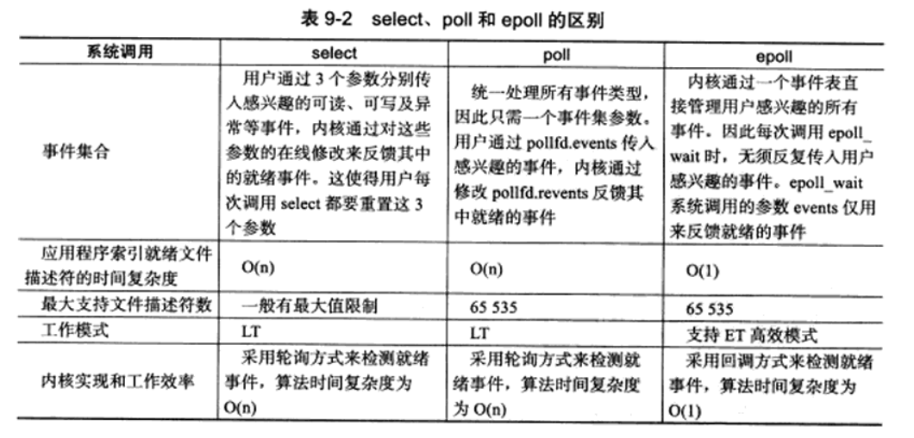

## 阻塞、非阻塞、同步、异步

[这个issue说的很明白了](https://github.com/CyC2018/CS-Notes/issues/194)

说白了异步和非阻塞的一个很大的区别就是：异步会返回一个完整的结果，如果一个调用很久很久很久才返回值x，那么异步早晚都会返回x。而非阻塞不是，非阻塞返回的可能不是x，也可能是x。

对于IO调用自身来说，都是同步的，这个是正确的，但也没有意义的。同步异步应该对应调用者来说，select、poll、epoll相对于caller来说都是同步的，而很多信号量对caller来说都是异步的。

caller 可以开启一个线程**并以某种方式调用一个阻塞函数**，如果想要caller是异步的，那么该线程必须以**同步形式(一定要注意)（保证caller异步结果是正确的）**发送信号给caller，该线程在函数完成后用信号通知caller，那这对于caller就是一个**异步调用（异步阻塞调用）**。

## IO复用之间的区别

