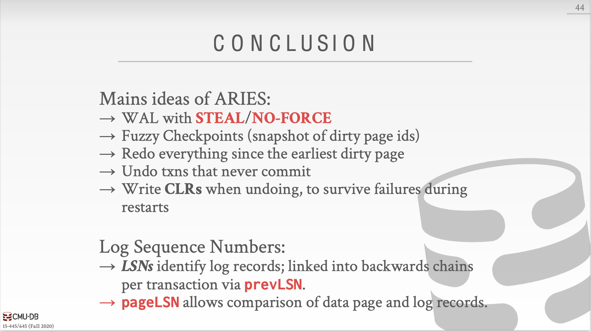

上节课我们讲了并发控制。这节课我们来讲讲logging，分为以下几点balabala。恢复算法由两部分组成：在事务运行过程中过的动作来保证DBMS从失败中恢复；出现故障以后的动作来将数据库恢复成ACID。这节课我们来讲第一种。

### Failure Classification

事务内部错误、系统错误、 存储媒介错误 

### Buffer Pool Policies

然后又提到了steal policy和force policy。分别是未提交的事务是否允许写入磁盘（对应undo）和已提交的事务是否立刻写入磁盘（对应redo）。

no-steal+force：不用undo、也不用redo，最容易实现。

### Shadow Paging

no-steal+force。

分成master和shadow，master中只有提交事务的改变，shadow中只有未提交事务的改变。事务提交时将shadow转换成master。

缺点：从master中拷贝中shadow开销太大。提交开销也很大。

然后上课时提到了SQLITE是怎么做的，其实正好相反，SQLITE会拷贝原始Page进入单独的日志文件，如果重启时需要undo就直接加载原始Page回内存，内存再写回磁盘（我们没办法直接从磁盘到磁盘）。

### Write-Ahead Log

steal（log的写入）+not force（实例的改变）

在事务提交改变以前，DBMS必须将log写回到磁盘。只有将log写回到磁盘以后，事务才可以被认为是提交了的。

group commit：一页log写满了就直接写入磁盘，再另起一页写。

### Logging Schemes

physical logging、Logical logging。就是写具体位置和写查询语句的区别。逻辑记录数据较少但是一旦有并发事务发生，recovery起来就麻烦，不知道数据库的哪一部分被改动了，恢复起来也要重新执行每一个事务。

当然一般用混合方法。

### Checkpoints

WAL会永远增长，那么进行阶段性区分呢？当log写入磁盘时加上checkout，当前checkout之前的忽略；checkout之后的commit了就redo、没有commit的就undo。

为什么log里有commit了还要redo，因为log最终没有以checkout结尾说明在log中写入commit以后，事务其实并没有真正commit（之前我们提到要先写入log，再去commit），崩溃了，所以log里最后也没有写入checkout。那么就需要redo本该commit的那一部分。

为什么log里没有commit的要undo，因为log中连commit都没有，说明事务根本没有到commit的那一步，连个意向都没有，但是log中却有actions，那这些actions必须undo。

问题：DBMS在检查快照点的时候要停止事务，不然事务又写入新的内容就混乱了。

下节课我们来讲讲Better Checkpoint Protocols、Recovery with ARIES。

上节课我们讲了在事务运行过程中的动作来保证DBMS可以从失败中恢复，这节课我们来讲讲当失败发生以后什么动作来让数据库恢复。

今天的上课内容，今天这节课看的我好懵啊。。。

### Log Sequence Numbers

### Normal Commit & Abort Operations

事务commit成功，就写TXN-END到log。

Compensation log record：说的是用于undo的动作的记录。

Abort算法

* 先写一条Abort记录
* play back in reverse order，每个更新还要写CLR，恢复旧值
* 写一条TXN-END记录

### Fuzzy Checkpointing

non-fuzzy checkpoints性能表现差

* 暂停启动任何一个新事务
* 等待知道所有活跃事务完成执行
* 刷新脏页到磁盘

ATT、DPT

在checkpoint的开始阶段记录ATT、DPT，但是这样还不是理想化状态，因为这个期间DBMS必须暂停事务。那么怎么弄？Fuzzy checkpoint就是指在系统刷脏页到磁盘的时候DBMS允许活跃事务继续跑。

checkpoint-begin：checkout的开始

checkpoint-end：包含ATT、DPT

当checkpoint成功完成时，checkpoint-begin的LSN会被写到数据库的MasterRecord。

任何在checkpoint之后启动的事务都会被ATT中去除。

### Recovery Algorithm

* 步骤1 analysis

  从上一个checkpoint-end开始读取crash时的ATT、DPT。

  如果发现TXN—END，说明commit成功或者是abort以后恢复成功，就把该事务从ATT中移除。

  对于其他records：写入ATT并且状态为undo。

  如果commit了，就改变事务状态为commit。

  对于Update records：如果P在DPT里，更新recLSN；如果不在，加入DPT。

* 步骤2 Redo

  从DPT的最小recLSN开始

  redo所有updates（包括aborted事务），redo CLR。

  从DPT中recLSN最小的log record开始：对于每一个update 或者 CLR ，redo它们，除了以下两种情况：受影响的page不在DPT中，或者在DPT中但是，record的LSN小于页的recLSN（这种情况下说明有另外一个事务把这个页写入到磁盘中了，顺带把本事务的修改写入了）。

  

  redo action：reapply logged action，set pageLSN。

  Redo完成后，写TXN-END，把事务状态变成Commit，从ATT中移除这些事务。

* 步骤3 Undo

  crash时的活跃事务中的 oldest log record，逆序。

  目标ATT中uncommit事务

analysis、redo阶段crash，就再做一遍analysis、redo就行，不用额外动作。

如何提高redo性能？假设不会crash，在后台异步刷磁盘。

如何提高undo性能？等待新事务访问某一page的时候rollback change。重写应用避免长时间运行的事务。

本节课的内容到此结束，现在你已经知道如何构建一个单节点DBMS。下一节课我们来说说分布式数据库。

