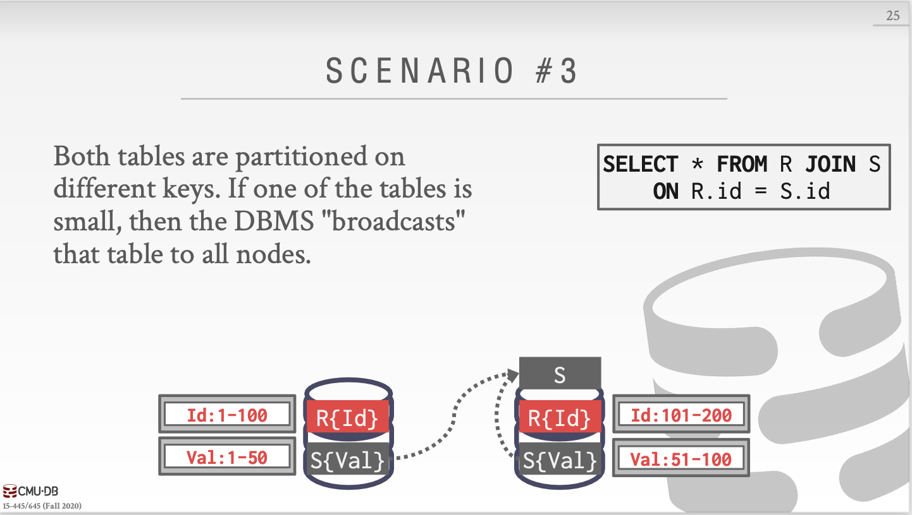
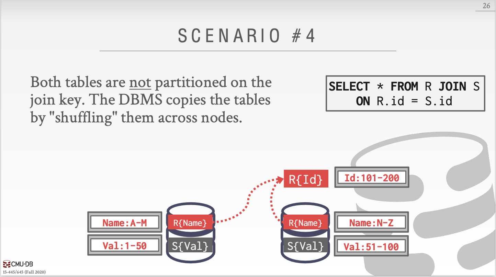
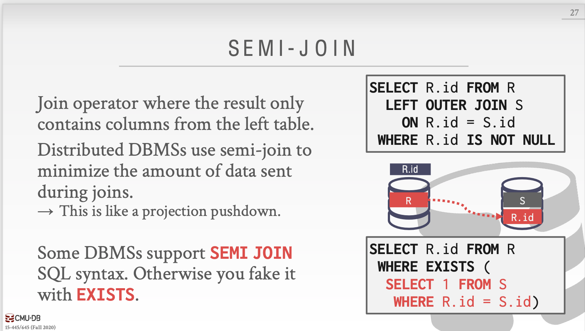

前面的所有课程都是讲的单机数据库，接下来的几节课我们来看看分布式数据库相关。用前面我们构建的单点DBMS来支持分布式环境下的事务处理和查询执行，包括：Optimization&Planning、Concurrency Control、Logging&Recovery。

今天我们的上课内容主要是以下几点

### System Architectures

DBMS的系统架构指定CPU可以直接访问哪些共享资源，一般分为以下几种系统架构：共享内存和磁盘、共享内存、共享磁盘、不共享。

#### 共享内存

#### 共享磁盘

### 不共享

TiDB出现了hhhhhTiDBnb

### Design Issues

分布式系统设计肯定有很多问题，应用如何找到数据？如何在分布式数据上执行查询？如何确保DBMS的正确性？根据每个节点执行的任务是否是相同的进行划分。

同质节点：每个集群中的节点可以执行相同的任务（尽管存在不同的数据分区），让分配和故障转移更加轻松。

异质节点：节点被分配特定的任务，允许单个物理节点承载多个具有特定任务的虚拟节点（？不懂

### Patitioning Schemes

水平分区，使用hash partitioning，range partitioning。DBMS对不共享的数据库进行物理分区，对共享磁盘的数据库进行逻辑分区。

其中有一种hash叫做consistent hashing（网络存储技术中提到过）

提到了事务的协调，centralized coordinator（2PC），decentralized coordinator（主从）。

### Distributed Concurrency Control

下节课我们来说说分布式OLTP系统、复制、CAP原理以及真实世界的例子。

上节课我们说了系统架构，Partitioning/Sharding（Hash，Range，Round Robin），事务协调（Centralized vs Decentralized）

上节课我们讲了系统架构、分区与共享以及事务协同，这节课来讲讲分布式oltp。

OLTP：短时间的读写事务、数据量小、重复操作。

OLAP：长时间只读事务、复杂join、查询比较新。

然后突然跳到分布式的coordinator。我们首先要做一个假设：分布式数据库里的所有节点都能听话并做事：如果我们告诉一个节点需要提交一个事务，那么它一定会提交这个事务。

但是如果你不相信分布式DBMS的其他接待你，那么这就是一个拜占庭容错问题。

### Atomic Commit Protocols

当一个涉及到多节点的事务完成时，DBSMS会询问所有涉及到的节点是否可以commit。

* 2PC

  Prepare+commit

  优化方法

  * 在给最后一个节点发送query时，该节点直接返回prepare阶段的投票结果，还有查询结果。
  * 所有节点同意commit后，coordinator直接告诉client事务成功提交了。

* 3PC（not used）

* Paxos

* Raft

* ZAB（Apache Zookeeper）

* Viewstamped Replication

  

### Replication

DBMS通过在多余节点中复制数据来增强可用性

* 副本配置

  * Primary
    * 只在Primary更新
    * Primary传播更新不通过atomic commit protocol
    * 只读事务被允许访问replicas，带有写的事务不能够访问replicas
    * 如果Primary不行了，就从replicas中选举出一个primary
  * Multi-Primary
    * 事务可以在任意replica上更新
    * replica**必须**用atomic commit protocol和其他replicas同步

  K-safety：达到容错能力的每份数据的副本数量，当任何一个副本数量低于K，DBMS停止运行并下线。

* 传播方式

  当一个事务提交的时候，DBMS决定在向应用返回ack前是否等待事务的改变传播到其他节点。

  传播等级有

  * 同步（强一致性）

    primary发送更新到replicas并且等待它们写入磁盘后发来的ack，然后primary再发送ack到client。

  * 异步（最终一致性）

    primary发送更新到replicas以后直接返回ack到client，不再等待replicas写入磁盘。

* 传播时机

  * Continuous

    DBMS一产生记录就发送。

    也需要发送commit/abort记录。

  * On Commit

    只在事务commit时向replicas发送记录。

    不在aborted事务上浪费事件发送记录。

    假设一个事务的记录可以完整的放在内存中（就是先把记录们都存在内存中，等到commit时一股脑发送给replicas）。

* 更新方法

  * active-active

    一个事务在每一个replica独立运行。

    需要在事务完成后检测是否每一个replica都有相同的结果。

  * active-passive

    一个事务在master运行，然后将改变传播到其他replica。

### Consistency Issues（CAP）

对于分布式系统来说，下面三个条件只能保持两个成立。

* 一致性

  线性一致性。

* 总是可用

  所有节点满足所有请求。

* 网络分区容错

  网络分区以后，网络再恢复，保持一致性。

DBMS如何应对错误取决于它支持CAP理论的哪两个。

传统/NewSQL DBMS：在大部分节点重联之前不允许更新操作。

NoSQL DBMS：在节点重联后提供解决冲突的机制。

在上面的讨论中我们都是在假设分布式系统中的各个节点运行的是相同的DBMS软件，但是各个组织经常在它们的应用上跑不同的DBMS。所以如果我们可以为数据提供一个单独的接口就舒服了。

### Federated Databases

提到了PostgreSQL适合做联合数据库，因为它提供了外部数据包装器。

### Conclusion

我们假设分布式DBMS中的节点都是友好的。

区块链数据库假设节点都是对抗性的（？，这意味着你必须使用不同协议来提交事务。

下一节课我们来说说分布式OLAP系统。

* Star Schema
* Snowflake Schema

Issue #1:规范化

雪花模型占据较少存储空间。

非规范化数据模型可能导致违反完整性和一致性。

Issue #2:查询复杂度

为了得到查询所需要的数据，雪花模型需要更多的join。

星型模型上的查询一般来说会更快。

今天上课的内容有：Execution Models、Query Planning、Distributed Join Algorithms、Cloud Systems。

### Execution Models

#### Push vs Pull

* Push Query to Data

  将查询或者查询的一部分发送到数据在的那个节点。

  在通过网络传输之前尽量做好过滤和处理。

  比较适合share-nothing system。

* Pull Data to Query

  将数据带到正在执行查询的节点上。

#### Observation

从远程节点传过来的数据被缓存在buffer pool中，这使得DBMS支持远大于内存容量的中间结果。暂时性的页在重启之后不会保留。

那么如果长时间运行的OLAP查询在执行的时候一个节点崩溃了怎么办？

#### Query Fault Tolerance

绝大部分不共享的分布式OLAP DBMSs都被设计成假设节点在查询执行中不会失败，因此如果一个节点失败了，整个查询都会失败。（因为没有容错能力）

DBMS会对查询的中间结果建立快照，来让失败的节点恢复。

### Query Planning

以前我们讨论过的所有优化都可以在分布式环境下使用。

* 谓词下沉
* 先做投影
* 优化Join顺序

#### Query Plan Fragments

* Physical Operators

  在base node上生成一个查询计划，并分发到其他节点上，告诉这些节点应该怎么怎么做。

  大部分系统使用这个方法。

  缺点是其他节点不能做局部（相对于它们自己）优化

* SQL

  将原始查询重写成几段。

  允许每一个节点的局部优化。

  很少有系统这么做。

#### observation

分布式join的效率取决于数据库表的分区模式。

### Distributed Join Algorithms

这个没啥说的。

这个也没啥说的。

这个也没啥说的，因为S选的键和join key不相关，把它当作scenario #1处理即可。

这个是最差的，等于什么都没做，原始的R和S。

#### semi-join

来看这张图，如果没有semi-join的话，我们怎么做呢？要么就是把S整个拷贝过来，要么就是把R整个拷贝过去。

那么现在查询符合semi-join的条件，即join结果只包含outer table，我们只需要把join结果的那个key所在的column拷贝过去即可，即拷贝R.id这一列过去。

### cloud systems

供应商们提供数据库服务来帮助客户管理DBMS环境（？新的系统在shared-nothing和shared-disk之间开始变得模糊。

* Managed DBMSs
  * 对于DBMS来说是透明的，DBMS不知道自己跑在云环境上。
  * 绝大部分供应商这么做
* Cloud-Native DBMS
  * DBMS被设计成跑在云环境上。
  * 一般基于shared-disk架构

一个serverless DBMS不会为每个客户保持资源，当客户闲置时，DBMS就会“偷取”资源。

#### universal formats

绝大部分DBMS都有专用的磁盘二进制格式，就像我们的BusTub页类型。

在系统之间共享数据唯一的办法就是将数据转换成基于文本的格式：CSV、JSON、XML。

现在有新的开源二进制格式来让系统之间访问数据变得更简单。 

下一节课是Snowflake的客座演讲，那么这里就先跳过了。

## potpourri

这节课就是每年讲几个排名靠前的数据库。这我就不看了。

# Andy的结束语

数据库很美妙。

* 他们涵盖了计算机科学的所有方面。
* 我们只是挖掘了很少的一部分。

不断前进，你就会对这些系统如何工作有一个更好的理解。

下面这一点会帮助你在整个职业生涯中作出明智的决定。

* 避免过早优化。

