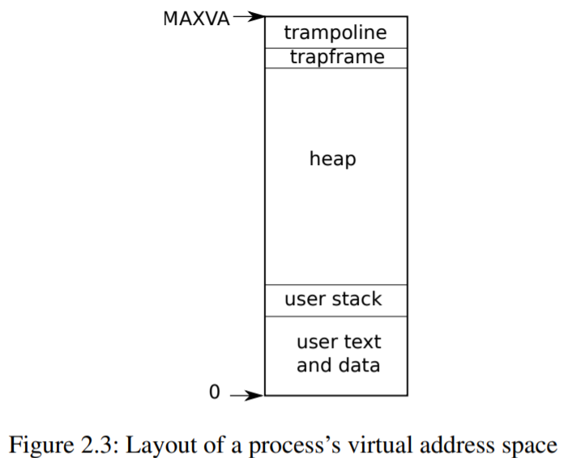
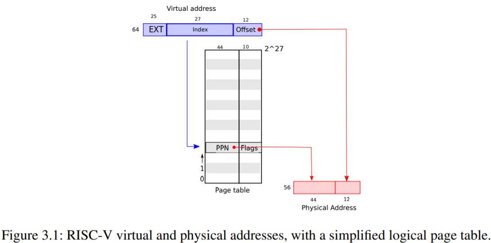
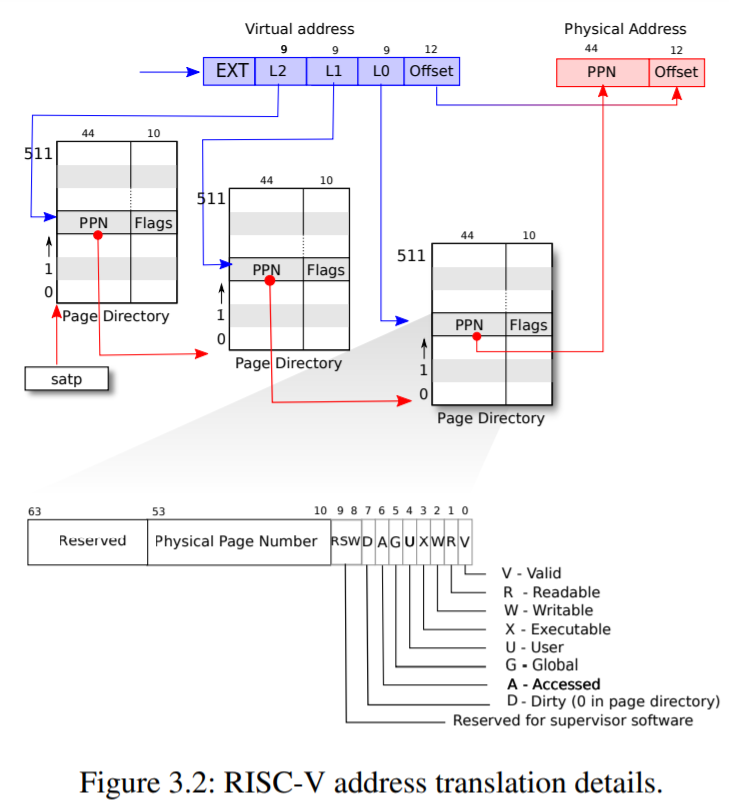
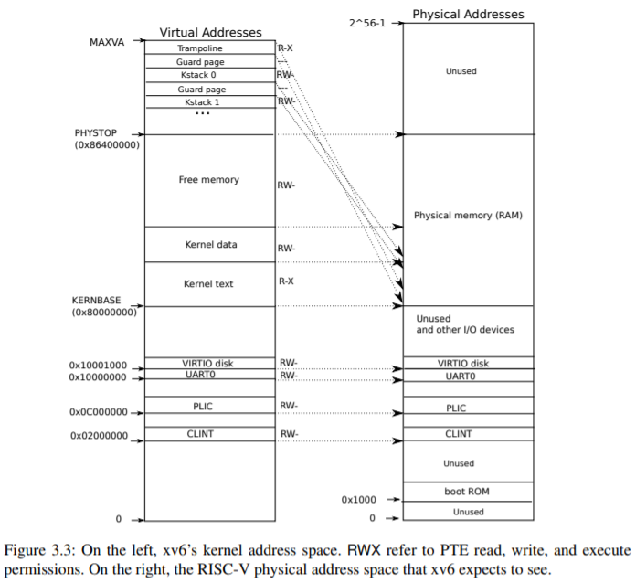
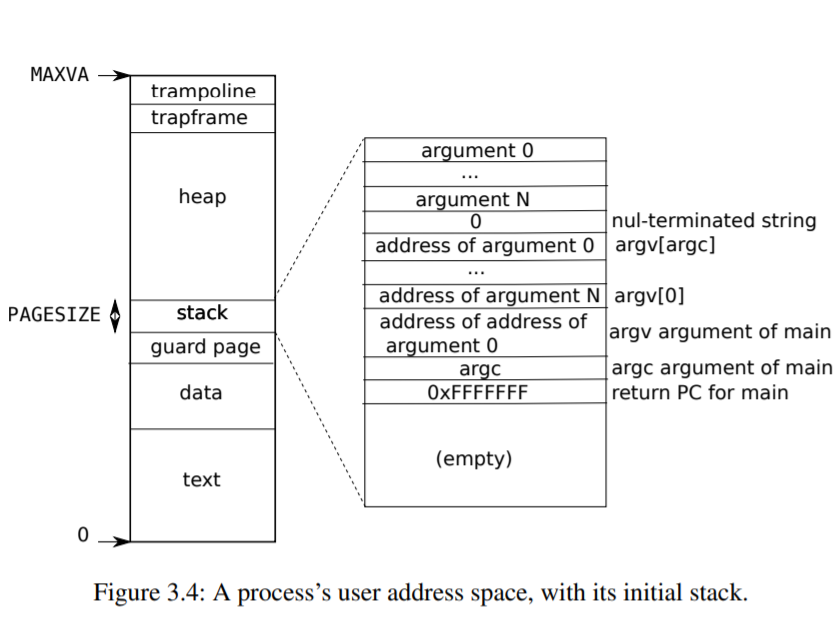

做每一部分的实验之前需要把makefile中的CC = $(TOOLPREFIX)gcc修改成CC = $(TOOLPREFIX)gcc-8。

trap以前的实验没有做answers，需要补齐。

## Lab:Xv6 and Unix utilities

### sleep

kernel/sysproc.c中实现了sleep的系统调用，user/user.h是sleep的用户程序调用，user/usys.S用于将用户代码跳转到内核代码。

### pingpong

管道是阻塞的。

### primes

管道的由来。

 processes communicate by sending or receiving values from named unbuffered channels. Since the channels are unbuffered, the send operation blocks until the value has been transferred to a receiver, thus providing a mechanism for synchronization. 

### find

复用了一部分ls命令。

### xargs

前面写的find有亿点问题，没有输出到标准输出（1），导致管道无法将find的标准输出（1）转换为标准输入（0）。

## Lab: page tables

### print a page table

### a kernel page table per process

[hints from piazza](https://piazza.com/class/kgkxf1hjf3kw7?cid=9)

第一级和第二级页表中pte的标志为是只设valid位，而RWX都是0，只有第三级页表会置这些标志位 

```c
  // map kernel text executable and read-only.
  ukvmmap(kpagetable,KERNBASE, KERNBASE, (uint64)etext-KERNBASE, PTE_R | PTE_X);
  // map kernel data and the physical RAM we'll make use of.
  ukvmmap(kpagetable,(uint64)etext, (uint64)etext, PHYSTOP-(uint64)etext, PTE_R | PTE_W);
  // map the trampoline for trap entry/exit to
  // the highest virtual address in the kernel.
  ukvmmap(kpagetable,TRAMPOLINE, (uint64)trampoline, PGSIZE, PTE_R | PTE_X);
```

这些代码触发了下面的remap				

```c
int
mappages(pagetable_t pagetable, uint64 va, uint64 size, uint64 pa, int perm)
{
  uint64 a, last;
  pte_t *pte;

  a = PGROUNDDOWN(va);
  last = PGROUNDDOWN(va + size - 1);
  for(;;){
    if((pte = walk(pagetable, a, 1)) == 0)
      return -1;
    if(*pte & PTE_V)
      panic("remap");
    *pte = PA2PTE(pa) | perm | PTE_V;
    if(a == last)
      break;
    a += PGSIZE;
    pa += PGSIZE;
  }
  return 0;
}
```

###  Simplify

发生系统调用时，内核想要访问用户空间的指针时，需要借助user page table进行一次转换，我们的任务就是将user mappings 加入到 process's kernel page table 中。user process 地址从0开始，小于PLIC（0xC000000）。

目前进程有两张表，一个process’s kernel pagetable，一个process’s pagetable。我们只把process’s pagetable中低于PLIC的地址在process’s kernel pagetable中做了映射。 

## Lab: traps

### RISC-V assembly

1. Which registers contain arguments to functions? For example, which register holds 13 in main's call to `printf`? 

   a0-a7。a2。

2. Where is the call to function `f` in the assembly code for main? Where is the call to `g`? (Hint: the compiler may inline functions.) 

   没有看到f函数调用，编译器优化了。汇编代码中甚至连+3都忽略了，放在了函数体的外面。

3. At what address is the function `printf` located? 

   代码中写着是0x64a。至于怎么得来的，0x64a=1562+0x30，这个就不深究了，就是各种相对地址加减。

   ```assembly
     30:	00000097          	auipc	ra,0x0
     34:	61a080e7          	jalr	1562(ra) # 64a <printf>
   ```

4. What value is in the register `ra` just after the `jalr` to `printf` in `main`? 

   返回地址0x38。

5. 大端：数据的高字节保存在内存的低地址中。而RISC-V是小端。

   我发现自己对C语言的认知还停留在入门阶段。57616=0xe110，但是这个打印的是%x，并不涉及到内存地址的高低。而字符串不同，字符串是从给定地址开始，直到碰到‘\0’为止，涉及到内存地址的高低。

   ```c
   	unsigned int i = 0x00646c72;
   	printf("H%x Wo%s", 57616, &i);
   ```

   HE110 World

   如果RISC-V使用的大端法，i应该设置成0x726c6400，不用。

6. 取决于a2寄存器的值（第三个参数）

### Backtrace

### Alarm

1.请问 alarm实验中 为什么要在if(which_dev == 2)中添加保存trapframe的代码？trampoline.S 中的uservec和userret已经有保存trapframe和恢复trapframe的代码了 ？

 当用户进入内核时会将当前程序计数器PC存到spec里，然后从内核返回的时候再load进来，这时如果我们将spec（程序里是trapframe->epc）换成我们获取的自定义函数的地址，然后就会返回时进入自定义函数的地址（ The sret (return from trap) instruction copies sepc to the pc. The kernel can write to sepc to control where sret goes. ），然后为了调用函数完成之后返回正确的地址，则需要在sys_sigreturn里重新将trapframe->epc的值给赋值成原来的，所以需要存下历史trapframe->epc的值，与此同时，不光是epc会因为时钟中断而丢失，其他寄存器值也需要保存，故proc.h里的struct proc需要添加历史寄存器属性。

- Caller Saved寄存器在函数调用的时候不会保存
- Callee Saved寄存器在函数调用的时候会保存

结合piazza上的问题来看，trap中sret返回是看epc，handler中返回是看ra。

## Labs：lazy page allocation

## Labs：Copy-on-Write Fork for xv6


## xv6-book



xv6的进程地址空间是有限制的：RISC-V的指针是64位的；但是硬件只使用低39位；xv6只使用低39位中的低38位。因此xv6中的最大地址空间是2^38 -1。

每一个进程有两个栈：用户栈和内核栈。当用户进入内核时（系统调用或者中断），内核代码在进程的内核栈上执行。

### 2.6  Code: starting xv6 and the first process  

RISC-V计算机开机，在ROM中跑boot loader，boot loader将xv6内核加载到内存中。在机器模式下，CPU在`_entry`开始执行xv6内核。一开始RISC-V的分页硬件是关闭的：此时虚拟地址直接映射到物理地址。

boot loader将xv6内核加载到内存物理地址为 0x80000000的地方（因为0x0: 0x80000000被I/O设备占用了）。

```c
// entry.S needs one stack per CPU.
__attribute__ ((aligned (16))) char stack0[4096 * NCPU];
```

在`_entry`的指令设置了一个栈（给每一个CPU都分配了一个初始的stack0）因此xv6才可以运行C语言代码。这个栈是stack0，在文件start.c中。`_entry`中的代码将寄存器sp加载在stack0+4096，因为RISC-V中的栈是向下生长的。现在内核已经有一个栈了，`_entry`就可以在start处进入C语言代码了。

函数`start`执行了一些只能在机器模式下的配置以后就切换到特权模式。为了进入特权模式，RISC-V提供了`mret`，虽然这条指令原先都是从特权模式返回到机器模式的，但是在这里正好相反，我们在mstatus寄存器中写入特权模式，在mepc寄存器中写入`main`地址，禁止虚拟地址转换，将所有的中断和异常委派给特权模式。start还开了时钟中断，然后start就通过mret“返回”到特权模式了，program counter register指向`main`函数。

`main`初始化一些设备以及子系统后，调用`userinit`创建了第一个进程。第一个进程执行了一段小程序initcode.S，initcode.S通过调用`exec`再次进入内核，`exec`会用一个新程序（init.c）替换当前进程中的内存和寄存器。内核一旦完成`exec`系统调用，就会返回init进程的用户空间。init.c创建了一个新的控制设备文件，并开始一个shell。整个系统启动完成。

### 3.1  Paging hardware 





虚拟地址的高25位目前是没有被使用的，而PTE中高10位也是没有被使用的，所以RISC-V在未来还可能利用这些位来做更多事。

虚拟地址的Index是27位？3级页表，每一级都是9位。当然PPN都是物理地址，否则就陷入虚拟地址的无限转换了。

每个CPU都有一个页表寄存器，所以每个CPU都能运行不同的进程，每个CPU都有自己的页表和由页表描述的私有地址空间。

### 3.2  Kernel address space 

QEMU将物理地址低于0x80000000的memory-mapped控制寄存器作为设备接口暴露给软件，这样内核就能通过读写这些特殊物理地址来和设备进行交互，`reads`和`writes`就会和设备硬件进行交互，而不是和RAM。



有些内核虚拟地址也是Direct mapping，有些则不是：

* trampoline page被映射了两次，一次被映射到虚拟地址的顶端，一次是direct mapping。
* kernel stack pages。其下有没有被映射的guard page，这样可以在内核栈溢出的时候给出提醒。这个也有direct mapping。但是如果你使用的是direct mapping，就失去了guard page的保护。

### 3.3  Code: creating an address space 



main先用kvminit创建内核页表，这时还没有开启分页模式，因此所有地址都是直接映射的。main马上调用kvminithart来开启分页模式，在这以后CPU会用内核页表来转换地址。

### 3.4  Physical memory allocation 

### 3.5  Code: Physical memory allocator 

可用于分配的物理内存页形成的数据结构是链表，这段空间是内核数据后的首地址end到PHYSTOP。链表也是存在这一空间内，因为此时这些空间没有存储其它数据。

### 3.6  Process address space 

用户栈也有一个guard page。

### 3.7  Code: sbrk 

xv6使用进程页表不只是为了告诉硬件如何映射虚拟地址，也是对分配给进程的物理内存页的唯一记录，这样在释放用户内存时就可以检查用户页表了。

### 3.8  Code: exec 

### 3.9  Real world 

xv6没有实现kernel allocator（像malloc）。

### 4.1  RISC-V trap machinery 

三种可以让CPU搁置当前执行的指令的事件：

* 系统调用，ecall
* exception
* device interrupt

xv6采用4个阶段来处理异常：

* hardware actions taken by the RISC-V CPU 
* an assembly “vector” that prepares the way for kernel C code 
* a C trap handler that decides what to do with the trap 
* the system call or device-driver service routine

虽然内核可以用单独的代码路径来处理三类trap，但是使用不同的汇编向量来处理三种不同情况（来自用户空间、内核空间、时间中断的trap）是十分方便的。

**注意**此时：

1.CPU没有切换到kernel page table

2.CPU没有切换到内核栈

3.CPU没有保存任何寄存器（除了pc）

那么这些都需要内核来完成（硬件不做，就软件来做呗）。 那么既然CPU已经有这么多没做的任务，为什么CPU还要去切换pc呢，干脆连pc都不切换它不香么？答：如果不切换pc就进入特权级的话，用户指令会破坏用户/内核隔离，例如有一个用户指令就是修改satp寄存器，使其指向一个页表，该页表中的entry访问权限是不对的，那么就很容易出问题。

### 4.2  Traps from user space 

从高层角度来看trap处理的路径是`uservec` (kernel/trampoline.S:16), then `usertrap` (kernel/trap.c:37); and when returning, `usertrapret` (kernel/trap.c:90) and then `userret` (kernel/trampoline.S:16). 

从用户代码产生的异常具有挑战性，因为`satp`指向不映射内核的`user page table`，并且栈指针可能包含无效甚至恶意的值。

因为RISC-V硬件在trap时不切换页表，因此user page table必须包含对uservec的映射，uservec必须切换satp使其指向kernel page table；为了继续执行切换后的指令，uservec在kernel page table中被映射的地址必须和user page table中相同。

xv6通过一个包含uservec的trampoline page来满足上一段的限制。xv6在kernel page table和每一个user page table中将trampoline page映射到相同的虚拟地址。这个虚拟地址就是TRAMPOLINE。在trampoline.S中设置trampoline的内容，并且（当执行用户代码时）stvec被设置成uservec。

在进入用户空间前，内核将sscratch设置成指向每一个进程的trapframe（用来保存全部的用户寄存器），因为这时satp仍然指向user page table，uservec需要trapframe被映射到用户地址空间。

uservec的下一个任务是保存user registers。

### 4.3  Code: Calling system calls 

系统调用也是通过trap来完成的。

### 4.4 Code: System call arguments 

在process中保存trap frame，后续可以使用参数。然后就是kernel如何使用用户地址空间的指针。

### 4.5 Traps from kernel space

根据运行代码是用户还是内核的不同，xv6配置CPU trap寄存器的方式也不同。但是总体上和usertrap是差不多的。

### 4.6  Page-fault exceptions 

* copy on write

  fork（）就是拷贝父进程的页表和物理内存到子进程。那么实现COW的基本方案是最开始父子进程共享所有物理页，并且将这些页都映射成只读。当某些页page fault时再复制该页，并将父子进程中对应该虚拟地址的页都设置成read/write。更新完父子进程的页表以后，内核重新启动出错的进程，这下就不会出错了。

* lazy allocation

  1. 当应用调用sbrk，内核grows地址空间（注意，不是分配地址空间），但是在页表中标记新的地址空间invalid。
  2. 当出现新地址的page fault时，内核分配物理内存并且映射到页表中。		

  这样内核就只会在应用实际使用内存时才会分配。

* paging from disk 

  但内存不够时，内核可以牺牲某些页，将这些页写入磁盘并且标记PTE为invalid。

另外一些结合分页和page-fault异常的特性：

* automatically extending stacks  

  参考Linux栈的自动增长。

* memory-mapped files 

  mmap

### 4.7  Real world 

所以进程的kernel page table 拥有user page table相同的映射十分重要，这么做就可以在trap时免去页表的切换，kernel就可以直接使用user的指针。