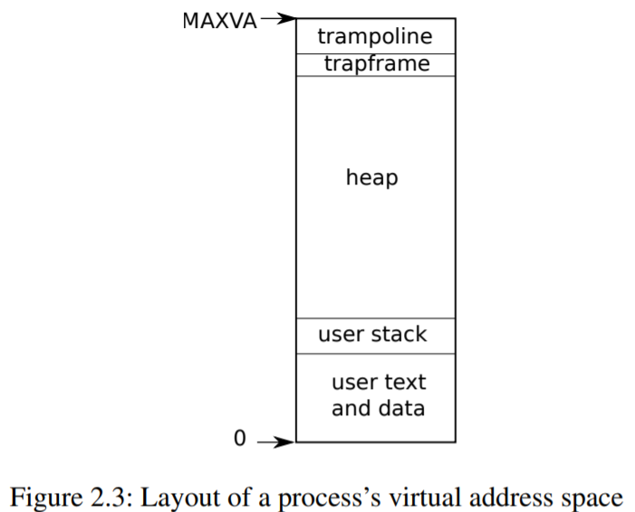

---

layout: post
title: 6.S081小结
tags: [operating system]
---

做每一部分的实验之前需要把makefile中的CC = $(TOOLPREFIX)gcc修改成CC = $(TOOLPREFIX)gcc-8。

trap以前的实验没有做answers，需要补齐。

## Lab:Xv6 and Unix utilities

### sleep

kernel/sysproc.c中实现了sleep的系统调用，user/user.h是sleep的用户程序调用，user/usys.S用于将用户代码跳转到内核代码。

### pingpong

管道是阻塞的。

### primes

管道的由来。

 processes communicate by sending or receiving values from named unbuffered channels. Since the channels are unbuffered, the send operation blocks until the value has been transferred to a receiver, thus providing a mechanism for synchronization. 

### find

复用了一部分ls命令。

### xargs

前面写的find有亿点问题，没有输出到标准输出（1），导致管道无法将find的标准输出（1）转换为标准输入（0）。

## Lab: page tables

### print a page table

### a kernel page table per process

[hints from piazza](https://piazza.com/class/kgkxf1hjf3kw7?cid=9)

第一级和第二级页表中pte的标志为是只设valid位，而RWX都是0，只有第三级页表会置这些标志位 

```c
  // map kernel text executable and read-only.
  ukvmmap(kpagetable,KERNBASE, KERNBASE, (uint64)etext-KERNBASE, PTE_R | PTE_X);
  // map kernel data and the physical RAM we'll make use of.
  ukvmmap(kpagetable,(uint64)etext, (uint64)etext, PHYSTOP-(uint64)etext, PTE_R | PTE_W);
  // map the trampoline for trap entry/exit to
  // the highest virtual address in the kernel.
  ukvmmap(kpagetable,TRAMPOLINE, (uint64)trampoline, PGSIZE, PTE_R | PTE_X);
```

这些代码触发了下面的remap				

```c
int
mappages(pagetable_t pagetable, uint64 va, uint64 size, uint64 pa, int perm)
{
  uint64 a, last;
  pte_t *pte;

  a = PGROUNDDOWN(va);
  last = PGROUNDDOWN(va + size - 1);
  for(;;){
    if((pte = walk(pagetable, a, 1)) == 0)
      return -1;
    if(*pte & PTE_V)
      panic("remap");
    *pte = PA2PTE(pa) | perm | PTE_V;
    if(a == last)
      break;
    a += PGSIZE;
    pa += PGSIZE;
  }
  return 0;
}
```

###  Simplify

发生系统调用时，内核想要访问用户空间的指针时，需要借助user page table进行一次转换，我们的任务就是将user mappings 加入到 process's kernel page table 中。user process 地址从0开始，小于PLIC（0xC000000）。

目前进程有两张表，一个process’s kernel pagetable，一个process’s pagetable。我们只把process’s pagetable中低于PLIC的地址在process’s kernel pagetable中做了映射。 

## Lab: traps

### RISC-V assembly

1. Which registers contain arguments to functions? For example, which register holds 13 in main's call to `printf`? 

   a0-a7。a2。

2. Where is the call to function `f` in the assembly code for main? Where is the call to `g`? (Hint: the compiler may inline functions.) 

   没有看到f函数调用，编译器优化了。汇编代码中甚至连+3都忽略了，放在了函数体的外面。

3. At what address is the function `printf` located? 

   代码中写着是0x64a。至于怎么得来的，0x64a=1562+0x30，这个就不深究了，就是各种相对地址加减。

   ```assembly
     30:	00000097          	auipc	ra,0x0
     34:	61a080e7          	jalr	1562(ra) # 64a <printf>
   ```

4. What value is in the register `ra` just after the `jalr` to `printf` in `main`? 

   返回地址0x38。

5. 大端：数据的高字节保存在内存的低地址中。而RISC-V是小端。

   我发现自己对C语言的认知还停留在入门阶段。57616=0xe110，但是这个打印的是%x，并不涉及到内存地址的高低。而字符串不同，字符串是从给定地址开始，直到碰到‘\0’为止，涉及到内存地址的高低。

   ```c
   	unsigned int i = 0x00646c72;
   	printf("H%x Wo%s", 57616, &i);
   ```

   HE110 World

   如果RISC-V使用的大端法，i应该设置成0x726c6400，不用。

6. 取决于a2寄存器的值（第三个参数）

### Backtrace

### Alarm

1.请问 alarm实验中 为什么要在if(which_dev == 2)中添加保存trapframe的代码？trampoline.S 中的uservec和userret已经有保存trapframe和恢复trapframe的代码了 ？

 当用户进入内核时会将当前程序计数器PC存到spec里，然后从内核返回的时候再load进来，这时如果我们将spec（程序里是trapframe->epc）换成我们获取的自定义函数的地址，然后就会返回时进入自定义函数的地址（ The sret (return from trap) instruction copies sepc to the pc. The kernel can write to sepc to control where sret goes. ），然后为了调用函数完成之后返回正确的地址，则需要在sys_sigreturn里重新将trapframe->epc的值给赋值成原来的，所以需要存下历史trapframe->epc的值，与此同时，不光是epc会因为时钟中断而丢失，其他寄存器值也需要保存，故proc.h里的struct proc需要添加历史寄存器属性。

- Caller Saved寄存器在函数调用的时候不会保存，caller saved寄存器调用者需要管。
- Callee Saved寄存器在函数调用的时候会保存，callee saved寄存器调用者不用管。

结合piazza上的问题来看，trap中sret返回是看epc，handler中返回是看ra。

## Labs：lazy page allocation

这个实验要好好总结。

## Labs：Copy-on-Write Fork for xv6

这个实验要好好总结。

## Labs：Multithreading

 Why are there missing keys with 2 threads, but not with 1 thread? Identify a sequence of events with 2 threads that can lead to a key being missing. Submit your sequence with a short explanation in answers-thread.txt 

当两个线程对同一个bucket进行插入时，造成key丢失。

Using threads这个部分的测试是有问题的，并没有检验put的正确性，即使我们将只锁住insert函数也可以通过测试，但这显然是不对的，因为e->value=value并不是原子的，需要把它也锁起来。

### Barrier

我还是第一次听说这个，很不错。

## Lab：Locks

### memory allocator

每个CPU来一个freelist，没了就偷别的CPU的freelist。

### buffer cache

hashtable。也是偷buffer。

## Lab: file system

### Large files

### Symbolic links


## xv6-book



xv6的进程地址空间是有限制的：RISC-V的指针是64位的；但是硬件只使用低39位；xv6只使用低39位中的低38位。因此xv6中的最大地址空间是2^38 -1。

每一个进程有两个栈：用户栈和内核栈。当用户进入内核时（系统调用或者中断），内核代码在进程的内核栈上执行。

### 2.6  Code: starting xv6 and the first process  

RISC-V计算机开机，在ROM中跑boot loader，boot loader将xv6内核加载到内存中。在机器模式下，CPU在`_entry`开始执行xv6内核。一开始RISC-V的分页硬件是关闭的：此时虚拟地址直接映射到物理地址。

boot loader将xv6内核加载到内存物理地址为 0x80000000的地方（因为0x0: 0x80000000被I/O设备占用了）。

```c
// entry.S needs one stack per CPU.
__attribute__ ((aligned (16))) char stack0[4096 * NCPU];
```

在`_entry`的指令设置了一个栈（给每一个CPU都分配了一个初始的stack0）因此xv6才可以运行C语言代码。这个栈是stack0，在文件start.c中。`_entry`中的代码将寄存器sp加载在stack0+4096，因为RISC-V中的栈是向下生长的。现在内核已经有一个栈了，`_entry`就可以在start处进入C语言代码了。

函数`start`执行了一些只能在机器模式下的配置以后就切换到特权模式。为了进入特权模式，RISC-V提供了`mret`，虽然这条指令原先都是从特权模式返回到机器模式的，但是在这里正好相反，我们在mstatus寄存器中写入特权模式，在mepc寄存器中写入`main`地址，禁止虚拟地址转换，将所有的中断和异常委派给特权模式。start还开了时钟中断，然后start就通过mret“返回”到特权模式了，program counter register指向`main`函数。

`main`初始化一些设备以及子系统后，调用`userinit`创建了第一个进程。第一个进程执行了一段小程序initcode.S，initcode.S通过调用`exec`再次进入内核，`exec`会用一个新程序（init.c）替换当前进程中的内存和寄存器。内核一旦完成`exec`系统调用，就会返回init进程的用户空间。init.c创建了一个新的控制设备文件，并开始一个shell。整个系统启动完成。

### 3.1  Paging hardware 


虚拟地址的高25位目前是没有被使用的，而PTE中高10位也是没有被使用的，所以RISC-V在未来还可能利用这些位来做更多事。

虚拟地址的Index是27位？3级页表，每一级都是9位。当然PPN都是物理地址，否则就陷入虚拟地址的无限转换了。

每个CPU都有一个页表寄存器，所以每个CPU都能运行不同的进程，每个CPU都有自己的页表和由页表描述的私有地址空间。

### 3.2  Kernel address space 

QEMU将物理地址低于0x80000000的memory-mapped控制寄存器作为设备接口暴露给软件，这样内核就能通过读写这些特殊物理地址来和设备进行交互，`reads`和`writes`就会和设备硬件进行交互，而不是和RAM。


有些内核虚拟地址也是Direct mapping，有些则不是：

* trampoline page被映射了两次，一次被映射到虚拟地址的顶端，一次是direct mapping。
* kernel stack pages。其下有没有被映射的guard page，这样可以在内核栈溢出的时候给出提醒。这个也有direct mapping。但是如果你使用的是direct mapping，就失去了guard page的保护。

### 3.3  Code: creating an address space 


main先用kvminit创建内核页表，这时还没有开启分页模式，因此所有地址都是直接映射的。main马上调用kvminithart来开启分页模式，在这以后CPU会用内核页表来转换地址。

### 3.4  Physical memory allocation 

### 3.5  Code: Physical memory allocator 

可用于分配的物理内存页形成的数据结构是链表，这段空间是内核数据后的首地址end到PHYSTOP。用于表示链表的struct也是存在这一空间内，因为此时这些空间没有存储其它数据。allocator有时候将地址当作整型来看待，有时候将地址当作指针来看待，这也是为什么allocator中的C代码充满了cast的原因。kfree将struct run的首地址等同于physical address，这样以后取run的时候直接取PGSIZE，其实就是一个逻辑上的转换。

### 3.6  Process address space 

用户栈也有一个guard page。

### 3.7  Code: sbrk 

xv6使用进程页表不只是为了告诉硬件如何映射虚拟地址，也是对分配给进程的物理内存页的唯一记录，这样在释放用户内存时就可以检查用户页表了。

### 3.8  Code: exec 

### 3.9  Real world 

xv6没有实现kernel allocator（像malloc）。

### 4.1  RISC-V trap machinery 

三种可以让CPU搁置当前执行的指令的事件：

* 系统调用，ecall
* exception
* device interrupt

xv6采用4个阶段来处理异常：

* hardware actions taken by the RISC-V CPU 
* an assembly “vector” that prepares the way for kernel C code 
* a C trap handler that decides what to do with the trap 
* the system call or device-driver service routine

虽然内核可以用单独的代码路径来处理三类trap，但是使用不同的汇编向量来处理三种不同情况（来自用户空间、内核空间、时间中断的trap）是十分方便的。

**注意**此时：

1.CPU没有切换到kernel page table

2.CPU没有切换到内核栈

3.CPU没有保存任何寄存器（除了pc）

那么这些都需要内核来完成（硬件不做，就软件来做呗）。 那么既然CPU已经有这么多没做的任务，为什么CPU还要去切换pc呢，干脆连pc都不切换它不香么？答：如果不切换pc就进入特权级的话，用户指令会破坏用户/内核隔离，例如有一个用户指令就是修改satp寄存器，使其指向一个页表，该页表中的entry访问权限是不对的，那么就很容易出问题。

### 4.2  Traps from user space 

从高层角度来看trap处理的路径是`uservec` (kernel/trampoline.S:16), then `usertrap` (kernel/trap.c:37); and when returning, `usertrapret` (kernel/trap.c:90) and then `userret` (kernel/trampoline.S:16). 

从用户代码产生的异常具有挑战性，因为`satp`指向不映射内核的`user page table`，并且栈指针可能包含无效甚至恶意的值。

因为RISC-V硬件在trap时不切换页表，因此user page table必须包含对uservec的映射，uservec必须切换satp使其指向kernel page table；为了继续执行切换后的指令，uservec在kernel page table中被映射的地址必须和user page table中相同。

xv6通过一个包含uservec的trampoline page来满足上一段的限制。xv6在kernel page table和每一个user page table中将trampoline page映射到相同的虚拟地址。这个虚拟地址就是TRAMPOLINE。在trampoline.S中设置trampoline的内容，并且（当执行用户代码时）stvec被设置成uservec。

在进入用户空间前，内核将sscratch设置成指向每一个进程的trapframe（用来保存全部的用户寄存器），因为这时satp仍然指向user page table，uservec需要trapframe被映射到用户地址空间。

uservec的下一个任务是保存user registers。

### 4.3  Code: Calling system calls 

系统调用也是通过trap来完成的。

### 4.4 Code: System call arguments 

在process中保存trap frame，后续可以使用参数。然后就是kernel如何使用用户地址空间的指针。

### 4.5 Traps from kernel space

根据运行代码是用户还是内核的不同，xv6配置CPU trap寄存器的方式也不同。但是总体上和usertrap是差不多的。

### 4.6  Page-fault exceptions 

* copy on write

  fork（）就是拷贝父进程的页表和物理内存到子进程。那么实现COW的基本方案是最开始父子进程共享所有物理页，并且将这些页都映射成只读。当某些页page fault时再复制该页，并将父子进程中对应该虚拟地址的页都设置成read/write。更新完父子进程的页表以后，内核重新启动出错的进程，这下就不会出错了。

* lazy allocation

  1. 当应用调用sbrk，内核grows地址空间（注意，不是分配地址空间），但是在页表中标记新的地址空间invalid。
  2. 当出现新地址的page fault时，内核分配物理内存并且映射到页表中。		

  这样内核就只会在应用实际使用内存时才会分配。

* paging from disk 

  但内存不够时，内核可以牺牲某些页，将这些页写入磁盘并且标记PTE为invalid。

另外一些结合分页和page-fault异常的特性：

* automatically extending stacks  

  参考Linux栈的自动增长。

* memory-mapped files 

  mmap

### 4.7  Real world 

所以进程的kernel page table 拥有user page table相同的映射十分重要，这么做就可以在trap时免去页表的切换，kernel就可以直接使用user的指针。

### 7.1 Multiplexing

1.当等待设备或者管道I/O，等待子进程退出，或者进程处于sleep系统调用时，xv6使用sleep和wakeup切换。

2.xv6周期性的强制切换来处理那些长时间计算的进程（非sleeping）。

当然，实现multiplexing存在一些挑战。

1.如何进行切换？上下文切换。

2.如何让强制切换对用户进程来说是透明的？使用时钟中断来驱动上下文切换

3.有多个CPU切换进程，需要注意避免竞争。

4.进程退出时不能全靠自己来释放资源（如kernel stack）。

5.每一个CPU都必须记住自己正在运行的进程，这样系统调用就能正确的影响进程的内核状态。

6.sleep和wakeup允许进程放弃CPU并且sleep，允许唤醒进程来wake第一个等待唤醒的进程。

### 7.2  Code: Context switching 

核心要义：在任何的sched前都会上锁，这把锁由cpu的scheduler来解锁；cpu的scheduler在选择一个进程并运行前都会上锁，这把锁由该进程sched后的那一步来解锁。


1.从用户态到内核态的转换。

2.上下文切换到当前CPU的调度者线程。

3.上下文切换到新进程。

4.返回到用户态。

swtch函数只知道保存和恢复context，context结构体在proc和cpu中出现。swtch只保存callee-saved寄存器，caller-save寄存器通过C代码保存在栈上。swtch知道每一个寄存器在context中的偏移。它不需要保存pc，但它保存了ra寄存器，当swtch返回时，返回到ra寄存器中的地址。同时，进程的栈也被切换到新的。

### 7.3  Code: Scheduling 

调度者以一种特殊线程的形式存在于每一个CPU中，每一个调度者都在运行scheduler函数，这个函数负责选择接下来运行哪个函数。

想要放弃CPU的进程必须获取自己的进程锁，释放自己占有的其他锁，更新自己的状态，然后调用sched。Yield函数就是这么做的。Sched会再次检查这些条件是否成立并且还有一个隐含的条件：如果锁被进程持有，那么中断会被禁止。最后sched调用swtch来保存当前上下文和切换目标上下文。Swtch返回scheduler的栈。scheduler继续执行for循环，发现一个进程来切换到该进程，重复往复。

一般而言申请锁的线程也要释放锁，但是在上下文切换中不是这样的。如果不在swtch期间加锁的话，可能出现两个CPU同时运行在一个栈上。

两个线程之间形式化切换的过程有时候也叫做协程。在这个例子中sched和scheduler是彼此的协程。

有一个例子scheduler对swtch的调用不是在sched结束的。当一个新进程第一次被调度时，它是在forkret开始的，forkret的存在是为了释放锁；否则，其他情况下新的进程都从usertrapret开始。

在调度时有一些常量条件要保持：如果一个进程处于RUNNING状态，那么yield必须可以安全的从该进程切换出去；如果一个进程处于RUNNABLE，那么空闲CPU的scheduler可以安全的运行该进程。要维持这些常量条件保持，xv6就经常在一个线程中获取锁，在另一个线程中释放锁。

p->lock保护了下面的事情：exit和wait之间的相互作用，避免丢失wakeups的机制（见7.5），避免一个进程退出和其他进程读或写退出进程状态的竞争。为了清楚或者是性能，在不同类型的函数中分离p->lock可能是一件值得考虑的事情。

7.5 

讲起了信号量……sleep和wakeup是一对调用，sleep(chan)将调用进程睡眠，释放其CPU来给其他进程工作。wakeup(chan)唤醒所有在chan上睡眠的进程，使得它们的sleep函数返回。


这里可能会出现lost wake-up的问题：假设P在line212行发现s->count==0，当P在line212到213之间时，在另一个CPU上运行了V，V改变了s->count的值到非0并且调用wakeup，但却发现没有进程正在睡眠，因此V的wakeup实际上没有做什么事情；现在P到213行运行sleep(s)函数，并且去睡眠。上面说的就是lost wake-up问题：处于睡眠状态的P在等待已经发生的V的唤醒。除非我们运气好，生产者再次调用V，否则即使s->count是非0的情况下，消费者也只会永远睡眠。


我们能像上面代码中那样写吗？看起来好像使得消费者在检查s->count和进入睡眠的原子性，但是这么做生产者也被锁给阻塞了，不行。


消费者在调用sleep时传入了condition clock，这样sleep函数就能在进程标记为asleep并且在sleep channel上waiting以后释放lock，行！

### 7.6  Code: Sleep and wakeup 

sleep和wakeup的锁是怎么回事？sleep lock ->scheduler unlock ->wakeup lock unlock->scheduler lock->sleep unlock。

 为什么对于sleep和wakeup的锁规则可以保证一个睡眠进程不会丢失一次被唤醒呢？balabala。可能出现多个进程同时在一个channel上睡眠的情况，比如不止一个进程正在从一个管道中读取数据。单个wakeup调用会把这些进程都唤醒，其中一个率先被唤醒并且将数据读出。其它进程被唤醒后发现尽管被唤醒，但是管道里没有数据，从它们的角度来看唤醒是虚假的，它们必须再次进入睡眠状态，出于这个原因sleep经常在一个带有检查条件的循环中被调用。

### 7.7 Code: Pipes 

pipes使用了sleep和wakeup。pipe就是将用户态的数据写入(copyin)内核的buffer中，在另一端从内核的buffer读出到(copyout)用户态数据中。

### 7.8 Code: Wait, exit, and kill  

如果父进程在子进程之前exit，那么父进程会将子进程交给init进程。init进程会调用wait，因此每个子进程都会有一个父进程来清理。最主要的实现难处就是父子进程之间可能出现wait和exit的竞争和死锁，exit和exit也是这样的。

### 7.9 Real world

xv6的调度策略就是简单的RR。复杂策略可能会导致priority inversion和convoys？不懂。

sleep和wakeup的lost wakeups问题。

wakeup会唤醒所有在特定channel上等待的进程。操作系统会调度这些进程，这些进程会竞争的去检查睡眠条件。进程如此表现有时候称作thundering herd，这种现象最好能够避免。有些条件变量有两个原语：wakeup：signal，分别是唤醒一个进程和唤醒所有等待该channel的进程。

信号量。

如何终结进程并且如何清理进程

### 6.1 Race conditions

竞争条件就是一个地址，该地址被同时访问，并且至少有一个访问的类型是write。有时候你加一个print结果竞争消失了，并不意味你的程序没有问题。在acquire和release锁之间的指令被称作“临界区”。xv6基本没怎么做锁竞争的避免，因此锁影响了xv6的性能。但是复杂的内核将数据结构和算法进行特殊处理来避免锁竞争。举个例子，内核为每一个CPU都维护一个free list，只有当自己的free list为空的时候才去其他CPU中偷取内存。

### 6.2   Code: Locks 

自旋锁、sleep lock（这怎么翻译？）。

先来看自旋锁。


这样的代码在多核CPU下不行。25行和26行中间会出问题。必须要让25行和26行合并为一个原子操作。依靠硬件提供的特殊指令来完成。

###  6.3 Code: Using locks 

a big kernel lock，进入内核加锁，离开内核解锁。如果内核执行的计算比较多，那还是使用更多细粒度的锁来得好。

###  6.4 Deadlock and lock ordering 

###  6.5 Locks and interrupt handlers 

使用自旋锁可能会出现一种情况：线程持有锁，但是被中断，进入interrupt handlers，handlers如果acquire锁，就出事了。handlers没办法获取锁，因为锁被线程持有，但是又因为handler没办法move on，没办法回到线程，就尬住了。

为了避免这种情况的出现，如果一把自旋锁被handler使用，当CPU持有该锁的时候会关中断。xv6更保守，当CPU获取任何一把锁，都会在该CPU上关中断，中断可能在其它CPU上发生，所以其它CPU上的中断会等待这个CPU上的线程释放锁，那就没事了。

xv6重新开中断当CPU不持有自旋锁。

十分关键的一点是acquire调用push_off和获取锁的时机，以及release释放锁和pop_off的时机。这都是为了避免出现（持有锁&开中断）的发生。

###  6.6 Instruction and memory ordering

CPU调度指令的规则称作memory model。为了告诉硬件和编译器不要执行乱序，xv6在acquire和release中使用__sync_synchronize() ，这是一个memory barrier：它告诉编译器和CPU不要跨过barrier重排load或者store。

###  6.7 Sleep locks 

因为sleep-locks可以开中断，因此它们不能用于interrupt handler。因为acquiresleep可以yield CPU，因此sleeplocks不能用于spinlock临界区（尽管spinlocks可以用于sleep-lock临界区）。

自旋锁适合短的临界区，sleep-locks适合长的操作。

###  6.8 Real world 

许多操作系统支持pthread，这需要内核的支持。

不使用原子指令来实现lock也是可以的，但是代价十分大，所以大多数操作系统都是用原子指令。

为了避免lock的代价，许多操作系统是用lock-free的数据结构和算法。但是lock-free编程起来复杂度太大。

##  Chapter 8 File system 

xv6文件系统解决了几个挑战：

* 文件系统需要on-disk数据结构来代表目录结构、文件以及记录代表每个文件内容的blocks的标识，记录哪些磁盘区域是free。
* 文件系统必须支持crash recovery。风险是crash可能中断更新的指令，导致on-disk数据结构不一致的现象（block同时在一个文件里使用和被标记成free）。
* 不同进程可能同时操作文件系统，因此文件系统代码必须保证不变量。
* 访问磁盘比内存慢，因此文件系统必须维护一个频繁访问block的内存cache。

###  8.1 Overview  


Disk层在virtio硬件驱动上读写block。

Buffer cache层缓存磁盘block，同步访问blocks，保存一次只有一个内核进程可以修改block中的数据。

Logging层以transaction的形式封装更高层对blocks的修改，保证blocks以原子的形式更新，来应对crash。

Inode层提供单独文件，每个inode用i-number来表示，inode代表持有文件数据的blocks。

Directory层用一种特殊的inode来代表每一个directory，这种inode的内容是一个directory entries序列，每一个entry包含一个filename和i-number。

Pathname层提供层次结构的path name就像 /usr/rtm/xv6/fs.c，并且可以递归查询来搜索它们。

File descriptor层用文件系统接口抽象许多Unix资源，简化了码农们的工作。


###  8.2 Buffer cache layer 

buffer cache有两个工作：

* 同步对disk blocks的访问，确保对于block只有一个copy在内存中，并且同时只有一个kernel thread使用该copy。

* 缓存活跃的block，就不用从读取很慢的磁盘中多次read。

  

###  8.3 Code: Buffer cache 

sleep-lock保护buffer中block**内容**的读和写。

spin-lock保护哪些block被缓存的信息。

###  8.4 Logging layer  

先写log，log写完后加入一条commit。按照log执行。哪怕是crash也可以做到要么全做，要么不做的效果。

###  8.5 Log design 

将多个事务一起commit被称作“group commit”。group commit向磁盘系统提交并发的write，磁盘有可能在一个磁盘旋转的过程中将他们都完成。xv6的磁盘驱动不支持这种批处理，但是xv6的文件系统设计允许这么实现。

xv6给log的空间是一个固定值，这就会产生两个影响：

* 一个系统调用如果write很多log，就出事了。例如write、unlink。

  xv6将write系统调用分裂成很多小的write写入log。unlink也不会产生问题因为xv6只有一个bitmap block。

* 只有在操作系统确定系统调用写log小于剩余空间，才能开始这个系统调用。

###  8.6 Code: logging  

absorption:blockno相同的log，直接在旧的log处更新，可以节约空间。


###  8.7 Code: Block allocator 

mkfs程序设置boot sector、superblock、log blocks、inode blocks和bitmap blocks中的bit。

###  8.8 Inode layer 

inode有两种意思。nlink是directory entries指向该inode的数量，用于辨识什么时候on-disk inode和它的数据块应该被free。

kernel会在内存中维护活跃的dinode，称作inode。kernel只有在存在C指针指向该inode时才会在内存中存储该inode，体现在ref域。如果inode.ref==0，kernel会从内存中丢弃该inode。iget和iput函数修改inode的ref。指向inode的指针可能来自fd、当前的工作目录以及exec这种短暂的内核代码。ref大于0，kernel就会在内存中维护该inode，并且不把cache entry给不同的inode使用。

inode cache是write-through，修改cached   inode必须立即使用iupdate写入到磁盘。

###  8.9 Code: Inodes 

iput的锁策略值得细看。

* 一个可能是并发的线程正在等待使用该inode，但却没发现inode已经不被分配。但这种情况是不会发生的，因为唯一的引用就是调用iput的线程，并且没有其它link。
* 另一个可能是并发的线程ialloc选择了该inode。不会的，ialloc要等inode->type==0。而这个0是由iput的iupdate写入的。

iput和crash之间的交互存在问题。在最后一个进程关闭fd之前，crash发生，那么就会出现文件被标记成allocated，但是却没有directory entry指向它。

文件系统一般采用两种方式来解决这个问题。一种简单的就是在重启后扫描一遍。另一种就是文件系统记录在磁盘上link==0 & ref!=0的文件的inode number。当文件的ref=0以后，文件系统就讲list中该inode移除。在recovery中，文件系统会free list中的全部file。

xv6可能出现inodes在磁盘上被标记成allocated，但是他们没有被使用的情况。也就是说随着时间的推移，xv6可能用光磁盘空间。

###  8.10 Code: Inode content

dinode的结构如图所示。


###  8.11 Code: directory layer 

###  8.12 Code: Path names  

namex可以并发执行，namex分别在每一个directory上加锁，因此对于不同directories的查找可以并行执行。

但是并行执行namex也会带来一些麻烦。

* 但一个线程在查找一个pathname的时候，另一个线程可能通过unlink改变了目录结构。