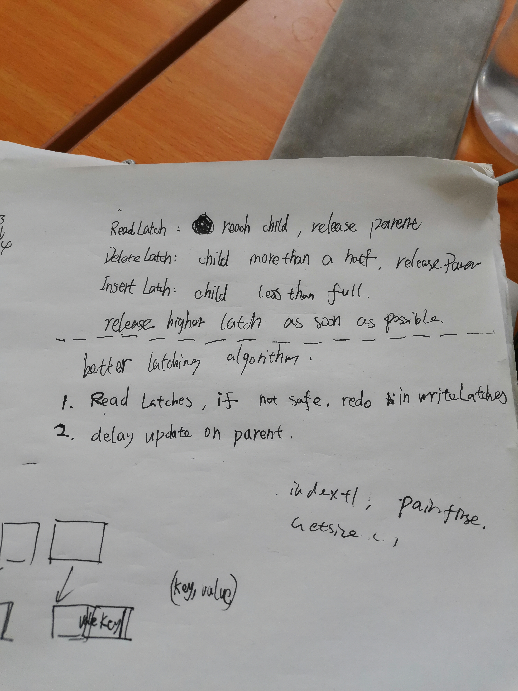
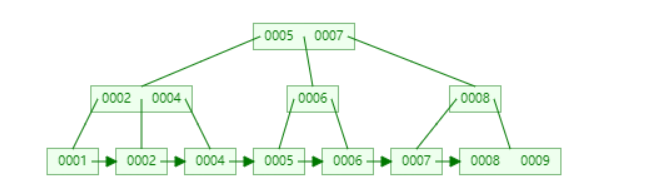
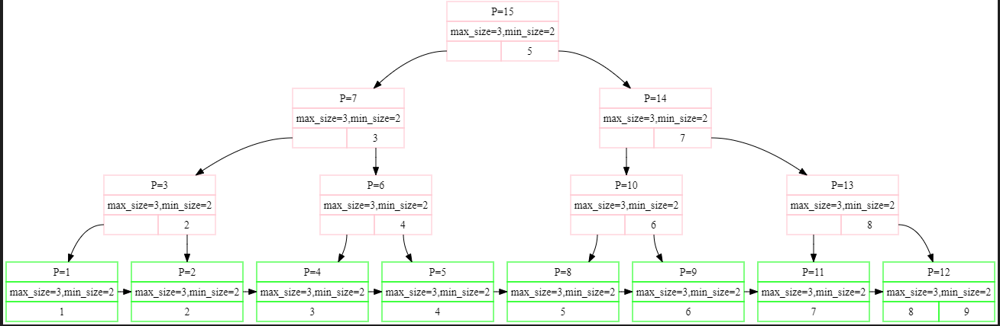
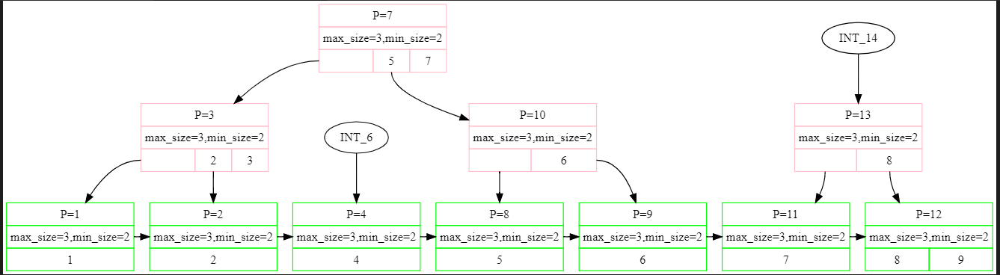
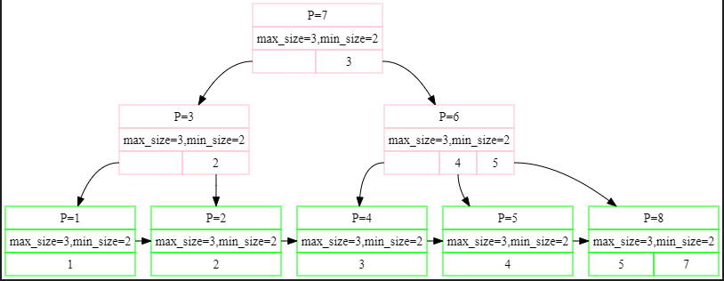
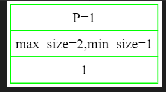
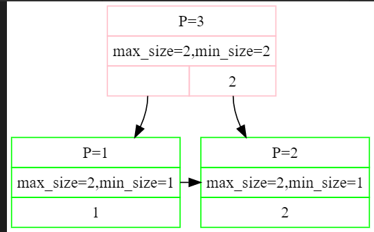
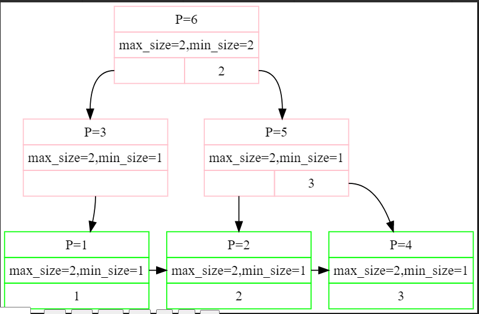
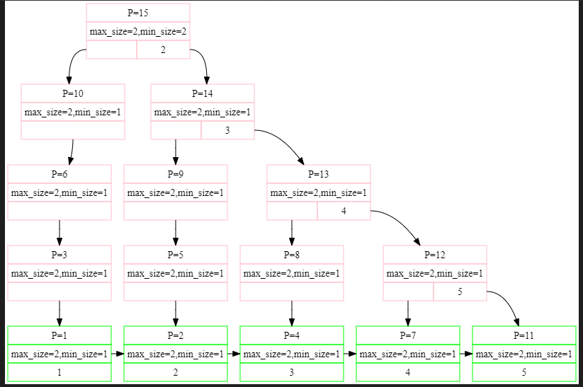

Project1 C++Primer

Feature1：如何理解 模板类继承模板类， 子类看不到父类成员？https://www.zhihu.com/question/28139230

Do I need to explicitly call the base virtual destructor? https://stackoverflow.com/questions/677620/do-i-need-to-explicitly-call-the-base-virtual-destructor 

C with class 全忘了，一点也记不得了，将就着糊代码吧。

Lecture #01: Course Introduction and the Relational Model

data model：A schema is a blueprint of the database which specifies what fields will be present and what would be their types. For example an `employee` table will have an `employee_ID` column represented by a string of 10 digits and an `employee_Name` column with a string of 45 characters. 

schema：Data model is a high level design which decides what can be present in the schema. It provides a database user with a conceptual framework in which we specify the database requirements of the database user and the structure of the database to fulfill these requirements.

A data model can, for example, be a relational model where the data will be organised in tables whereas the schema for this model would be the set of attributes and their corresponding domains.

复制黏贴自Stack Overflow

Bug1：我过于高估自己对于智能指针的认知了，我只适合用裸指针。


该Project下有4个主要的数据结构，分别是：

```c++
/** Array of buffer pool pages. */
Page *pages_;              
/** Page table for keeping track of buffer pool pages. */
std::unordered_map<page_id_t, frame_id_t> page_table_;
/** Replacer to find unpinned pages for replacement. */
Replacer *replacer_;
/** List of free pages. */
std::list<frame_id_t> free_list_;
```

从注释来看，`pages_` 包含了 `replacer_` `free_list_` 以及含有pin_count的所有frames。再根据page的三种状态之间的转换free、unpin、pin，我们可以进行编程。

在编程时关注 page的三个属性:`page_id`,`pin_count_`,`is_dirty_`,更新上述4个数据结构。

- Bug1:C++的类内成员变量如果是内置类型，比如int，一定要进行初始化，否则你永远不知道编译器会给它设置成多少……


- Bug2:`pages_`的索引在用page_id。。。大概我不是用脑子写的代码，是用脚写的。


- Bug3:之前`lru_replacer`留下的蹩脚代码，之前的析构函数是这样处理的。当时想的太简单，测试用例又没检查出来。


```c++
    // head->prev=nullptr;
    // head->next=nullptr;
    // tail->prev=nullptr;
    // tail->next = nullptr;
```

其实应该这样处理：

```c++
    std::shared_ptr<Node> work=head;
    std::shared_ptr<Node> next=head->next;
    while(work){
        work->next=nullptr;
        work=next;
        if (next) next = next->next;
    }
```

- Bug4：Single-parameter constructors should be marked explicit.


https://clang.llvm.org/extra/clang-tidy/checks/google-explicit-constructor.htm 这种类型的失误我目前没有太多时间去学习，需要注意。

- Feature?：如果Unpin的时候Frame已经在replacer中，不必处理，就当没发生事情一样，否则就会过不了测试。

-------------------------------------------------------------------------------

## page_table_ 中是否应该只存放pinned的Frame？

`pages_``page_table_``replacer_``free_list_`

从存放的Frame来看，`pages_`是全集，`free_list_`是删除了Page的Frame，`replacer_`是page.pin_count==0的Frame。

但是剩下的`page_table_`就有点疑问了：它到底是存着pinned page的Frame，还是全部Frame...在本实验中我是把它当成全集来看的。当然可能只放pinned page的Frame会好一点，毕竟这样就达成了一种互斥的感觉，很完美。那么如何实现这种方法呢？

首先明确一点：`free_list_`中的Frame不需要查找，直接取出来即可。然后考虑`Page *BufferPoolManager::FetchPageImpl(page_id_t page_id)`，给定page_id取出该Page，现在Page有可能是pin_count==0，那么一定不在`page_table_`中了，我们不能直接通过`page_table`的哈希表查找。必须在`replacer_`中增加一个查找接口，这个也好做，因为`replacer_`中本身也有一个哈希表，此处就不实现了。


1.Every node has at most m children.

2.Every non-leaf node (except root) has at least ⌈m/2⌉ child nodes.

3.The root has at least two children if it is not a leaf node.

4.A non-leaf node with k children contains k − 1 keys.

5.All leaves appear in the same level and carry no information.

第一个Key是默认没有的。

1.为啥 B_PLUS_TREE_INTERNAL_PAGE_TYPE::MoveAllTo 可以保持不变？从父节点处拿下来一个放在第0号，再把整个给出到 recipient（有所要把父节点 拿下来的那个删掉吗？）

2.B_PLUS_TREE_INTERNAL_PAGE_TYPE::MoveFirstToEndOf 因为一边更新了，所以另一边就不更新了？


1.需要注意InteralPage 和 LeadPage的 Lookup 函数 不同，InternalPage需要找<=key，LeafPage需要找>=key。。。

2.好吧，KeyIndex也是不同的方法（这个后续需要修改）

3.不知道Node中Init应该初始化MaxSize设置成多少

4.FindLeafPage后面就要跟 Unpin（只有Fetch 、FindLeafPage需要这个）

5.GetValue的参数为什么是个vector

特点：

1.为了更好的偷懒（设置Leaf 和 Internal Page MaxSize的时候，-1，所以之后就可以直接插入，然后再Split，方便很多）

2.这里的Delete和网上流传的众多版本是不同的，分支上的最小Key没了以后是不会更新这条分支其它node的最小Key，相当于是简化版本的，不过这样也不影响正确性。

  

  

3.有几种优化方法在slice中会提到，先这样吧，目前懒得得到一个好看的流程



bug

0.concurrent_test 两个线程进行delete时

1 4

14

5 3 

5 2 

3 2 

3 1

4 0

4 0

1.unPin

2.nextpageid

3.注意到MoveAllTo是有顺序关系的，被加的那个在左边

  

4.我好像把node的Size（）定义弄错了....还是有很多没想明白的


删除key=3后，出现问题了，



4.我有一个非常疑惑的问题，在这个实验中我们需要在NewPage和FetchPage后面跟随Unpin，当然如果因为某个函数里无法这么做，该函数后续也要加上Unpin。

有一个极其特殊的地方也要加InsertIntoParent中的new_node，因为这个new_node在实验中是Split中虽然对recipient(recipient==new_node)已经unpin，但是在InsertIntoParent中这个new_node又一次被修改，所以是需要再次Unpin。然而old_node就不用在InsertIntoParent中Unpin了，因为old_node其实是原来的node，肯定会在caller中被unpin。

5.在Index Iterator中我们好像无法unpin

6.FindLeafPage中 除了root是通过FetchPage得来的，需要Unpin，剩下的有unpin的必要么？不必要，但是也可以unpin，因为在bufferpool中unpin是幂等的，如果pincount<=0了再unpin也没事。

7.CoalesceOrRedistribute中的unpin逻辑好乱啊。







d 1 失败

8.需要忽略那个没有key的pair，直接把在判断parent需要再次  CoalesceOrRedistribute 的条件变为  GetSize()<GetMinSize()+1 ，因为现在是InternalNode，比如MaxSize=3，MinSize=1，但实际上array[0].first不是key，表面上Size=1，实际上是0.










10.在程序中对于Size--对应的操作都是移动array，所以其实那些“被删除的array”依然存在，这就导致并发操作时，跟KeyIndex的实现方法也有关系，一前一后删除Key时，出现bug。


Project3

```c++
bool SeqScanExecutor::Next(Tuple *tuple, RID *rid) {
  TableIterator iter_ = *table_iter_;
  while (iter_ != table_heap_->End()) {
    Tuple tup = *iter_;
    iter_++;
    bool eval = true;
    if (plan_->GetPredicate() != nullptr) {
      eval = plan_->GetPredicate()->Evaluate(&tup, GetOutputSchema()).GetAs<bool>();
    }
    if (eval) {
      *tuple = tup;
      return true;
    }
  }
  return false;
}
```

当我写出如上所示代码以后，程序就陷入了死循环。单看代码当然是没问题的……因为这里我们需要推进迭代器，所以复制的话每次都是Begin迭代器。只有引用才可以持续推进迭代器。

```c++
TableIterator &iter_ = *(table_iter_.get());
```


