以下内容是课程笔记

Storage-Part1

## 1 Storage

目前我们处在Disk Manager这一层，如果不加说明，DBMS的默认存储地址是非易失的磁盘，而DBMS的Disk Manager则将数据从非易失的磁盘和易失的内存中间移动。

至于存储体系，自下而上。从Network Storage到CPU寄存器，越小越贵越快。易失的存储硬件更加适合随机访问，且以字节为单位。非易失的存储硬件更加适合顺序访问，且以块（block）为单位。

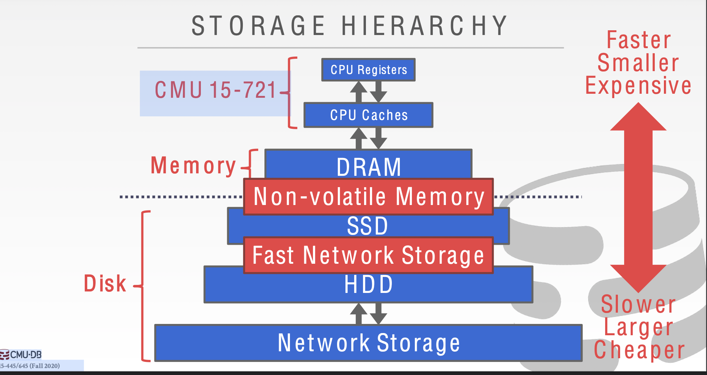

## 2 Disk-Oriented DBMS Overview

内存毕竟就那么点，我们需要将数据存在磁盘中，因此DBMS需要最大限度的进行顺序访问。

## 3 DBMS vs. OS

看起来我们可以使用OS中的mmap来管理page，mmap会映射virtual memory和physical memory，到那时这样其实不行。

1.我们没办法对mmap映射的页进行写操作，只能读

2.如果mmap发生了page fault，我们的进程就会阻塞，因为这时候没有其他OS措施来处理page fault。

## 4 File Storage

然后我们来讨论DBMS是怎么把database表示成存储在磁盘中的文件的。balabala...不重要的就跳过了。

### File Storage

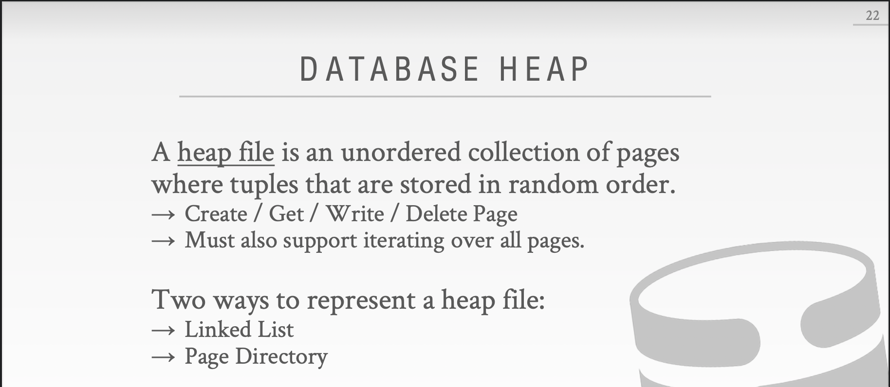

### Page Layout

这里的self-contained指的是什么？如果我们把创建数据库的元数据存储在单独的page里，发生crash以后其他数据就没办法解释。那么只要把这个元数据存在每一个page中，就是self-contained了。

那么除了元信息，如何组织page内部的data呢？我们假设只存储tuple。

两种方法：Tuple-oriented、Log-structured。

先来看Tuple-oriented。

如何删除一个tuple呢？slide中给定方法是设置墓碑标志，不过很神奇的是这样的话tuple的插入就不是简单append到末尾了，而要遍历墓碑，这和slide中说的有点矛盾。

如果有一个变长tuple如何存储呢？slotted page。

### Tuple Layout

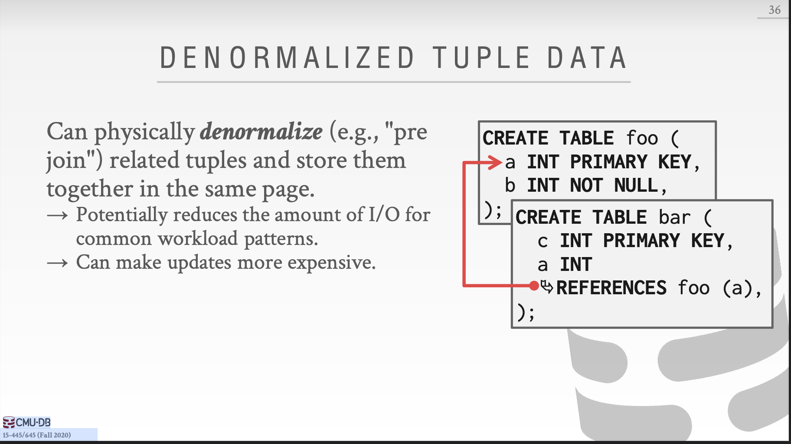

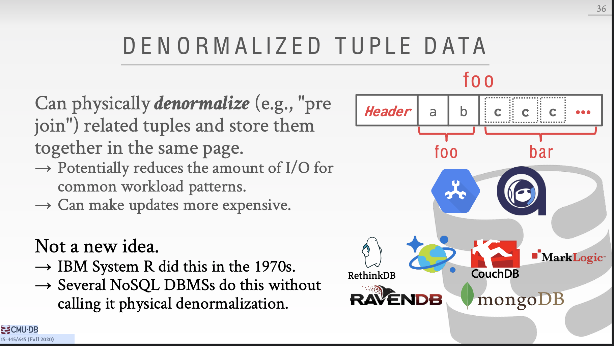

Denormalized 可以看作 PreJoin。

## Conclusion

## Storage2

### Log-structured file organization

不同于直接在Page中写入完全的Tuple，记录结构的文件组织方式是另一种方式。

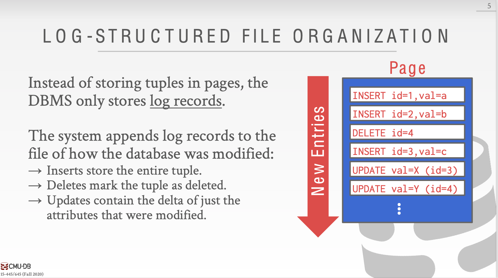

​	从插入Entry的过程可以看到，Insert、Update只包含了变化的属性值，所以需要读取某个Tuple的时候，只需要倒序读取就能重构出Tuple。

这样添加Entry的方式还有一些问题，比如Log文件会过大，倒序读取速度太慢等。因此，以下方式改善Log-Structured。

1.建立Entry的索引，这个就不提了，很常用的方法。

2.周期性的压缩Log

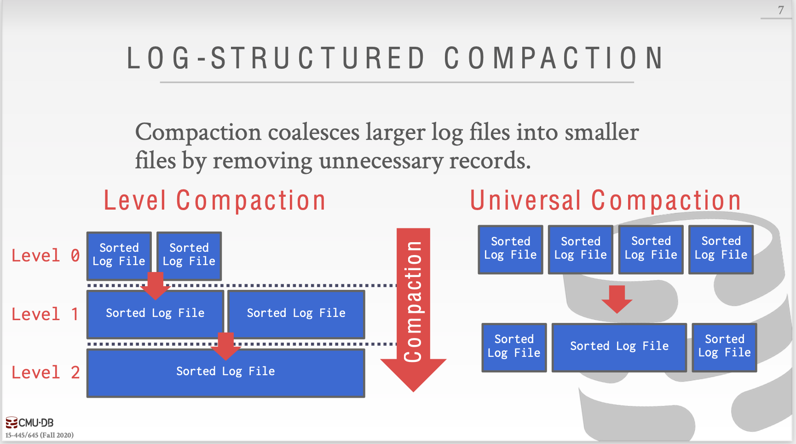

今天课程的主题。

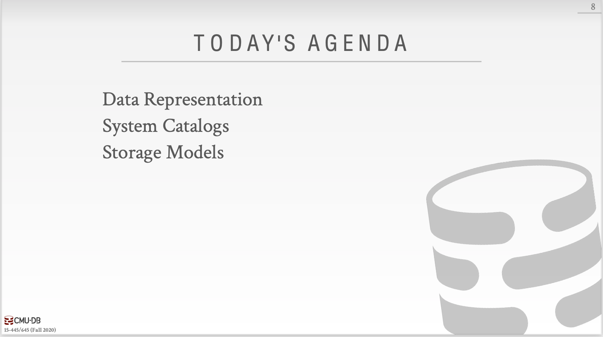

Tuple只是一连串的bytes，需要DBMS来把这些bytes解释成types和values。DBMS的catalogs中的schema包含这些解释信息。

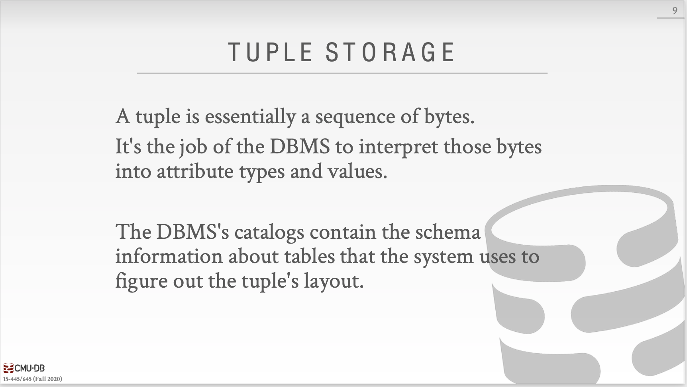

接下来是几种数据库的工作方式。

OLTP：快、短，操作整个Entity，重复操作。

OLAP：长、复杂、操作数据库的部分。

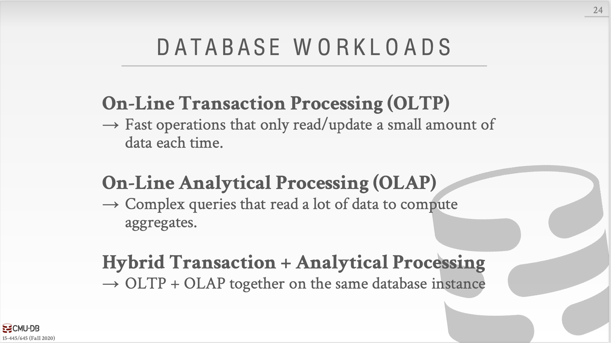

关系型数据库模型不满足我们必须把相同Tuple属性都存储在单个Page上的要求，因为关系型数据库是一行一行的，需要存储其他属性。

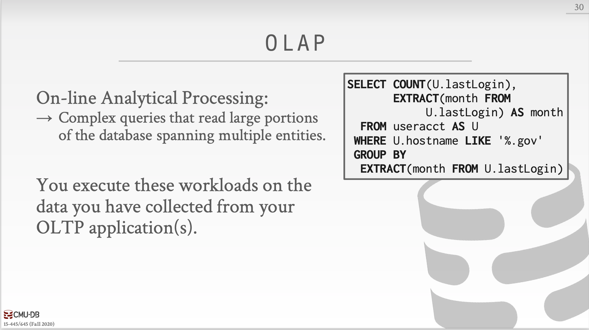

接下来介绍一个适合OLTP的存储模型，N-ARY Storage Model。就是按行存储Tuple。

与NSM对应的就是DSM，将所有Tuple的相同属性都存储在同一个Page中。

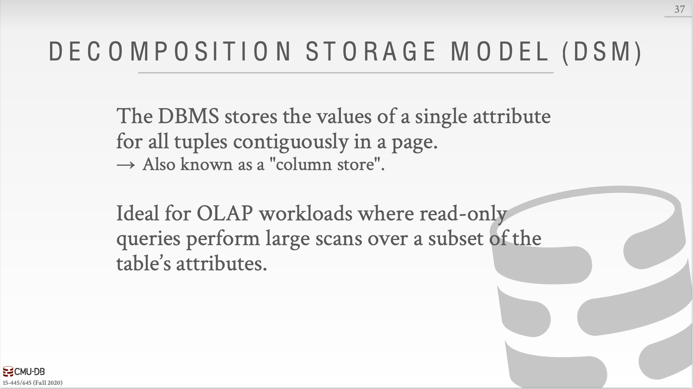

总结一下就是，OLTP=Row Store，OLAP=Column Store。接下来就该说说DBMS是如何管理内存，并且从磁盘中往复移动数据。

在磁盘上存储Page的时候应该注意一下两点：

1.尽可能的把一起使用的Page放在磁盘的靠近位置

2.尽可能减少读取磁盘的次数

今天的课程主要是三个方面：Buffer Pool Manager、Replacement Policies、Other Memory Pools。

我们把内存中一个array entry叫做Frame，其实就是磁盘中的Page，换了一个说法。

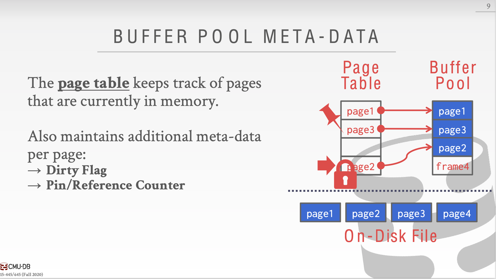

Locks 和 Latched的区别：Locks比较高层，是用来保护数据库的内容不受其他事务影响的原语。事务会持有Lock直到事务结束，Locks需要能回滚修改。

Latched则相反，保护的范围比较底层，用户保护数据库内部数据的关键部分，只有在操作进行的过程中会持有Latched，不需要回滚修改。

Page Table 和 Page Directory的区别

内存分配策略分为全局策略和局部策略。全局策略要求在分配内存的时候考虑所有正在运行的事务。而局部策略的目标是让一个查询或者事务变得更快，不考虑其他并发运行的事务。

Buffer Pool的优化方法：Mutiple Buffer Pools、Pre-Fetching、Scan Sharing、Buffer Pool Bypass。

Mutiple Buffer Pools：减少latches的竞争和提高命中率（毕竟缓冲区空间变大了）

Pre-Fetching：主要用在Sequential Scans和Index Scans上（因为这两个操作都是有规律的）

Scan Sharing：查询游标可以重用其他查询取得的数据。

Buffer Pool Bypass：[不怎么接触过的Light Scans](https://www.ibm.com/docs/en/informix-servers/12.10?topic=io-light-scans)，Sequential Scans不把从磁盘中取出来的Page放在Buffer Pool中，减少开销。

接下来说到**Buffer替换策略**。LRU、CLOCK。**问题**在于这两种策略会遇到sequential flooding，比如2个Frame和3个Page使用Sequential Scan，当Buffer Pool满了以后每次Buffer Pool都不会命中。

更好的策略：

 LRU-K：不谈了。

Localization：保持一个对于query来说**私有**的small buffer，使得真正的buffer里的page不变成dirty。

Priority Hint：对于某些特定查询，存在优先级，在Buffer中保留优先级高的Page。

同时由于Page处于Dirty状态我们在换出的时候必须写回磁盘，考虑使用**Background writing**

总结下来就是相比较于OS管理内存，DBMS自己进行管理更好。

下面是索引结构的课程内容，其实就是两种索引结构：哈希表和B+树。

Hash Function怎么挑选就不提了。主要把重心放在Hashing Scheme如何设计上。3种方法

- Linear Probe Hashing 删除的话直接用TombStone就好。Movement就是图个乐，十分的复杂。

  Non-unique keys

  * Separate Linked List 
  * Redundant Keys  直接把key和value绑定起来

  

- Robin Hood Hashing（劫富济贫）

  每个Key都会保留一个number，该number指的是它们离最初位置的距离。

  当争夺同一个slot的时候，距离最初位置越远的key可以获得该slot。相同的话遵循先后来到规则。

  

- Cuckoo Hashing

  就是拿多个哈希表，多个哈希函数，如果有冲突发生了就使用另一个哈希表，以及与之对应的哈希函数。循环往复，直到没有冲突。

  

接下来是**动态哈希表**。

* Chained hashing

  以bucket为单位

* Extendible hashing

  global count、local count。桶不够用了，global count+1，那个不够的桶 local count+1，这个桶就可以分裂了。

  

* Linear hashing

  Split pointer控制着demarcation line，demarcation line之上的bucket是split之后的一部分，所以还要应用另外几个hash函数才能够最终确定bucket的位置。

  

结论：O（1）就完事了。下面一节课就是历史上最伟大的数据结构，B+树。

说真的动手写完B+树索引的实验以后，再看slide都可记录的不多，由此可见实践编程的重要性，多写点bug，就什么都理解了，比起记忆怎么split，怎么merge要好太多了。

Leaf Node Values

Leaf node values可以是Record Ids和Tuple Data。本实验中用的是Record Ids。

Duplicate Keys

* Append Record Id
* Overflow Leaf Nodes

Clustered B+Tree，[一篇介绍聚集索引的好文章](http://www.programmerinterview.com/database-sql/clustered-vs-non-clustered-index/)

聚集索引一般设置在Primary Key上，因为他们不会经常update（一次update往往会变成delete+insert）

下一节课我们会继续学习B+树，Tries/Radix Trees，Inverted Indexes

Variable length keys

intra-node search

* Linear

* Binary

* Interpolation

  根据已知分布的keys得出目标key的大概位置

Optimization

* Prefix Compression
* Deduplication
* Suffix Truncation
* Bulk Insert
* Pointer Swizzling：value不存page ids，当page在buffer pool处于pinned状态的时候，直接存raw pointers。

Partial Indexes：只在数据库表中的子集中添加索引。

Covering indexes：query中的所有要求的信息都在一个索引中，那么DBMS就不用取得该tuple。

Index include columns：columns只在leaf nodes中出现，不会在internal nodes中出现，所以不会影响index-only queries

Functional/expression indexes：创建index的时候用function、expression

Trie index ：

Radix Tree：就是把single child合到parent的Trie Index。

下一节课我们会学习Index Concurrency Control

**Latches Overview**

Blocking OS Mutex

Test-and-Set Spinlock（TAS）：别在用户空间下使用自旋锁

Reader-Writer Locks

**Hash Table Latching**

HashTable上锁比较简单，因为数据结构比较简单。

* Page Latches：每个Page都有自己的读写锁
* Slot Latches：每个Slot都有自己的锁

**B+ Tree Latching**

B+ Tree需要解决两个问题：不同线程同时修改一个node，当一个线程在split/merge的时候另一个线程路过。

最基本的原则：

1.父节点加锁

2.子节点加锁

3.当父节点安全的时候解锁父节点

那么什么样的节点是安全的呢？不处于split/merge边界条件的节点是安全的。

对于R锁（Find）就更简单了，当获取child的读锁以后直接释放parent的读锁。

对于W锁（Insert/Delete），child是安全的以后，释放其所有祖先的所有锁（为其他线程提供方便）。

Better latching algorithm

大多数修改并不会导致split/merge，所以我们可以乐观的认为使用read latches。只有leaf node使用W锁，internal node都是用R锁。如果发现leaf node不安全，释放所有的latches，重新使用悲观算法。

**Leaf Node Scans**

internal node的锁获取方式都是自上而下的，如果下面的锁无法获得，就会wait，不会导致死锁，因为这样不会影响下面线程的继续前进。而Leaf Node Scans的锁有两个方向，从左到右、从右到左，这样就会导致死锁。当一个线程自左向右Leaf node scan时，遇到一把无法获得的锁时，不能wait，因为wait的同时，自右向左的线程也无法前进，导致死锁。

Latches不支持死锁避免和死锁预防，只能通过编程规范来解决。如果线程想要获得leaf node的latch，但是latch还不能获得，线程应该立即abort操作（释放线程自己拥有的所有锁），然后再重新开始失败的操作。

**Delayed Parent Updates**

等到下一次parent再次获得W锁时再更新。

上一部分学完Access Methods以后，我们该学习Operator Execution了，先是Sorting & Aggregations。接下来两周我们的学习任务是

* Operator Algorithms
* Query Processing Models
* Runtime Architectures

Query Plan像是一棵树，数据从叶流向根，根的结果就是query的结果。

今天的目标是学完 External Merge Sort、Aggregations

### Sort

那么为什么需要排序？

首先Quries可能会要求tuples以特定的方式排序（ORDER BY）。但即便query没有要求这么做，我们依然可以依靠排序做其他事情：

* 支持去重（DISTINCT）
* 插入大批排序过的tuples进B+Tree更加快
* Aggregations（GROUP BY）

如果数据能够直接放入内存，那么毫无疑问我们直接用快速排序就完事了。可惜磁盘中的数据量太大了，无法直接用快速排序。用分治就完事了，先排序小块，再合并。循环往复。

拿2路外部排序来说，如果DBMS有一个Bpage大小的BufferPool。

Pass#0:每次读取Bpages进入内存，排序并写回

Pass#1，2，3，。。。使用3个buffer pages，2个输入，1个输出，不断merge

这个算法只要求3个buffer pages来进行排序B=3，但是如果B>3，我们也不能够有效利用多出来的bufferpages，因为工作的瓶颈在磁盘I/O。

针对上面的问题，Double Buffering Optimizatio：当前这趟正在处理处理的时候，预取下一趟的数据到第二个buffer。

使用B+树来排序，可以利用叶子节点。当然要分成聚集B+树、非聚集B+树。对于聚集B+树来说，总是好于外部排序因为没有计算开销并且所有的磁盘访问都是顺序的。对于非聚集B+树来说是个坏主意，基本上一次I/O一个record。

### Aggregations

接下来说说**聚集**。有两种方式实现聚集：排序和哈希。

排序其实相对于聚集来说又做了更多的工作，也带来了不必要的开销。所以有些情况下使用哈希更好。直接建立一个短暂的哈希表来扫描table。每个record，就查哈希表。

* Distinct：丢弃重复的
* Group by：执行聚合运算。

当然如何这些都可以放进内存来做的话，是很简单的……但是不能，所以另谋他路。所以来看外部哈希聚合

Phase#1-Partition：根据哈希函数h1把tuples划分到不同桶中，当桶满了把他们写到磁盘。

Phase#2-Rehash：建立一个或者多个哈希表（哈希函数h2），遍历每一个Partition（也就是第一步中的桶）并放入哈希表中，最后遍历哈希表（们）来取得符合要求的tuples。（假定每一个Partition都能放进内存）。

### Conclusion

选择sorting还是hashing要分情况，不能一概而论。

我们已经讨论过关于sorting的优化：分块来分摊开销、两个buffer来解决I/O瓶颈。

### NextClass

* Nested Loop Join

* Sort-Merge Join

* Hash Join

### Join operators

问题1：join操作需要给parent operator留下什么数据

问题2：如何判断两个join之间哪个更好

Early materialization：把outer和inner tuples拷贝进新的output tuple。缺点是可能最后的output tuple会很大很大。

Late materialization：把join keys连同record ids拷贝进来，如果后续还需要其他属性，通过record ids再获取。十分适合column stores，不会拷贝不需要的属性。

### cost analysis criteria

衡量cost的标准：IO次数。

假定 R有M pages，m tuples，S有N pages，n tuples。

### Nested Loop Join

* Simple/Stupid

  对R中的每一个tuple，遍历S中的每一个tuple，如果match，就emit。 

  Cost：M+m*N

* Block

  对R中每一个blockr，对S中的每一个blocks，对blockr中每一个tupler，对blocks中每一个tuples，如果match，就emit。

  Cost：M+M*N

  如果我们有B个buffer，可以如何利用呢？拿B-2个buffer来扫描outer table，1个扫描inner table，1个buffer输出。

  Cost：M+（M/（B-2） * N）

* Index

  为什么basic nested loop join看起来如此糟糕？对于outer table的每一个tuple，都要对inner table做一次sequential scan。因此我们可以使用索引来找inner table中符合的tuple。

  假设每次通过索引查找inner table的开销是C

  Cost：M+m*C

综上所述，Nested Loop Join要注意以下几点：

1.选择较小的table作为outer table（left table）

2.把outer table尽量多的放在内存buffer中

3.对inner table使用index

### Sort-Merge Join

Phase #1:Sort

Sort Cost（R）：2M *（1+logB-1（M/B）），复杂度注意是怎么回事，前面的2 * M是每一趟从磁盘读取，写入Mpages，后面是总共的趟数。

Sort Cost（S）：2N*（1+logB-1 （N/B））

Phase #2:Merge

Merge Cost：（M+N）

Total Cost： Sort + Merge

当然最差的情况就是outer table 和inner table里面所有join attribute值都相同。那么Cost就变成Nested loop join + sort cost=M*N+sortcost，这里推测使用的是Block为单位的Nested Loop Join。

那么什么情况下sort-merge有用呢？

当一个或者两个table都已经对join key排序。

当join key的输出必须是排序的。

### Hash Join

既然join属性相同，那么经过hash之后肯定也相同，因此可以使用hash join。

Phase #1:Build

扫描outer table并在join attributes使用h1，建立哈希表

Phase #2:Probe

扫描inner table并使用h1来跳到哈希表，检查是否匹配。

如何优化？在第一步哈希表find元素的时候使用bloom filter，bloom filter可以保证False negative不会发生，也就是说如果bloom filter告诉你这个元素不存在那就是不存在，如果告诉你存在那不一定存在。

如果没有足够的内存放下整个哈希表怎么办？我们当然也不想要buffer pool manager随机的将哈希表所在的page换出到磁盘。

这个Cost也是3（M+N），见Grace Hash Join

### Grace hash join

Recursive partitioning：桶中桶，使用不同的哈希函数。

Partitioning Phase：Read+Write Both tables 2（M+N） IO'S

Probing Phase：Read both tables M+N IO'S

当然如果DBMS知道outer table的大小的话，直接使用一个静态的哈希表就行，减少了build/probe的开销。如果不知道的话就只能动态哈希表或者允许page溢出。

### Join Algorithms：Summary

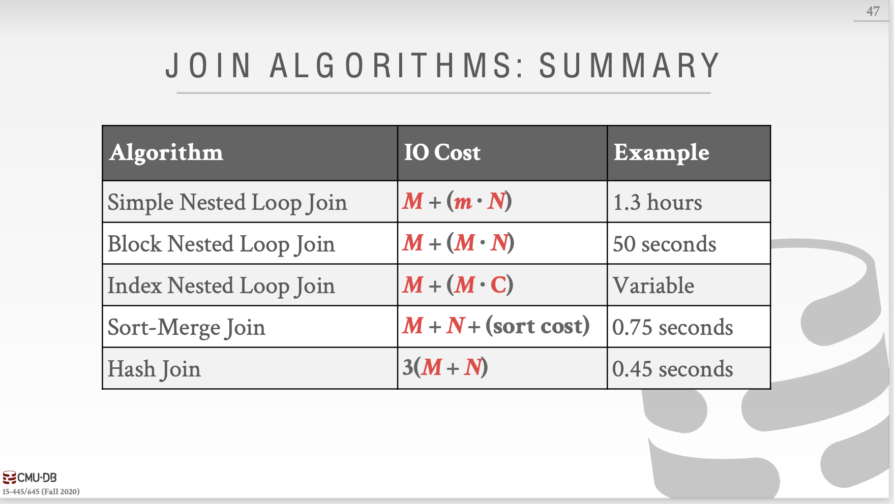

### Conclusion

在聚合中使用sorting还是hashing要分情况。

下一节课我们要来着重讲讲组合operators来执行查询。

今天的课程内容

* Processing Models
* Access Methods
* Modification Queries
* Expression Evaluation

### Processing Models

Iterator model：就跟迭代器一样，每次输出一个tuple

materialization model：一次把全部结果输出

vectorized/batch model：像迭代器一样，只不过每次输出一个batch

### Access Methods

sequential Scan

optimizations

* zone maps：对于某个page预先计算出min，max，sum，DBMS然后就可以决定是否要访问该page
* Late materialization：延迟tuples的组合，在中间传输offset。

Index Scan

Multi-Index / “Bitmap” Scan

### Modification Queries

halloween problem：update改变了tuple的物理位置，导致scan operator访问该tuple多次（一般发生在update=delete+insert处），可能会在clustered tables 或者 索引扫描中出现。

### Expression Evaluation

就是说表达式树虽然很灵活，但是很满。

下一节课我们来讲讲 并行query execution，上一节课中我们都是假设只有一个worker在查询，那么现在来看看多个workers一起工作的情况。

parallel vs distributed

parallel：资源在物理上仅靠在一起，资源之间的通信很快，通信被认为是简单可靠的。

distributed正好相反。

今天的主要内容：process models、execution parallelism、I/O parallelism

### process models

#### process per DBMS worker

#### process pool

#### thread per dbms worker

使用多线程的好处：减少每次上下文切换的开销、不用管理共享内存。

10年内除了Redis和Postgres forks，Andy没发觉有其他DBMS不使用多线程。说明DBMS一般都使用多线程查询。

### execution parallelism

inter- vs intra-query parallelism

inter是不同queries之间执行。如果queries是只读的，那么不同queries之间只需要一点协同。如果要同时更新数据库，那么会有点困难（之后的课程会讲这部分）。

intra是一个queries被并行执行。

#### intra-operator（horizontal）

将operator分解成互相独立的fragments，对于数据的不同子集执行相同的函数。

引入了一个exchange operaotr：gather、distribute、repartition

#### inter-operator（Vertical）

operations之间有重叠的，目的是为了从一个stage pipeline到另一个stage，比如原先是先全部join完再project，现在可以让join完的一部分pipeline到project部分。

#### bushy

就是inter-operator的扩展版本，inter-operator有点像组内两个operator重叠，bushy就是组间重叠。

### I/O parallelism

#### multiple disks per database

#### one database per disk

#### one relation per disk

#### split relation across multiple disks

这节课到此结束，下节课我们来讲讲query optimization

Heuristics/Rules

重写query来移除低效的部分。

Cost-based Search

使用模型来计算query plan的开销，选择开销最小的plan。

### 今天的学习任务：启发式/规则：关系代数等式、逻辑查询优化、嵌套查询、表达式重写。

### relational algebra equivalences

Selections：尽早筛选，将复杂的谓词逻辑简单化执行。

Joins：交换律、结合律。

Projections：尽早执行投影，只剩下需要的属性，其他全都去掉。

### logical query optimization

转换成等价的逻辑查询，以便选出最优的计划。

split conjunctive predicates：就是分离连接谓词，一个一个执行，减少工作量。

predicate pushdown：将谓词移到尽可能的下方，同时也是对应的笛卡尔积的上方。

replace cartesian products with joins：可以把笛卡尔积和谓词替换成inner joins。

project pushdown：下沉project，去掉不必要的属性。

### nested sub-queries

rewrite to de-correlate and/or flatten them

decompose nested query and store result to temporary table

### Expression rewriting

就是说了一些没必要的谓词的删除或者化简。

## 今日学习任务：上一节课我们讲了启发式/规则来优化查询，这节课我们来讲基于开销的搜索

### Cost Estimation

Choice #1:Physics Costs

Choice #2:Logical Costs

Choice #3:Algorithmic Costs

对于基于磁盘的DBMS来说访问磁盘的次数的衡量一个query执行时间的主导因素。

### Plan Enumeration

在执行重写以后，DBMS会为这个quert列举不同的plans并且评价他们的开销。选择最好的plan。

single relation

multiple relations：只考虑left deep join。

在这种情况下其实还可以列举出很多。比如Left-deep tree就不止一种。aggregation、join又不止一种，aggregation可以是sort、merge，join可以是nested loop join、sort-merge join、grace sort-merge join。每个数据库的访问方式又不止一种，可以是index、seq scan。

nested sub-queries？没讲东西啊，略过算了。

dynamic programming：比较不同plan之间的cost，留下cost最小的那个plan

所以得到候选plan的步骤如下

1.枚举relation orderings

2.枚举join

3.枚举access

下一节课我们要讲事务了！数据库系统第二个最困难的部分。

### Locks,Mutexes,Semaphores的区别

Locks：保护对共享对象的访问，即一个资源可以被多个线程共享。

Mutexes：如果不是特指某种互斥锁，一般指的是一个资源只能被一个线程占有。

Mutexes又分为Recursive Mutexes(可重入锁)、Reader/Writer Mutexes、Spinlocks。

Semaphores：不提了，就是PV操作。

之前经常看到的那张图，自下而上五层。Disk manager、Buffer Pool manager属于Recovery部分，Access Methods、Operator Execution属于Concurrency Control部分。最上面还有一层Query Planning。

事务的四个特性ACID，balabala。

### 处理原子性

Logging：DBMS记录所有的undo actions，同时保存在内存和磁盘。

Shadow Paging：拷贝那些被操作的页，并在拷贝后的页上操作，只有commit以后才对其他事物可见。

提到一个**并发控制协议**就是DBMS如何决定多个事务的操作之间的正确顺序。多个事务之间交织是因为如果一个事务因为某种资源停下来，那么另一个事务可以继续前进，这样可以最大化资源利用率。

如何判断一个调度是正确的？如何一个调度等价于某些串行执行，就是正确的。

什么是串行执行？不同事务中的操作不相互交织。

### 处理一致性

database consistency：之后的事务可以看到之前提交事务的影响

transaction consistency：这个归应用程序管，不归DBMS管，所以我们也不讨论。

### 处理隔离性（做好并发控制）

### conflicting operations

既然不同事务中的操作会交织，那么到底怎样的操作交织会对形成串行化执行结果有影响呢？冲突操作。

两个操作是冲突的：他们来自不同的事务；他们作用于同一个实例并且至少其中一个是W。

所以显然是RW、WR、WW这三种冲突操作组合。脏读、不可重复读、脏写都是没有串行化时的错误结果。

### two types of serializability

串行化有不同的级别：大多数DBMSs尝试支持的**冲突串行化**，几乎没有DBMS做到的**View Serializability**（这个我不知道怎么翻译）。在这节课中我们的主要内容是冲突串行化。

### conflict serializability

冲突串行话不止一种调度，那么如何知道两个调度是否等价呢？

1.他们涉及同一事务的同一操作。2.每一对冲突操作都按相同顺序排列。言下之意是非冲突操作想怎么来怎么来。同时如果你能讲一个调度S中的非冲突操作变换顺序成一个串行调度，那么这个调度S显然是一个串行话调度。

这么来回换一点也不方便，有什么好的算法来判断一个调度是否是串行调度吗？如果**前驱图**形成了环，那么就不是一个冲突串行化。

### View serializability

View Serializability比冲突串行话有更多的调度，说明View S限制更少。同时View S很难有高效的方法去检测。

所有调度的包含关系如下图所示。

### 处理持久性

所有提交事务的改变都应该是持久的。也用logging 或者 shadow paging……

下一节课我们来讲2PL、隔离级别。

先来复习一下上节课的内容，上节课提到了冲突串行话和查看串行话。冲突串行话有交换和依赖图两种方式，且几乎任何数据库都支持冲突串行话。查看串行化没有有效的方式去验证，几乎没有DBMS支持查看串行化。

显然，上节课检验一个调度是否是串行话调度需要先知道整个调度，但是现实情况下我们没办法知道整个调度。所以我们需要用锁来保护数据库实例。

今天的课程内容主要是Lock Types、2PL、死锁检测+预防、层级锁、隔离级别。

### Lock Types 

Locks 和 Latches的区别，已经不想重复了……

### 2PL

阶段1:Growing，事务申请、lock manager给/不给。

阶段2:Shrinking，事务释放，且不能再申请新的锁。

2PL要服从级联中止，因为abort的事务中的任何信息都不能流出该事务。

observations：

* 可能会出现2PL不允许的调度，但这个调度其实是串行化的。因为锁会限制并发性

* 可能会出现脏读->使用严格2PL，出现脏读其实就是在**没有级联中止**的情况下发生的。

  而严格2PL要求只有在提交或异常中止后才释放锁。这样一来，就没事了，相当于加了一把大锁。

* 可能会导致死锁->死锁预防或者检测

总而言之，言而总之，就是有级联中止，2PL就不会出现脏读。没有，那就老老实实用S2PL吧。

#### 2PL Deadlocks

死锁检测：也是画前驱图，发生死锁了就选择一个替罪羊事务回滚。替罪羊会重启或者是中止。

选替罪羊可以根据时间戳、事务进度、锁个数，也可以考虑该事务过去重启的次数来避免“饿死”。回滚也可以选择回滚进度。

死锁预防：事务申请的锁被另一个事务持有，DBMS就杀死其中一个事务来预防死锁。

### Lock granularities

IS：子节点有一个shared

IX：子节点有一个exclusive

SIX：子节点全部是share，有一个exclusive

意向锁允许高层节点以shared或者exclusive方式加锁，并且不用检查子节点。

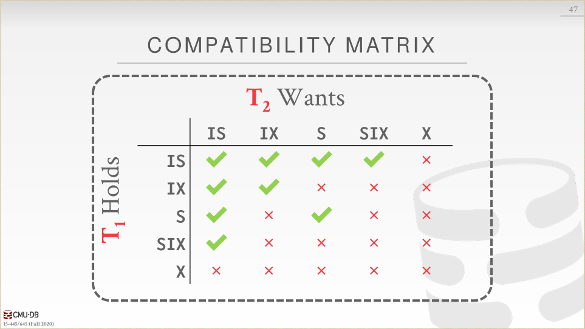

当获取了太多了低级别的锁以后，锁升级会动态的请求粗粒度的锁。着减少了lock manager需要处理的请求的数量。

select...for update：执行select并对符合的tuples设置一个exclusive lock。

### 没啥可总结的，下节课我们来讲时间戳排序的并发控制。

2PL是悲观CC、TO是乐观CC。接下来就着重说TO是怎么实现的了。

有几种实现timestamp的方法：system clock、Logical counter、hybrid。

今天的主要内容就是：T/O 协议、OCC、隔离级别。

### Basic Timestamp Ordering (T/O) Protocol

注意T/O不仅要更新实例的读写时间戳，还要拷贝X的旧值来保证**可重复读**。

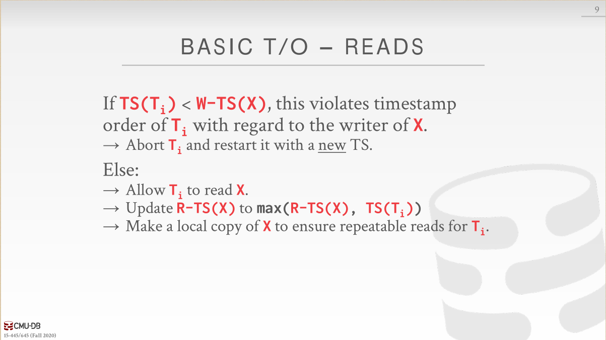

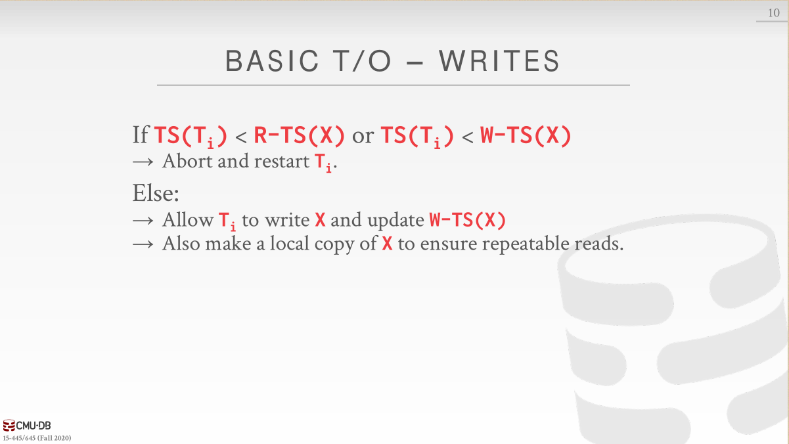

**Thomas Write Rule**提到我们可以忽略旧事务对于X的**写操作**，这是可以理解的，反正即使这个旧事务在正确的时间点对X进行写，写入的值也会被新事务的写所覆盖，最终结果X的值是新事务写入的值。

Observations：如果你不使用Thomas Write Rule，T/O协议产生的就是冲突串行化。没有死锁，没有等待（因为不符合时间戳要求的都abort了），当然存在长事务饿死的情况（短事务一直冲突，一直restart）。

### recoverable schedules（？哪里来的）

### Optimistic Concurrency Control

如果你假设事务之间的冲突很少并且绝大部分事务都是短暂的，那么用锁的方式就会带来过多开销，我们可以考虑OCC。……好像可串行化的快照隔离啊，有两种`基于过期的条件做决定`的方法，前向和后向（需要求证一下）。

OCC：任何读取实例都被拷贝到工作区，修改都应用于工作区。当提交时，DBMS会比较该事务的工作区和其他事务是否有冲突，没有冲突就将工作区的写集合安装到全局数据库。

#### OCC 前向验证的三个要求之一

如果TS(Ti)<TS(Tj)：以下三个条件至少有一个满足

下图中的读写集合冲突是对应与某一个时间点来说的，而不是针对整个事务持续时间来说的。

同时只有一个事务处于Write Phase，可以用write latches来支持并行的validation/writes。

目前我们只处理了read、update existing objects，但是面对不存在的object却没办法处理。（说真的一开始我都没看出来这是幻读，看了看示例才发现好像是幻读……）

### THE PHANTOM PROBLEM（幻读），2PL

* Re-Execute Scans：记录每个range query的scan set，等到commit以后，重新执行刚才每个query的scan部分来检查是否形成了相同的结果。
* Predicate Locking：对select查询的where子句中的谓词加共享锁，对update、insert、delete查询中的where子句中的谓词加排他锁。
* Index Locking：锁index page，如果数据在，锁在的那页；如果数据不在，锁数据将会放置的那页。如果没有适合的index，那么必须锁住table的每一页防止其中的一个tuple变成目标tuple；table也要锁住，防止加入或删除目标tuple。

### Isolation Levels

这节课我们来讲讲MVCC，首先来说说概念。MVCC就是DBMS会为数据库中每个逻辑实例维护多个物理版本。

当事务向该实例写时，DBMS会为该实例创建一个新版本。

当事务读取该实例时，事务会读取事务started时存在的最新的版本。

### MVCC

总结一下我们之前学习过的concurrency control protocol

* Timestamp Ordering
* Optimistic Concurrency Control
* Two-Phase Locking

然后就是如何存储实例的版本，有以下3种办法

* Append-Only Storage
* Time-Travel Storage
* Delta Storage

当然如果让版本一直增加下去肯定不对啊，那需要垃圾回收。

* Tuple-level：Background Vacuuming，Cooperative Cleaning

  背后回收就是另起线程来周期性的扫描version table。合作回收就是工作线程在工作的时候顺便回收，但是只适用于O2N。

* Transaction-level

MVCC的primary key指向版本链头部，但是二级索引就复杂很多了。二级索引需要根据找到tuple的primary key去找到版本链。

* Logical Pointers

  在二级索引处加一个指向primary key的指针，通过primary key找到版本头。好处是更新tuple，更新primary key，二级索引不用更新（因为指向了primary key）。

* Physical Pointers

  就是在二级索引处直接存版本链头，但是缺点是有多个二级索引的话，每次更新tuple时，所有二级索引都要更新。

MVCC的索引结构必须支持non-unique keys，因为相同的key指向不同快照中的logical tuples。因此workers在fetch一个实例时要找到正确的版本。

mvcc deletes

* deleted flag
* tombstone tuple

上节课我们讲了并发控制。这节课我们来讲讲logging，分为以下几点balabala。恢复算法由两部分组成：在事务运行过程中过的动作来保证DBMS从失败中恢复；出现故障以后的动作来将数据库恢复成ACID。这节课我们来讲第一种。

### Failure Classification

事务内部错误、系统错误、 存储媒介错误 

### Buffer Pool Policies

然后又提到了steal policy和force policy。分别是未提交的事务是否允许写入磁盘（对应undo）和已提交的事务是否立刻写入磁盘（对应redo）。

no-steal+force：不用undo、也不用redo，最容易实现。

### Shadow Paging

no-steal+force。

分成master和shadow，master中只有提交事务的改变，shadow中只有未提交事务的改变。事务提交时将shadow转换成master。

缺点：从master中拷贝中shadow开销太大。提交开销也很大。

然后上课时提到了SQLITE是怎么做的，其实正好相反，SQLITE会拷贝原始Page进入单独的日志文件，如果重启时需要undo就直接加载原始Page回内存，内存再写回磁盘（我们没办法直接从磁盘到磁盘）。

### Write-Ahead Log

steal（log的写入）+not force（实例的改变）

在事务提交改变以前，DBMS必须将log写回到磁盘。只有将log写回到磁盘以后，事务才可以被认为是提交了的。

group commit：一页log写满了就直接写入磁盘，再另起一页写。

### Logging Schemes

physical logging、Logical logging。就是写具体位置和写查询语句的区别。逻辑记录数据较少但是一旦有并发事务发生，recovery起来就麻烦，不知道数据库的哪一部分被改动了，恢复起来也要重新执行每一个事务。

当然一般用混合方法。

### Checkpoints

WAL会永远增长，那么进行阶段性区分呢？当log写入磁盘时加上checkout，当前checkout之前的忽略；checkout之后的commit了就redo、没有commit的就undo。

为什么log里有commit了还要redo，因为log最终没有以checkout结尾说明在log中写入commit以后，事务其实并没有真正commit（之前我们提到要先写入log，再去commit），崩溃了，所以log里最后也没有写入checkout。那么就需要redo本该commit的那一部分。

为什么log里没有commit的要undo，因为log中连commit都没有，说明事务根本没有到commit的那一步，连个意向都没有，但是log中却有actions，那这些actions必须undo。

问题：DBMS在检查快照点的时候要停止事务，不然事务又写入新的内容就混乱了。

下节课我们来讲讲Better Checkpoint Protocols、Recovery with ARIES。

上节课我们讲了在事务运行过程中的动作来保证DBMS可以从失败中恢复，这节课我们来讲讲当失败发生以后什么动作来让数据库恢复。

今天的上课内容，今天这节课看的我好懵啊。。。

### Log Sequence Numbers

### Normal Commit & Abort Operations

事务commit成功，就写TXN-END到log。

Compensation log record：说的是用于undo的动作的记录。

Abort算法

* 先写一条Abort记录
* play back in reverse order，每个更新还要写CLR，恢复旧值
* 写一条TXN-END记录

### Fuzzy Checkpointing

non-fuzzy checkpoints性能表现差

* 暂停启动任何一个新事务
* 等待知道所有活跃事务完成执行
* 刷新脏页到磁盘

ATT、DPT

在checkpoint的开始阶段记录ATT、DPT，但是这样还不是理想化状态，因为这个期间DBMS必须暂停事务。那么怎么弄？Fuzzy checkpoint就是指在系统刷脏页到磁盘的时候DBMS允许活跃事务继续跑。

checkpoint-begin：checkout的开始

checkpoint-end：包含ATT、DPT

当checkpoint成功完成时，checkpoint-begin的LSN会被写到数据库的MasterRecord。

任何在checkpoint之后启动的事务都会被ATT中去除。

### Recovery Algorithm

* 步骤1 analysis

  从上一个checkpoint-end开始读取crash时的ATT、DPT。

  如果发现TXN—END，说明commit成功或者是abort以后恢复成功，就把该事务从ATT中移除。

  对于其他records：写入ATT并且状态为undo。

  如果commit了，就改变事务状态为commit。

  对于Update records：如果P在DPT里，更新recLSN；如果不在，加入DPT。

* 步骤2 Redo

  从DPT的最小recLSN开始

  redo所有updates（包括aborted事务），redo CLR。

  从DPT中recLSN最小的log record开始：对于每一个update 或者 CLR ，redo它们，除了以下两种情况：受影响的page不在DPT中，或者在DPT中但是，record的LSN小于页的recLSN（这种情况下说明有另外一个事务把这个页写入到磁盘中了，顺带把本事务的修改写入了）。

  

  redo action：reapply logged action，set pageLSN。

  Redo完成后，写TXN-END，把事务状态变成Commit，从ATT中移除这些事务。

* 步骤3 Undo

  crash时的活跃事务中的 oldest log record，逆序。

  目标ATT中uncommit事务

analysis、redo阶段crash，就再做一遍analysis、redo就行，不用额外动作。

如何提高redo性能？假设不会crash，在后台异步刷磁盘。

如何提高undo性能？等待新事务访问某一page的时候rollback change。重写应用避免长时间运行的事务。

本节课的内容到此结束，现在你已经知道如何构建一个单节点DBMS。下一节课我们来说说分布式数据库。

前面的所有课程都是讲的单机数据库，接下来的几节课我们来看看分布式数据库相关。用前面我们构建的单点DBMS来支持分布式环境下的事务处理和查询执行，包括：Optimization&Planning、Concurrency Control、Logging&Recovery。

今天我们的上课内容主要是以下几点

### System Architectures

DBMS的系统架构指定CPU可以直接访问哪些共享资源，一般分为以下几种系统架构：共享内存和磁盘、共享内存、共享磁盘、不共享。

#### 共享内存

#### 共享磁盘

### 不共享

TiDB出现了hhhhhTiDBnb

### Design Issues

分布式系统设计肯定有很多问题，应用如何找到数据？如何在分布式数据上执行查询？如何确保DBMS的正确性？根据每个节点执行的任务是否是相同的进行划分。

同质节点：每个集群中的节点可以执行相同的任务（尽管存在不同的数据分区），让分配和故障转移更加轻松。

异质节点：节点被分配特定的任务，允许单个物理节点承载多个具有特定任务的虚拟节点（？不懂

### Patitioning Schemes

水平分区，使用hash partitioning，range partitioning。DBMS对不共享的数据库进行物理分区，对共享磁盘的数据库进行逻辑分区。

其中有一种hash叫做consistent hashing（网络存储技术中提到过）

提到了事务的协调，centralized coordinator（2PC），decentralized coordinator（主从）。

### Distributed Concurrency Control

下节课我们来说说分布式OLTP系统、复制、CAP原理以及真实世界的例子。

上节课我们说了系统架构，Partitioning/Sharding（Hash，Range，Round Robin），事务协调（Centralized vs Decentralized）

上节课我们讲了系统架构、分区与共享以及事务协同，这节课来讲讲分布式oltp。

OLTP：短时间的读写事务、数据量小、重复操作。

OLAP：长时间只读事务、复杂join、查询比较新。

然后突然跳到分布式的coordinator。我们首先要做一个假设：分布式数据库里的所有节点都能听话并做事：如果我们告诉一个节点需要提交一个事务，那么它一定会提交这个事务。

但是如果你不相信分布式DBMS的其他接待你，那么这就是一个拜占庭容错问题。

### Atomic Commit Protocols

当一个涉及到多节点的事务完成时，DBSMS会询问所有涉及到的节点是否可以commit。

* 2PC

  Prepare+commit

  优化方法

  * 在给最后一个节点发送query时，该节点直接返回prepare阶段的投票结果，还有查询结果。
  * 所有节点同意commit后，coordinator直接告诉client事务成功提交了。

* 3PC（not used）

* Paxos

* Raft

* ZAB（Apache Zookeeper）

* Viewstamped Replication

  

### Replication

DBMS通过在多余节点中复制数据来增强可用性

* 副本配置

  * Primary
    * 只在Primary更新
    * Primary传播更新不通过atomic commit protocol
    * 只读事务被允许访问replicas，带有写的事务不能够访问replicas
    * 如果Primary不行了，就从replicas中选举出一个primary
  * Multi-Primary
    * 事务可以在任意replica上更新
    * replica**必须**用atomic commit protocol和其他replicas同步

  K-safety：达到容错能力的每份数据的副本数量，当任何一个副本数量低于K，DBMS停止运行并下线。

* 传播方式

  当一个事务提交的时候，DBMS决定在向应用返回ack前是否等待事务的改变传播到其他节点。

  传播等级有

  * 同步（强一致性）

    primary发送更新到replicas并且等待它们写入磁盘后发来的ack，然后primary再发送ack到client。

  * 异步（最终一致性）

    primary发送更新到replicas以后直接返回ack到client，不再等待replicas写入磁盘。

* 传播时机

  * Continuous

    DBMS一产生记录就发送。

    也需要发送commit/abort记录。

  * On Commit

    只在事务commit时向replicas发送记录。

    不在aborted事务上浪费事件发送记录。

    假设一个事务的记录可以完整的放在内存中（就是先把记录们都存在内存中，等到commit时一股脑发送给replicas）。

* 更新方法

  * active-active

    一个事务在每一个replica独立运行。

    需要在事务完成后检测是否每一个replica都有相同的结果。

  * active-passive

    一个事务在master运行，然后将改变传播到其他replica。

### Consistency Issues（CAP）

对于分布式系统来说，下面三个条件只能保持两个成立。

* 一致性

  线性一致性。

* 总是可用

  所有节点满足所有请求。

* 网络分区容错

  网络分区以后，网络再恢复，保持一致性。

DBMS如何应对错误取决于它支持CAP理论的哪两个。

传统/NewSQL DBMS：在大部分节点重联之前不允许更新操作。

NoSQL DBMS：在节点重联后提供解决冲突的机制。

在上面的讨论中我们都是在假设分布式系统中的各个节点运行的是相同的DBMS软件，但是各个组织经常在它们的应用上跑不同的DBMS。所以如果我们可以为数据提供一个单独的接口就舒服了。

### Federated Databases

提到了PostgreSQL适合做联合数据库，因为它提供了外部数据包装器。

### Conclusion

我们假设分布式DBMS中的节点都是友好的。

区块链数据库假设节点都是对抗性的（？，这意味着你必须使用不同协议来提交事务。

下一节课我们来说说分布式OLAP系统。

* Star Schema
* Snowflake Schema

Issue #1:规范化

雪花模型占据较少存储空间。

非规范化数据模型可能导致违反完整性和一致性。

Issue #2:查询复杂度

为了得到查询所需要的数据，雪花模型需要更多的join。

星型模型上的查询一般来说会更快。

今天上课的内容有：Execution Models、Query Planning、Distributed Join Algorithms、Cloud Systems。

### Execution Models

#### Push vs Pull

* Push Query to Data

  将查询或者查询的一部分发送到数据在的那个节点。

  在通过网络传输之前尽量做好过滤和处理。

  比较适合share-nothing system。

* Pull Data to Query

  将数据带到正在执行查询的节点上。

#### Observation

从远程节点传过来的数据被缓存在buffer pool中，这使得DBMS支持远大于内存容量的中间结果。暂时性的页在重启之后不会保留。

那么如果长时间运行的OLAP查询在执行的时候一个节点崩溃了怎么办？

#### Query Fault Tolerance

绝大部分不共享的分布式OLAP DBMSs都被设计成假设节点在查询执行中不会失败，因此如果一个节点失败了，整个查询都会失败。（因为没有容错能力）

DBMS会对查询的中间结果建立快照，来让失败的节点恢复。

### Query Planning

以前我们讨论过的所有优化都可以在分布式环境下使用。

* 谓词下沉
* 先做投影
* 优化Join顺序

#### Query Plan Fragments

* Physical Operators

  在base node上生成一个查询计划，并分发到其他节点上，告诉这些节点应该怎么怎么做。

  大部分系统使用这个方法。

  缺点是其他节点不能做局部（相对于它们自己）优化

* SQL

  将原始查询重写成几段。

  允许每一个节点的局部优化。

  很少有系统这么做。

#### observation

分布式join的效率取决于数据库表的分区模式。

### Distributed Join Algorithms

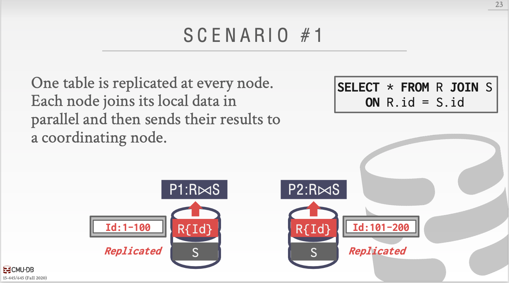

这个没啥说的。

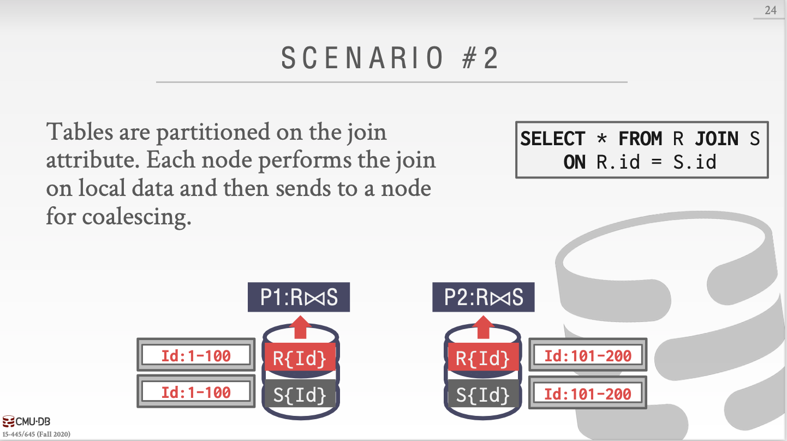

这个也没啥说的。

这个也没啥说的，因为S选的键和join key不相关，把它当作scenario #1处理即可。

这个是最差的，等于什么都没做，原始的R和S。

#### semi-join

来看这张图，如果没有semi-join的话，我们怎么做呢？要么就是把S整个拷贝过来，要么就是把R整个拷贝过去。

那么现在查询符合semi-join的条件，即join结果只包含outer table，我们只需要把join结果的那个key所在的column拷贝过去即可，即拷贝R.id这一列过去。

### cloud systems

供应商们提供数据库服务来帮助客户管理DBMS环境（？新的系统在shared-nothing和shared-disk之间开始变得模糊。

* Managed DBMSs
  * 对于DBMS来说是透明的，DBMS不知道自己跑在云环境上。
  * 绝大部分供应商这么做
* Cloud-Native DBMS
  * DBMS被设计成跑在云环境上。
  * 一般基于shared-disk架构

一个serverless DBMS不会为每个客户保持资源，当客户闲置时，DBMS就会“偷取”资源。

#### universal formats

绝大部分DBMS都有专用的磁盘二进制格式，就像我们的BusTub页类型。

在系统之间共享数据唯一的办法就是将数据转换成基于文本的格式：CSV、JSON、XML。

现在有新的开源二进制格式来让系统之间访问数据变得更简单。 

下一节课是Snowflake的客座演讲，那么这里就先跳过了。

## potpourri

这节课就是每年讲几个排名靠前的数据库。这我就不看了。

# Andy的结束语

数据库很美妙。

* 他们涵盖了计算机科学的所有方面。
* 我们只是挖掘了很少的一部分。

不断前进，你就会对这些系统如何工作有一个更好的理解。

下面这一点会帮助你在整个职业生涯中作出明智的决定。

* 避免过早优化。

